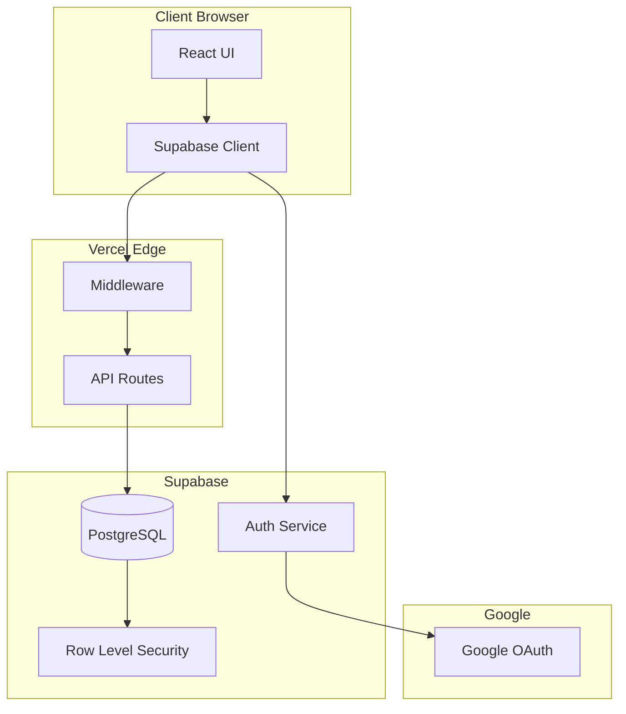

# Arquitectura del Sistema - IPU PY Tesorería

## Visión General

IPU PY Tesorería es una aplicación web moderna construida con Next.js 15 y Supabase, diseñada para gestionar las finanzas de 22 iglesias de la Iglesia Pentecostal Unida del Paraguay.

## Stack Tecnológico

### Frontend
- **Framework**: Next.js 15 con App Router
- **UI Library**: React 19
- **Language**: TypeScript 5
- **Styling**: Tailwind CSS 4
- **Components**: HeadlessUI
- **State Management**: Zustand
- **Data Fetching**: React Query (TanStack Query)

### Backend
- **API**: Next.js API Routes (Serverless Functions)
- **Database**: PostgreSQL (via Supabase)
- **Authentication**: Supabase Auth con Google OAuth
- **ORM**: SQL directo con cliente Supabase

### Infrastructure
- **Hosting**: Vercel (Serverless)
- **Database Provider**: Supabase
- **CDN**: Vercel Edge Network
- **Analytics**: Vercel Analytics

## Arquitectura de Alto Nivel



## Estructura del Proyecto

```
ipupy-tesoreria/
├── src/
│   ├── app/                      # Next.js App Router
│   │   ├── (auth)/               # Rutas de autenticación
│   │   │   ├── login/
│   │   │   └── auth/callback/
│   │   ├── (dashboard)/          # Rutas principales
│   │   │   ├── page.tsx         # Dashboard
│   │   │   ├── churches/
│   │   │   ├── reports/
│   │   │   ├── funds/
│   │   │   └── transactions/
│   │   ├── api/                  # API Routes
│   │   │   ├── dashboard/
│   │   │   ├── churches/
│   │   │   ├── reports/
│   │   │   └── financial/
│   │   ├── layout.tsx            # Root layout
│   │   └── providers.tsx         # Context providers
│   ├── components/               # Componentes React
│   │   ├── Auth/
│   │   ├── Churches/
│   │   ├── Layout/
│   │   └── Reports/
│   ├── lib/                      # Utilidades
│   │   ├── supabase/            # Cliente Supabase
│   │   │   ├── client.ts
│   │   │   ├── server.ts
│   │   │   └── middleware.ts
│   │   ├── auth-context.ts      # Contexto de auth
│   │   └── auth-supabase.ts     # Helpers de auth
│   ├── hooks/                    # Custom hooks
│   └── types/                    # TypeScript types
├── migrations/                   # SQL migrations
├── public/                       # Assets estáticos
└── docs/                        # Documentación
```

## Flujo de Autenticación

### 1. Login Flow
```
Usuario -> Click "Sign in with Google"
         -> Redirect a Google OAuth
         -> Callback a /auth/callback
         -> Supabase verifica token
         -> Trigger crea/actualiza profile
         -> Redirect a dashboard
```

### 2. Session Management
- Las sesiones se manejan via cookies httpOnly
- Supabase maneja refresh tokens automáticamente
- Middleware verifica sesión en cada request

### 3. Autorización
```typescript
// Verificación en middleware
if (pathname.startsWith('/api')) {
  const session = await getSession()
  if (!session) return unauthorized()
}

// Verificación en API routes
const context = await requireAuth(request)
if (context.role !== 'admin') {
  return forbidden()
}
```

## Base de Datos

### Esquema Principal

#### Tabla: profiles
```sql
CREATE TABLE profiles (
  id UUID PRIMARY KEY,              -- Linked to auth.users
  email TEXT NOT NULL,
  full_name TEXT,
  role TEXT,                        -- 8 role types
  church_id INTEGER,
  permissions JSONB,
  last_seen_at TIMESTAMPTZ
)
```

#### Tabla: churches
```sql
CREATE TABLE churches (
  id SERIAL PRIMARY KEY,
  name TEXT NOT NULL,
  city TEXT,
  pastor TEXT,
  cedula TEXT,
  grado TEXT,
  posicion TEXT
)
```

#### Tabla: reports
```sql
CREATE TABLE reports (
  id SERIAL PRIMARY KEY,
  church_id INTEGER REFERENCES churches(id),
  month INTEGER,
  year INTEGER,
  diezmos DECIMAL,
  ofrendas DECIMAL,
  fondo_nacional DECIMAL,
  numero_deposito TEXT,
  fecha_deposito DATE
)
```

### Row Level Security (RLS)

Todas las tablas tienen RLS habilitado:

```sql
-- Usuarios ven solo sus datos
CREATE POLICY "Users can view own data" ON profiles
  FOR SELECT USING (auth.uid() = id);

-- Admins ven todo
CREATE POLICY "Admins can view all" ON reports
  FOR SELECT USING (
    EXISTS (
      SELECT 1 FROM profiles
      WHERE id = auth.uid()
      AND role IN ('super_admin', 'admin')
    )
  );
```

## API Architecture

### Estructura de API Routes

```typescript
// src/app/api/churches/route.ts
export async function GET(request: NextRequest) {
  const context = await requireAuth(request);

  // Logic here

  return NextResponse.json(data);
}
```

### Respuesta Estándar

```json
{
  "success": true,
  "data": {},
  "error": null,
  "metadata": {
    "timestamp": "2025-09-23T10:00:00Z",
    "version": "1.0.0"
  }
}
```

### Error Handling

```json
{
  "success": false,
  "data": null,
  "error": {
    "code": "UNAUTHORIZED",
    "message": "Autenticación requerida",
    "details": {}
  }
}
```

## Seguridad

### Capas de Seguridad

1. **Autenticación**: Google OAuth via Supabase
2. **Autorización**: Sistema de 8 roles
3. **Database**: Row Level Security
4. **API**: Middleware validation
5. **Frontend**: Protected routes
6. **Network**: HTTPS only

### Políticas de Seguridad

- Dominio restringido: @ipupy.org.py
- Sesiones con timeout de 7 días
- Tokens almacenados en httpOnly cookies
- CORS habilitado solo para dominio propio
- Rate limiting en API routes

## Performance

### Optimizaciones

1. **Server Components**: Renderizado en servidor por defecto
2. **Static Generation**: Páginas estáticas donde sea posible
3. **Edge Runtime**: Middleware ejecuta en edge
4. **Database Pooling**: Connection pooling via Supabase
5. **Image Optimization**: Next.js Image component
6. **Code Splitting**: Automático via Next.js

### Caching Strategy

```typescript
// Datos estáticos (24h)
export const revalidate = 86400;

// Datos dinámicos (1h)
export const revalidate = 3600;

// Real-time
export const revalidate = 0;
```

## Deployment Architecture

### Environments

1. **Development**: localhost:3000
2. **Preview**: Vercel preview deployments
3. **Production**: ipupytesoreria.vercel.app

### CI/CD Pipeline

```
GitHub Push -> Vercel Build -> Tests -> Deploy
             -> Preview (PR)
             -> Production (main)
```

### Environment Variables

- `NEXT_PUBLIC_*`: Disponibles en cliente
- `SUPABASE_*`: Solo servidor
- `GOOGLE_*`: OAuth credentials

## Monitoring

### Métricas Clave

- **Uptime**: 99.9% SLA
- **Response Time**: <200ms p95
- **Error Rate**: <0.1%
- **Database Queries**: <100ms p95

### Logging

```typescript
// Activity logging
await logActivity('report_created', {
  churchId,
  month,
  year
});
```

## Escalabilidad

### Diseño para Escala

1. **Serverless Functions**: Auto-scaling
2. **Database Pooling**: Conexiones optimizadas
3. **CDN**: Assets en edge locations
4. **Lazy Loading**: Componentes bajo demanda
5. **Pagination**: Límites en queries

### Límites Actuales

- 22 iglesias (extensible)
- 1000 usuarios concurrentes
- 10GB database storage
- 100GB bandwidth/month

## Decisiones de Diseño

### Por qué Next.js 15?
- App Router para mejor DX
- Server Components para performance
- Built-in API routes
- Excelente soporte TypeScript

### Por qué Supabase?
- PostgreSQL robusto
- Auth integrado
- RLS para seguridad
- Real-time capabilities
- Excelente DX

### Por qué Vercel?
- Integración perfecta con Next.js
- Deploy automático
- Edge network global
- Analytics integrado

## Futuras Mejoras

1. **Real-time Updates**: Usar Supabase Realtime
2. **Mobile App**: React Native con mismo backend
3. **Offline Support**: PWA capabilities
4. **Multi-tenancy**: Soportar múltiples organizaciones
5. **Advanced Analytics**: Dashboard con gráficos
6. **Backup Automation**: Backups programados

## Contacto Técnico

Para consultas sobre la arquitectura:
- Email: administracion@ipupy.org.py
- GitHub: @anthonybirhouse