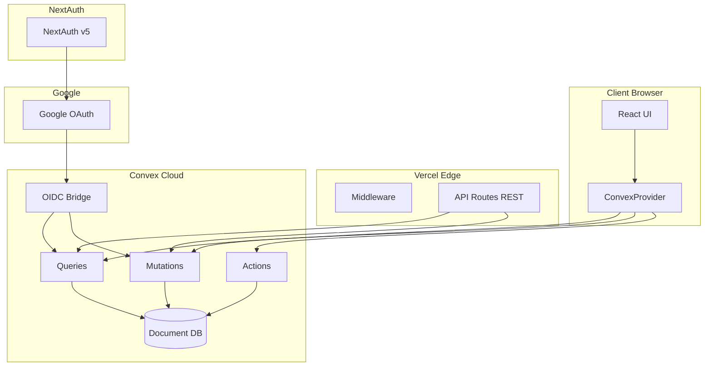

# Arquitectura del Sistema - IPU PY Tesorería

## Visión General

IPU PY Tesorería es una aplicación web moderna construida con Next.js 15 y Convex, diseñada para gestionar las finanzas de 22 iglesias de la Iglesia Pentecostal Unida del Paraguay.

## Stack Tecnológico

### Frontend
- **Framework**: Next.js 15 con App Router
- **UI Library**: React 19
- **Language**: TypeScript 5 (strict mode)
- **Styling**: Tailwind CSS 4
- **Components**: shadcn/ui + Radix UI
- **State Management**: React State + Convex React hooks (migración en progreso)
- **Data Fetching**: Convex real-time subscriptions + TanStack Query v5 (legacy)

### Backend
- **Backend Platform**: Convex (TypeScript-first serverless backend)
- **Database**: Convex Document Database
- **API Layer**: Next.js API Routes (REST wrapper sobre Convex)
- **Authentication**: NextAuth v5 con Google OAuth + Convex OIDC Bridge
- **Security**: Authorization en código (Convex functions)
- **Real-time**: Convex reactive subscriptions

### Infrastructure
- **Hosting Frontend**: Vercel (Serverless)
- **Hosting Backend**: Convex Cloud
- **CDN**: Vercel Edge Network
- **Analytics**: Vercel Analytics

## Arquitectura de Alto Nivel



## Estructura del Proyecto

```
ipupy-tesoreria/
├── src/
│   ├── app/                      # Next.js App Router
│   │   ├── admin/               # Rutas administrativas
│   │   │   └── configuration/   # Sistema de configuración
│   │   ├── api/                  # API Routes (REST wrapper)
│   │   │   ├── auth/            # NextAuth callbacks
│   │   │   │   └── [...nextauth]/
│   │   │   ├── dashboard/       # Dashboard data
│   │   │   ├── churches/        # Church endpoints
│   │   │   ├── reports/         # Monthly reports
│   │   │   ├── financial/       # Financial operations
│   │   │   │   ├── funds/
│   │   │   │   └── transactions/
│   │   │   ├── fund-events/     # Event management
│   │   │   └── admin/           # Admin operations
│   │   ├── dashboard/           # Dashboard principal
│   │   ├── churches/           # Gestión de iglesias
│   │   ├── reports/            # Informes mensuales
│   │   ├── funds/              # Gestión de fondos
│   │   ├── transactions/       # Transacciones
│   │   ├── fund-director/      # Fund director views
│   │   │   └── events/         # Event approval workflow
│   │   └── export/            # Exportación de datos
│   │   ├── layout.tsx            # Root layout
│   │   └── providers.tsx         # Context providers (NextAuth + Convex)
│   ├── components/               # Componentes React
│   │   ├── Admin/               # Componentes admin
│   │   ├── Auth/                # Autenticación
│   │   ├── Churches/            # Gestión iglesias
│   │   ├── Layout/              # Layout componentes
│   │   ├── Reports/             # Sistema informes
│   │   ├── Funds/               # Gestión fondos
│   │   ├── Export/              # Exportación
│   │   ├── Shared/              # Componentes compartidos
│   │   └── ui/                  # shadcn/ui componentes
│   ├── lib/                      # Utilidades
│   │   ├── auth.ts              # NextAuth configuration
│   │   ├── convex-server.ts     # Server-side Convex client
│   │   ├── convex-id-mapping.ts # Legacy ID compatibility
│   │   ├── cors.ts              # CORS configuration
│   │   └── rate-limit.ts        # Rate limiting
│   ├── hooks/                    # Custom hooks (TanStack Query - legacy)
│   └── types/                    # TypeScript types
├── convex/                       # Convex Backend
│   ├── schema.ts                # Database schema (TypeScript)
│   ├── auth.config.ts           # OIDC bridge configuration
│   ├── churches.ts              # Church queries/mutations
│   ├── reports.ts               # Report operations
│   ├── fundEvents.ts            # Event approval workflow
│   ├── fundTransactions.ts      # Financial transactions
│   ├── profiles.ts              # User management
│   └── _generated/             # Auto-generated (git-ignored)
├── migrations/                   # Legacy SQL migrations (historical reference)
├── public/                       # Assets estáticos
└── docs/                        # Documentación
```

## Flujo de Autenticación

### 1. Login Flow (NextAuth + Convex OIDC)

```
Usuario -> Click "Sign in with Google"
         -> NextAuth inicia OAuth flow
         -> Google valida credenciales (@ipupy.org.py)
         -> Callback a /api/auth/callback/google
         -> NextAuth crea sesión JWT
         -> JWT token enviado a Convex via OIDC bridge
         -> Convex valida token y carga perfil
         -> Redirect a dashboard
```

### 2. Session Management

- **Frontend**: NextAuth maneja sesiones con JWT tokens
- **Convex**: OIDC bridge valida tokens automáticamente
- **Backend**: Cada función Convex accede a `ctx.auth.getUserIdentity()`
- **Refresh**: NextAuth maneja refresh tokens de Google automáticamente

### 3. Autorización en Convex

```typescript
// convex/fundEvents.ts
export const approve = mutation({
  args: { id: v.id("fundEvents") },
  handler: async (ctx, { id }) => {
    // 1. Verificar autenticación
    const identity = await ctx.auth.getUserIdentity();
    if (!identity) {
      throw new Error("Not authenticated");
    }

    // 2. Cargar perfil de usuario
    const user = await ctx.db
      .query("profiles")
      .withIndex("by_email", (q) => q.eq("email", identity.email))
      .unique();

    if (!user) {
      throw new Error("User profile not found");
    }

    // 3. Verificar permisos por rol
    if (!["admin", "treasurer", "national_treasurer"].includes(user.role)) {
      throw new Error("Unauthorized: Only treasurers can approve events");
    }

    // 4. Realizar operación autorizada
    const event = await ctx.db.get(id);
    if (!event) {
      throw new Error("Event not found");
    }

    await ctx.db.patch(id, {
      status: "approved",
      approvedBy: user._id,
      approvedAt: Date.now(),
    });

    return event;
  },
});
```

## Base de Datos (Convex)

### Schema TypeScript (convex/schema.ts)

#### Collection: profiles

```typescript
profiles: defineTable({
  email: v.string(),
  fullName: v.optional(v.string()),
  role: v.union(
    v.literal("admin"),
    v.literal("national_treasurer"),
    v.literal("fund_director"),
    v.literal("pastor"),
    v.literal("treasurer"),
    v.literal("church_manager"),
    v.literal("secretary")
  ),
  churchId: v.optional(v.id("churches")),
  supabase_id: v.optional(v.string()), // Legacy compatibility
  isActive: v.boolean(),
  isAuthenticated: v.boolean(),
  onboardingStep: v.number(),
  lastSeenAt: v.optional(v.number()),
  createdAt: v.number(),
  updatedAt: v.number(),
})
.index("by_email", ["email"])
.index("by_church", ["churchId"])
.index("by_supabase_id", ["supabase_id"])
```

#### Collection: churches

```typescript
churches: defineTable({
  name: v.string(),
  city: v.string(),
  pastor: v.string(),
  cedula: v.optional(v.string()),
  grado: v.optional(v.string()),
  posicion: v.optional(v.string()),
  supabase_id: v.number(), // Legacy compatibility
  createdAt: v.number(),
  updatedAt: v.number(),
})
.index("by_name", ["name"])
.index("by_supabase_id", ["supabase_id"])
```

#### Collection: monthlyReports

```typescript
monthlyReports: defineTable({
  churchId: v.id("churches"),
  month: v.number(), // 1-12
  year: v.number(),
  diezmos: v.number(),
  ofrendas: v.number(),
  fondoNacional: v.number(),
  honorariosPastorales: v.number(),
  totalEntradas: v.number(),
  totalSalidas: v.number(),
  saldoMes: v.number(),
  numeroDeposito: v.optional(v.string()),
  fechaDeposito: v.optional(v.string()), // ISO date string
  status: v.union(
    v.literal("draft"),
    v.literal("submitted"),
    v.literal("approved")
  ),
  submissionSource: v.optional(v.string()),
  manualReportSource: v.optional(v.string()),
  manualReportNotes: v.optional(v.string()),
  enteredBy: v.id("profiles"),
  enteredAt: v.number(),
  approvedBy: v.optional(v.id("profiles")),
  approvedAt: v.optional(v.number()),
  supabase_id: v.optional(v.number()), // Legacy compatibility
  createdAt: v.number(),
  updatedAt: v.number(),
})
.index("by_church", ["churchId"])
.index("by_date", ["year", "month"])
.index("by_church_date", ["churchId", "year", "month"])
.index("by_status", ["status"])
```

#### Collection: fundEvents

```typescript
fundEvents: defineTable({
  fundId: v.id("funds"),
  churchId: v.optional(v.id("churches")), // Optional for national events
  eventName: v.string(),
  eventDate: v.string(), // ISO date
  description: v.optional(v.string()),
  status: v.union(
    v.literal("draft"),
    v.literal("submitted"),
    v.literal("approved"),
    v.literal("rejected")
  ),

  // Budget planning
  budgetItems: v.array(v.object({
    description: v.string(),
    estimatedAmount: v.number(),
    category: v.string(),
  })),
  totalBudget: v.number(),

  // Actual results (after event)
  actualItems: v.optional(v.array(v.object({
    description: v.string(),
    actualAmount: v.number(),
    category: v.string(),
    receiptNumber: v.optional(v.string()),
  }))),
  totalActual: v.optional(v.number()),

  // Workflow
  createdBy: v.id("profiles"),
  submittedBy: v.optional(v.id("profiles")),
  submittedAt: v.optional(v.number()),
  approvedBy: v.optional(v.id("profiles")),
  approvedAt: v.optional(v.number()),
  rejectedBy: v.optional(v.id("profiles")),
  rejectedAt: v.optional(v.number()),
  rejectionReason: v.optional(v.string()),

  supabase_id: v.optional(v.number()),
  createdAt: v.number(),
  updatedAt: v.number(),
})
.index("by_fund", ["fundId"])
.index("by_church", ["churchId"])
.index("by_status", ["status"])
.index("by_date", ["eventDate"])
```

#### Collection: systemConfiguration

```typescript
systemConfiguration: defineTable({
  section: v.string(),
  key: v.string(),
  value: v.any(), // JSON-compatible value
  updatedBy: v.id("profiles"),
  updatedAt: v.number(),
  createdAt: v.number(),
})
.index("by_section_key", ["section", "key"])
```

### Authorization Pattern

Convex no usa Row Level Security (RLS) como PostgreSQL. En su lugar, la autorización se implementa en código dentro de cada función:

```typescript
// Helper function para verificar permisos
async function requireRole(
  ctx: QueryCtx | MutationCtx,
  allowedRoles: string[]
): Promise<Profile> {
  const identity = await ctx.auth.getUserIdentity();
  if (!identity) {
    throw new Error("Not authenticated");
  }

  const user = await ctx.db
    .query("profiles")
    .withIndex("by_email", (q) => q.eq("email", identity.email))
    .unique();

  if (!user) {
    throw new Error("User not found");
  }

  if (!allowedRoles.includes(user.role)) {
    throw new Error(`Unauthorized: requires one of ${allowedRoles.join(", ")}`);
  }

  return user;
}

// Uso en queries
export const listChurches = query({
  handler: async (ctx) => {
    const user = await requireRole(ctx, ["admin", "pastor", "treasurer"]);

    // Filtrar por iglesia si no es admin
    if (user.role !== "admin" && user.churchId) {
      const church = await ctx.db.get(user.churchId);
      return church ? [church] : [];
    }

    // Admin ve todas
    return await ctx.db.query("churches").collect();
  },
});
```

## API Architecture

### REST API Routes (Compatibility Layer)

Las rutas REST en Next.js actúan como un wrapper sobre Convex para compatibilidad con el código existente:

```typescript
// src/app/api/churches/route.ts
import { NextRequest, NextResponse } from 'next/server';
import { getServerSession } from 'next-auth';
import { authOptions } from '@/lib/auth';
import { ConvexHttpClient } from 'convex/browser';
import { api } from '@/convex/_generated/api';

export async function GET(request: NextRequest) {
  try {
    // 1. Verificar sesión NextAuth
    const session = await getServerSession(authOptions);

    if (!session?.user?.email) {
      return NextResponse.json(
        { error: 'Unauthorized' },
        { status: 401 }
      );
    }

    // 2. Inicializar cliente Convex HTTP
    const client = new ConvexHttpClient(process.env['CONVEX_URL']!);

    // 3. Llamar función Convex
    // La autenticación se maneja via OIDC bridge automáticamente
    const churches = await client.query(api.churches.list);

    // 4. Mapear respuesta si es necesario (legacy ID compatibility)
    const response = NextResponse.json({
      success: true,
      data: churches,
    });

    return response;
  } catch (error) {
    console.error('API Error:', error);
    return NextResponse.json(
      { error: 'Internal server error' },
      { status: 500 }
    );
  }
}
```

### Direct Convex Client Usage (Preferred)

Para nuevas funcionalidades, se recomienda usar Convex React directamente:

```typescript
// components/Churches/ChurchList.tsx
import { useQuery } from "convex/react";
import { api } from "@/convex/_generated/api";

export function ChurchList() {
  // Real-time subscription - actualiza automáticamente
  const churches = useQuery(api.churches.list);

  if (churches === undefined) {
    return <LoadingSpinner />;
  }

  return (
    <ul>
      {churches.map((church) => (
        <li key={church._id}>{church.name}</li>
      ))}
    </ul>
  );
}
```

### Respuesta Estándar

API Routes mantienen este formato para compatibilidad:

```json
{
  "success": true,
  "data": {},
  "error": null
}
```

Convex functions retornan datos directamente:

```typescript
// Convex query retorna array directo
export const list = query({
  handler: async (ctx) => {
    return await ctx.db.query("churches").collect();
  },
});
```

## Patterns de Convex

### Queries (Lectura)

```typescript
// convex/reports.ts
export const getMonthlyReport = query({
  args: {
    churchId: v.id("churches"),
    year: v.number(),
    month: v.number(),
  },
  handler: async (ctx, { churchId, year, month }) => {
    const user = await requireAuth(ctx);

    // Verificar acceso
    if (user.role !== "admin" && user.churchId !== churchId) {
      throw new Error("Unauthorized");
    }

    return await ctx.db
      .query("monthlyReports")
      .withIndex("by_church_date", (q) =>
        q.eq("churchId", churchId).eq("year", year).eq("month", month)
      )
      .unique();
  },
});
```

### Mutations (Escritura)

```typescript
// convex/reports.ts
export const submitReport = mutation({
  args: {
    id: v.id("monthlyReports"),
  },
  handler: async (ctx, { id }) => {
    const user = await requireRole(ctx, ["treasurer", "admin"]);

    const report = await ctx.db.get(id);
    if (!report) {
      throw new Error("Report not found");
    }

    // Verificar acceso
    if (user.role !== "admin" && report.churchId !== user.churchId) {
      throw new Error("Unauthorized");
    }

    await ctx.db.patch(id, {
      status: "submitted",
      submittedBy: user._id,
      submittedAt: Date.now(),
    });

    // Audit log
    await ctx.db.insert("userActivity", {
      userId: user._id,
      action: "report.submit",
      details: { reportId: id },
      timestamp: Date.now(),
    });

    return await ctx.db.get(id);
  },
});
```

### Actions (External APIs)

```typescript
// convex/actions.ts
import { action } from "./_generated/server";
import { v } from "convex/values";

export const sendEmailNotification = action({
  args: {
    to: v.string(),
    subject: v.string(),
    body: v.string(),
  },
  handler: async (ctx, { to, subject, body }) => {
    // Actions pueden llamar APIs externas
    const response = await fetch("https://api.sendgrid.com/v3/mail/send", {
      method: "POST",
      headers: {
        "Authorization": `Bearer ${process.env.SENDGRID_API_KEY}`,
        "Content-Type": "application/json",
      },
      body: JSON.stringify({
        personalizations: [{ to: [{ email: to }] }],
        from: { email: "noreply@ipupy.org.py" },
        subject,
        content: [{ type: "text/plain", value: body }],
      }),
    });

    if (!response.ok) {
      throw new Error("Failed to send email");
    }

    return { success: true };
  },
});
```

## Real-time Updates

Convex proporciona subscripciones reactivas automáticas:

```typescript
// Component se actualiza automáticamente cuando cambia la data
export function Dashboard() {
  const reports = useQuery(api.reports.listRecent);
  const churches = useQuery(api.churches.list);

  // Si otro usuario crea un reporte, este componente se actualiza automáticamente
  // No se requiere polling ni WebSocket manual

  return (
    <div>
      <h2>Recent Reports ({reports?.length ?? 0})</h2>
      {/* ... */}
    </div>
  );
}
```

## Migration Status

Ver [CONVEX_MIGRATION_PLAN.md](./CONVEX_MIGRATION_PLAN.md) para el estado completo de la migración.

**Fases completadas:**
- ✅ Phase 4: API Routes migradas a Convex
- ✅ Phase 6: NextAuth + Google OAuth + OIDC bridge

**En progreso:**
- ⏳ Phase 5: Frontend migration (TanStack Query → Convex React)

## Security Best Practices

1. **Always verify authentication**: Usar `ctx.auth.getUserIdentity()` en cada función
2. **Check role permissions**: Verificar roles antes de operaciones sensibles
3. **Validate inputs**: Usar Convex validators (`v.*`) en args
4. **Audit logging**: Registrar acciones importantes en `userActivity`
5. **Rate limiting**: Implementar en API routes si es necesario
6. **Environment variables**: Nunca exponer secrets en client code

## Performance Considerations

- **Indexes**: Definir índices para queries frecuentes
- **Pagination**: Usar `.paginate()` para grandes datasets
- **Caching**: Convex cachea query results automáticamente
- **Real-time**: Subscripciones son más eficientes que polling

## References

- [Convex Documentation](https://docs.convex.dev)
- [NextAuth v5 Documentation](https://next-auth.js.org)
- [Next.js 15 Documentation](https://nextjs.org/docs)
- [CONVEX_MIGRATION_PLAN.md](./CONVEX_MIGRATION_PLAN.md)
- [Arquitectura Propuesta](./Arquitectura%20propuesta%20(Next.js%2015%20+%20Vercel%20+%20Convex).md)
