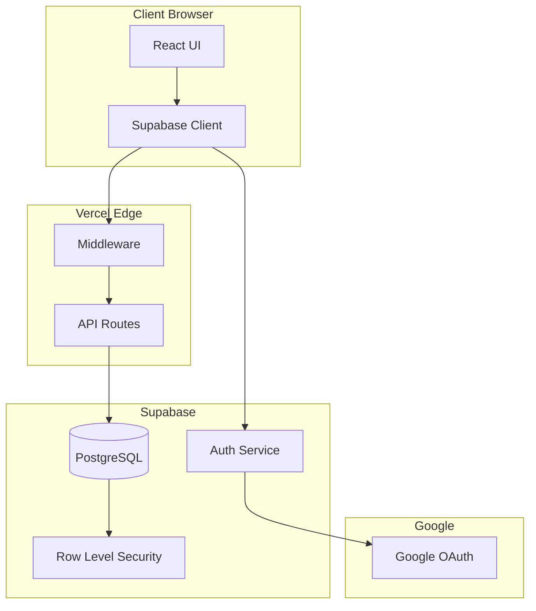

# Arquitectura del Sistema - IPU PY Tesorería

## Visión General

IPU PY Tesorería es una aplicación web moderna construida con Next.js 15 y Supabase, diseñada para gestionar las finanzas de 22 iglesias de la Iglesia Pentecostal Unida del Paraguay.

## Stack Tecnológico

### Frontend
- **Framework**: Next.js 15 con App Router
- **UI Library**: React 19
- **Language**: TypeScript 5
- **Styling**: Tailwind CSS 4
- **Components**: shadcn/ui + Radix UI
- **State Management**: React State + Custom hooks
- **Data Fetching**: TanStack Query v5

### Backend
- **API**: Next.js API Routes (Serverless Functions)
- **Database**: PostgreSQL (via Supabase)
- **Authentication**: Supabase Auth con Google OAuth + Magic Link
- **Database Layer**: Custom connection pooling with RLS context
- **Security**: Row Level Security (RLS) + Role-based access control

### Infrastructure
- **Hosting**: Vercel (Serverless)
- **Database Provider**: Supabase
- **CDN**: Vercel Edge Network
- **Analytics**: Vercel Analytics

## Arquitectura de Alto Nivel



## Estructura del Proyecto

```
ipupy-tesoreria/
├── src/
│   ├── app/                      # Next.js App Router
│   │   ├── admin/               # Rutas administrativas
│   │   │   └── configuration/   # Sistema de configuración
│   │   ├── auth/
│   │   │   └── callback/        # OAuth callback
│   │   ├── dashboard/           # Dashboard principal
│   │   ├── churches/           # Gestión de iglesias
│   │   ├── reports/            # Informes mensuales
│   │   ├── funds/              # Gestión de fondos
│   │   ├── transactions/       # Transacciones
│   │   ├── reconciliation/     # Reconciliación contable
│   │   ├── ledger/            # Libro mayor
│   │   └── export/            # Exportación de datos
│   │   ├── api/                  # API Routes
│   │   │   ├── dashboard/
│   │   │   ├── dashboard-init/
│   │   │   ├── churches/
│   │   │   ├── reports/
│   │   │   ├── admin/           # Rutas administrativas
│   │   │   │   ├── configuration/ # API configuración
│   │   │   │   ├── reports/
│   │   │   │   ├── funds/
│   │   │   │   └── transactions/
│   │   │   ├── financial/
│   │   │   │   ├── funds/
│   │   │   │   ├── transactions/
│   │   │   │   └── fund-movements/
│   │   │   ├── accounting/
│   │   │   ├── donors/
│   │   │   ├── people/
│   │   │   ├── worship-records/
│   │   │   └── data/
│   │   ├── layout.tsx            # Root layout
│   │   └── providers.tsx         # Context providers
│   ├── components/               # Componentes React
│   │   ├── Admin/               # Componentes admin
│   │   ├── Auth/                # Autenticación
│   │   ├── Churches/            # Gestión iglesias
│   │   ├── Layout/              # Layout componentes
│   │   ├── Reports/             # Sistema informes
│   │   ├── LibroMensual/        # Libro mensual
│   │   ├── Funds/               # Gestión fondos
│   │   ├── Export/              # Exportación
│   │   ├── Shared/              # Componentes compartidos
│   │   └── ui/                  # shadcn/ui componentes
│   ├── lib/                      # Utilidades
│   │   ├── supabase/            # Cliente Supabase
│   │   │   ├── client.ts
│   │   │   ├── server.ts
│   │   │   └── middleware.ts
│   │   ├── auth-context.ts      # Contexto de auth
│   │   ├── db.ts                # Database layer mejorado
│   │   ├── db-admin.ts          # Admin DB utilities
│   │   ├── cors.ts              # CORS configuration
│   │   ├── rate-limit.ts        # Rate limiting
│   │   └── env-validation.ts    # Environment validation
│   ├── hooks/                    # Custom hooks
│   └── types/                    # TypeScript types
├── migrations/                   # SQL migrations
├── public/                       # Assets estáticos
└── docs/                        # Documentación
```

## Flujo de Autenticación

### 1. Login Flow
```
Usuario -> Click "Sign in with Google"
         -> Redirect a Google OAuth
         -> Callback a /auth/callback
         -> Supabase verifica token
         -> Trigger crea/actualiza profile
         -> Redirect a dashboard
```

### 2. Session Management
- Las sesiones se manejan via cookies httpOnly
- Supabase maneja refresh tokens automáticamente
- Middleware verifica sesión en cada request

### 3. Autorización
```typescript
// Verificación en middleware
if (pathname.startsWith('/api')) {
  const session = await getSession()
  if (!session) return unauthorized()
}

// Verificación en API routes
const context = await requireAuth(request)
if (context.role !== 'admin') {
  return forbidden()
}
```

## Base de Datos

### Esquema Principal

#### Tabla: profiles
```sql
CREATE TABLE profiles (
  id UUID PRIMARY KEY,              -- Linked to auth.users
  email TEXT NOT NULL,
  full_name TEXT,
  role TEXT CHECK (role IN ('admin', 'national_treasurer', 'fund_director', 'pastor', 'treasurer', 'church_manager', 'secretary')),  -- 7 roles (migrations 023, 026, 037, 040)
  church_id INTEGER,
  is_active BOOLEAN DEFAULT true,
  is_authenticated BOOLEAN DEFAULT false,
  onboarding_step INTEGER DEFAULT 0,
  last_seen_at TIMESTAMPTZ,
  created_at TIMESTAMPTZ DEFAULT now(),
  updated_at TIMESTAMPTZ DEFAULT now()
)
```

#### Tabla: churches
```sql
CREATE TABLE churches (
  id SERIAL PRIMARY KEY,
  name TEXT NOT NULL,
  city TEXT,
  pastor TEXT,
  cedula TEXT,
  grado TEXT,
  posicion TEXT
)
```

#### Tabla: monthly_reports
```sql
CREATE TABLE monthly_reports (
  id SERIAL PRIMARY KEY,
  church_id INTEGER REFERENCES churches(id),
  month INTEGER CHECK (month BETWEEN 1 AND 12),
  year INTEGER,
  diezmos DECIMAL DEFAULT 0,
  ofrendas DECIMAL DEFAULT 0,
  fondo_nacional DECIMAL DEFAULT 0,
  honorarios_pastorales DECIMAL DEFAULT 0,
  total_entradas DECIMAL DEFAULT 0,
  total_salidas DECIMAL DEFAULT 0,
  saldo_mes DECIMAL DEFAULT 0,
  numero_deposito TEXT,
  fecha_deposito DATE,
  status TEXT DEFAULT 'draft',
  submission_source TEXT,
  manual_report_source TEXT,
  manual_report_notes TEXT,
  entered_by UUID REFERENCES profiles(id),
  entered_at TIMESTAMPTZ DEFAULT now(),
  approved_by UUID REFERENCES profiles(id),
  approved_at TIMESTAMPTZ,
  created_at TIMESTAMPTZ DEFAULT now(),
  updated_at TIMESTAMPTZ DEFAULT now(),
  UNIQUE(church_id, month, year)
)
```

#### Tabla: system_configuration (Nueva)
```sql
CREATE TABLE system_configuration (
  id SERIAL PRIMARY KEY,
  section TEXT NOT NULL,
  key TEXT NOT NULL,
  value JSONB NOT NULL,
  updated_by UUID REFERENCES profiles(id),
  updated_at TIMESTAMPTZ DEFAULT NOW(),
  created_at TIMESTAMPTZ DEFAULT NOW(),
  UNIQUE(section, key)
)
```

### Row Level Security (RLS)

Todas las tablas tienen RLS habilitado con contexto de usuario mejorado:

```sql
-- Context functions (set by application before queries)
CREATE OR REPLACE FUNCTION app_current_user_id()
RETURNS UUID
LANGUAGE SQL
STABLE
AS $$
  SELECT COALESCE(
    NULLIF(current_setting('app.current_user_id', true), ''),
    '00000000-0000-0000-0000-000000000000'
  )::UUID;
$$;

CREATE OR REPLACE FUNCTION app_current_user_role()
RETURNS TEXT
LANGUAGE SQL
STABLE
AS $$
  SELECT COALESCE(current_setting('app.current_user_role', true), '');
$$;

-- Admin check function (simplified roles)
CREATE OR REPLACE FUNCTION app_user_is_admin()
RETURNS BOOLEAN
LANGUAGE SQL
STABLE
AS $$
  SELECT app_current_user_role() = 'admin';
$$;

-- RLS policies using context
CREATE POLICY "profiles_access" ON profiles
  FOR ALL TO authenticated
  USING (
    app_user_is_admin() OR
    id = app_current_user_id() OR
    (app_current_user_role() IN ('pastor', 'treasurer', 'secretary')
     AND church_id = app_current_user_church_id())
  );

CREATE POLICY "monthly_reports_access" ON monthly_reports
  FOR ALL TO authenticated
  USING (
    app_user_is_admin() OR
    church_id = app_current_user_church_id()
  );
```

## API Architecture

### Estructura de API Routes

```typescript
// src/app/api/churches/route.ts
import { getAuthContext } from '@/lib/auth-context';
import { executeWithContext, executeTransaction } from '@/lib/db';
import { setCORSHeaders } from '@/lib/cors';

export async function GET(request: NextRequest) {
  try {
    const auth = await getAuthContext(request);

    if (!auth) {
      const response = NextResponse.json({ error: 'Unauthorized' }, { status: 401 });
      setCORSHeaders(response);
      return response;
    }

    // Use executeWithContext for RLS enforcement
    const result = await executeWithContext(
      auth,
      'SELECT * FROM churches ORDER BY name',
      []
    );

    const response = NextResponse.json({
      success: true,
      data: result.rows
    });

    setCORSHeaders(response);
    return response;
  } catch (error) {
    console.error('API Error:', error);
    const response = NextResponse.json(
      { error: 'Internal server error' },
      { status: 500 }
    );
    setCORSHeaders(response);
    return response;
  }
}

// Transaction example for complex operations
export async function POST(request: NextRequest) {
  try {
    const auth = await getAuthContext(request);
    const body = await request.json();

    await executeTransaction(auth, async (client) => {
      // Multiple related operations in single transaction
      const report = await client.query(
        'INSERT INTO monthly_reports (...) VALUES (...) RETURNING id',
        [...]
      );

      await client.query(
        'UPDATE fund_balances SET balance = balance + $1 WHERE ...',
        [...]
      );

      await client.query(
        'INSERT INTO user_activity (...) VALUES (...)',
        [auth.userId, 'report.create', JSON.stringify({ reportId: report.rows[0].id })]
      );
    });

    const response = NextResponse.json({ success: true });
    setCORSHeaders(response);
    return response;
  } catch (error) {
    console.error('Transaction Error:', error);
    const response = NextResponse.json(
      { error: 'Transaction failed' },
      { status: 500 }
    );
    setCORSHeaders(response);
    return response;
  }
}
```

### Respuesta Estándar

```json
{
  "success": true,
  "data": {},
  "error": null,
  "metadata": {
    "timestamp": "2025-09-23T10:00:00Z",
    "version": "1.0.0"
  }
}
```

### Error Handling

```json
{
  "success": false,
  "data": null,
  "error": {
    "code": "UNAUTHORIZED",
    "message": "Autenticación requerida",
    "details": {}
  }
}
```

## Seguridad

### Capas de Seguridad

1. **Autenticación**: Google OAuth + Magic Link via Supabase
2. **Autorización**: Sistema de 7 roles jerárquicos (admin, national_treasurer, fund_director, pastor, treasurer, church_manager, secretary)
3. **Database**: Row Level Security con contexto de usuario mejorado
4. **API**: executeWithContext para RLS + CORS estricto
5. **Frontend**: Protected routes + role-based UI
6. **Network**: HTTPS only + Rate limiting
7. **Configuration**: Sistema de configuración con auditoria

### Políticas de Seguridad

- Dominio restringido: @ipupy.org.py
- Sesiones con timeout de 7 días
- Tokens almacenados en httpOnly cookies
- CORS habilitado solo para dominio propio
- Rate limiting en API routes

## Performance

### Optimizaciones

1. **Server Components**: Renderizado en servidor por defecto
2. **Static Generation**: Páginas estáticas donde sea posible
3. **Edge Runtime**: Middleware ejecuta en edge
4. **Database Pooling**: Custom connection pooling with health monitoring
5. **Transaction Management**: ACID compliance for complex operations
6. **Image Optimization**: Next.js Image component
7. **Code Splitting**: Automático via Next.js

### Caching Strategy

```typescript
// Datos estáticos (24h)
export const revalidate = 86400;

// Datos dinámicos (1h)
export const revalidate = 3600;

// Real-time
export const revalidate = 0;
```

## Deployment Architecture

### Environments

1. **Development**: localhost:3000
2. **Preview**: Vercel preview deployments
3. **Production**: ipupytesoreria.vercel.app

### CI/CD Pipeline

```
GitHub Push -> Vercel Build -> Tests -> Deploy
             -> Preview (PR)
             -> Production (main)
```

### Environment Variables

- `NEXT_PUBLIC_*`: Disponibles en cliente
- `SUPABASE_*`: Solo servidor
- `GOOGLE_*`: OAuth credentials

## Monitoring

### Métricas Clave

- **Uptime**: 99.9% SLA
- **Response Time**: <200ms p95
- **Error Rate**: <0.1%
- **Database Queries**: <100ms p95

### Logging

```typescript
// Activity logging
await logActivity('report_created', {
  churchId,
  month,
  year
});
```

## Escalabilidad

### Diseño para Escala

1. **Serverless Functions**: Auto-scaling
2. **Database Pooling**: Conexiones optimizadas
3. **CDN**: Assets en edge locations
4. **Lazy Loading**: Componentes bajo demanda
5. **Pagination**: Límites en queries

### Límites Actuales

- 22 iglesias (extensible)
- 1000 usuarios concurrentes
- 10GB database storage
- 100GB bandwidth/month

## Decisiones de Diseño

### Por qué Next.js 15?
- App Router para mejor DX
- Server Components para performance
- Built-in API routes
- Excelente soporte TypeScript

### Por qué Supabase?
- PostgreSQL robusto
- Auth integrado
- RLS para seguridad
- Real-time capabilities
- Excelente DX

### Por qué Vercel?
- Integración perfecta con Next.js
- Deploy automático
- Edge network global
- Analytics integrado

## Mejoras Recientes (v2.0)

### Sistema de Configuración Administrable
- **Admin Configuration Panel**: Sistema completo de configuración por secciones
- **Database Storage**: Configuración almacenada en `system_configuration` con JSONB
- **Audit Trail**: Registro de cambios de configuración con `user_activity`
- **Type Safety**: TypeScript types completos para todas las configuraciones

### Arquitectura de Base de Datos Mejorada
- **executeWithContext**: Ejecución segura con contexto RLS
- **executeTransaction**: Soporte completo para transacciones ACID
- **Connection Pooling**: Pool de conexiones con monitoreo de salud
- **Error Resilience**: Retry logic con backoff exponencial

### Sistema de Roles (Migrations 023, 026, 037, 040)
- **7 roles jerárquicos**: admin, national_treasurer, fund_director, pastor, treasurer, church_manager, secretary
- **Migration 023**: Simplificación inicial de 8 a 6 roles
- **Migration 026**: Agregado fund_director para gestión de fondos
- **Migration 037**: Eliminados roles obsoletos (district_supervisor, member)
- **Migration 040**: Agregado national_treasurer para supervisión nacional
- **Role Hierarchy**: Sistema jerárquico con niveles 1-7 (get_role_level())
- **Permission Matrix**: Tabla `role_permissions` con 44 permisos totales
- **Branded Types**: ProfileRole type en TypeScript para type safety

### Seguridad Mejorada
- **RLS Context Fix**: Corrección crítica del fallback de roles
- **CORS Security**: Restricción estricta de dominios permitidos
- **Rate Limiting**: Protección contra abuso de API
- **Environment Validation**: Validación de variables de entorno críticas

### Experiencia de Usuario
- **shadcn/ui Migration**: Componentes modernos con Radix UI
- **TanStack Query v5**: Migration completa con placeholderData
- **Type Safety**: Mejoras en TypeScript en toda la aplicación
- **Error Boundaries**: Manejo robusto de errores en UI

## Futuras Mejoras (v3.0)

1. **Real-time Updates**: Usar Supabase Realtime para actualizaciones en tiempo real
2. **Mobile App**: React Native con mismo backend
3. **Offline Support**: PWA capabilities con sync
4. **Multi-tenancy**: Soportar múltiples organizaciones
5. **Advanced Analytics**: Dashboard con gráficos interactivos
6. **Backup Automation**: Backups programados con recuperación point-in-time
7. **Audit Dashboard**: Visualización completa de auditoría
8. **API Versioning**: Versionado de API para compatibilidad
9. **Read Replicas**: Separación read/write para mejor performance
10. **Monitoring**: Sistema completo de monitoreo y alertas

## Contacto Técnico

Para consultas sobre la arquitectura:
- Email: administracion@ipupy.org.py
- GitHub: @anthonybirhouse