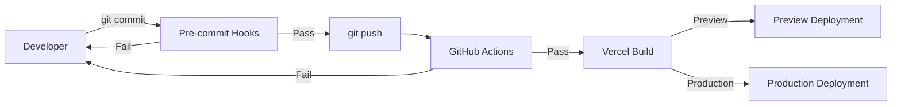
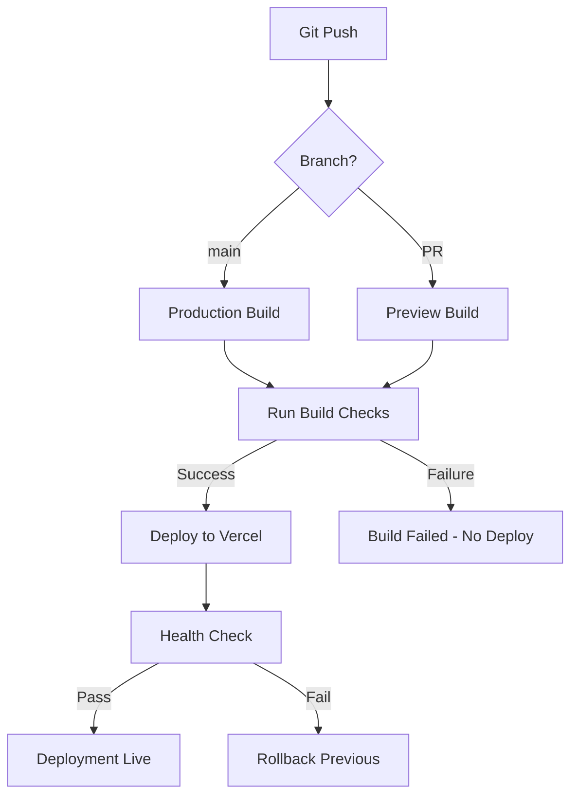

# CI/CD Pipeline - IPU PY Tesorería

## Overview

IPU PY Tesorería uses a multi-layered CI/CD pipeline with **local pre-commit hooks**, **GitHub Actions**, and **Vercel automatic deployments** to ensure code quality and production stability.

## Pipeline Architecture



## Local Pre-Commit Validation

### Husky Configuration

**Location**: `.husky/pre-commit`

```bash
#!/usr/bin/env sh
. "$(dirname -- "$0")/_/husky.sh"

# TypeScript compilation check
npm run typecheck

# ESLint with zero warnings
npm run lint:strict
```

### Validation Steps

1. **TypeScript Compilation** (`npm run typecheck`)
   ```bash
   npx tsc --noEmit
   ```
   - Checks all TypeScript files for type errors
   - No output = success
   - Uses strict mode configuration
   - Blocks commit if errors found

2. **ESLint Strict Mode** (`npm run lint:strict`)
   ```bash
   npx eslint . --ext .js,.jsx,.ts,.tsx --max-warnings 0
   ```
   - Zero warnings tolerance
   - Enforces code style consistency
   - Checks for common bugs
   - Blocks commit if warnings exist

### Pre-Commit Checklist

Commits are **blocked** if:

- ❌ TypeScript compilation errors exist
- ❌ ESLint warnings exist (even minor ones)
- ❌ `any` type used without `// TODO(type-cleanup)` comment
- ❌ Missing return types on exported functions
- ❌ `useState()` without explicit generic type

Commits **succeed** if:

- ✅ All TypeScript files compile successfully
- ✅ ESLint returns zero warnings
- ✅ All strict mode checks pass

### Bypassing Pre-Commit (Emergency Only)

**⚠️ NOT RECOMMENDED** - Only for emergency hotfixes:

```bash
git commit --no-verify -m "emergency: critical production fix"
```

**Requirements for --no-verify commits**:
- Must include "emergency:" prefix in commit message
- Must create follow-up issue to fix validation
- Must notify team in Slack/email
- Must fix validation errors within 24 hours

## GitHub Actions (Future)

**Status**: Not yet implemented

**Planned Configuration**: `.github/workflows/ci.yml`

```yaml
name: CI Pipeline

on:
  push:
    branches: [ main, develop ]
  pull_request:
    branches: [ main ]

jobs:
  typecheck:
    runs-on: ubuntu-latest
    steps:
      - uses: actions/checkout@v3
      - uses: actions/setup-node@v3
        with:
          node-version: '20'
          cache: 'npm'
      - run: npm ci
      - run: npm run typecheck

  lint:
    runs-on: ubuntu-latest
    steps:
      - uses: actions/checkout@v3
      - uses: actions/setup-node@v3
        with:
          node-version: '20'
          cache: 'npm'
      - run: npm ci
      - run: npm run lint:strict

  build:
    runs-on: ubuntu-latest
    needs: [typecheck, lint]
    steps:
      - uses: actions/checkout@v3
      - uses: actions/setup-node@v3
        with:
          node-version: '20'
          cache: 'npm'
      - run: npm ci
      - run: npm run build
      - uses: actions/upload-artifact@v3
        with:
          name: build-output
          path: .next/

  test:
    runs-on: ubuntu-latest
    needs: [typecheck, lint]
    steps:
      - uses: actions/checkout@v3
      - uses: actions/setup-node@v3
        with:
          node-version: '20'
          cache: 'npm'
      - run: npm ci
      - run: npm test  # When tests are implemented
```

### Planned CI Checks

| Check | Tool | Purpose | Blocking |
|-------|------|---------|----------|
| **TypeScript** | `tsc --noEmit` | Type safety | ✅ Yes |
| **Linting** | `eslint --max-warnings 0` | Code quality | ✅ Yes |
| **Build** | `npm run build` | Production build | ✅ Yes |
| **Unit Tests** | `jest` | Logic validation | ✅ Yes |
| **E2E Tests** | `playwright` | User flows | ⚠️ Warning only |
| **Security Scan** | `npm audit` | Dependency check | ⚠️ Warning only |
| **Bundle Size** | `next-bundle-analyzer` | Performance | ℹ️ Info only |

## Vercel Deployment Pipeline

### Automatic Deployments

Vercel automatically deploys:

- **Production**: Every push to `main` branch
- **Preview**: Every pull request
- **Development**: Branch pushes (optional)

### Deployment Flow



### Vercel Build Configuration

**Location**: `vercel.json`

```json
{
  "buildCommand": "npm run build",
  "devCommand": "npm run dev",
  "installCommand": "npm install",
  "framework": "nextjs",
  "regions": ["iad1"],
  "env": {
    "NODE_ENV": "production"
  }
}
```

### Build Steps

1. **Install Dependencies**
   ```bash
   npm install
   ```

2. **Environment Variables Injection**
   - Vercel injects environment variables
   - NEXT_PUBLIC_* vars replaced at build time
   - Server-only vars available at runtime

3. **Next.js Build**
   ```bash
   npm run build
   # Runs: next build
   ```

4. **Post-Build Checks**
   - Bundle size analysis
   - Static optimization report
   - Route generation validation

5. **Deployment**
   - Upload to Vercel CDN
   - Assign deployment URL
   - Update DNS (production only)

### Environment Variables

#### Required Variables (Vercel)

```bash
# Supabase
NEXT_PUBLIC_SUPABASE_URL=https://xxx.supabase.co
NEXT_PUBLIC_SUPABASE_ANON_KEY=eyJxxx...
SUPABASE_SERVICE_KEY=eyJxxx...

# Database
DATABASE_URL=postgresql://xxx

# OAuth (Optional)
GOOGLE_CLIENT_ID=xxx.apps.googleusercontent.com
GOOGLE_CLIENT_SECRET=xxx

# System
NODE_ENV=production
```

#### Auto-Set Variables (Vercel)

```bash
VERCEL_URL=ipupytesoreria.vercel.app
VERCEL_ENV=production
VERCEL_GIT_COMMIT_SHA=abc123
VERCEL_GIT_COMMIT_MESSAGE="feat: add feature"
```

### Deployment URLs

| Environment | URL Pattern | Purpose |
|-------------|-------------|---------|
| **Production** | `ipupytesoreria.vercel.app` | Live system |
| **Preview (PR)** | `ipupytesoreria-git-{branch}-{team}.vercel.app` | PR review |
| **Preview (Branch)** | `ipupytesoreria-{hash}.vercel.app` | Branch deploy |

## Database Migrations

### Migration Strategy

**Manual via Supabase Dashboard** (current approach)

1. Write migration SQL in `migrations/0XX_description.sql`
2. Test locally with Supabase local dev
3. Apply to staging via Supabase dashboard
4. Verify in staging environment
5. Apply to production via Supabase dashboard
6. Monitor for errors

### Migration Checklist

Before applying migration:

- [ ] SQL syntax validated
- [ ] Tested on local Supabase instance
- [ ] Backup created (automatic via Supabase)
- [ ] RLS policies updated if schema changes
- [ ] Type definitions updated in `src/types/`
- [ ] Documented in `MIGRATION_GUIDE.md`

After applying migration:

- [ ] Verify tables created/modified
- [ ] Test RLS policies in Supabase dashboard
- [ ] Run smoke tests on affected features
- [ ] Monitor logs for errors
- [ ] Update documentation

### Rollback Procedure

If migration fails:

1. **Immediate Rollback**
   ```sql
   -- Run reverse migration if available
   -- migrations/0XX_description_rollback.sql
   ```

2. **Restore from Backup**
   - Use Supabase point-in-time recovery
   - Restore to timestamp before migration

3. **Communicate**
   - Notify team of rollback
   - Document issue in GitHub Issue
   - Create hotfix plan

## Deployment Monitoring

### Health Checks

**Vercel automatically checks**:
- HTTP 200 response on homepage
- No server errors in logs (first 5 minutes)
- Build completed successfully

**Manual health checks**:
```bash
# Production health
curl https://ipupytesoreria.vercel.app/api/health

# Expected response
{
  "status": "healthy",
  "timestamp": "2025-10-04T12:00:00Z",
  "database": "connected"
}
```

### Rollback Strategy

**Automatic Rollback** (Vercel):
- If deployment fails health check
- Reverts to previous successful deployment
- Notifies team via email/Slack

**Manual Rollback**:
1. Go to Vercel dashboard
2. Select "Deployments" tab
3. Find previous working deployment
4. Click "Promote to Production"

### Deployment Notifications

**Vercel sends notifications for**:
- Deployment started
- Deployment succeeded
- Deployment failed
- Health check failed

**Notification channels**:
- Email: `administracion@ipupy.org.py`
- Vercel dashboard
- GitHub commit status

## Performance Monitoring

### Build Performance

Tracked metrics:
- Build time (target: < 2 minutes)
- Bundle size (target: < 500KB initial JS)
- Static page count
- Server component ratio

### Runtime Performance

See [MONITORING.md](MONITORING.md) for detailed monitoring setup.

**Key metrics**:
- Time to First Byte (TTFB): < 200ms
- Largest Contentful Paint (LCP): < 2.5s
- First Input Delay (FID): < 100ms
- Cumulative Layout Shift (CLS): < 0.1

## Security Scanning

### Dependency Audits

```bash
# Check for vulnerabilities
npm audit

# Fix automatically fixable issues
npm audit fix

# Review remaining issues
npm audit --json > audit-report.json
```

### Scheduled Scans

**Weekly** (automated via Dependabot):
- Dependency vulnerability scan
- Pull request created for updates
- Auto-merge if tests pass

**Monthly** (manual):
- Full security audit
- Penetration testing (if applicable)
- Review user activity logs

## Secrets Management

### Environment Variable Security

**✅ Secure practices**:
- Store secrets in Vercel dashboard (encrypted)
- Never commit `.env` files
- Use `NEXT_PUBLIC_*` only for truly public vars
- Rotate credentials quarterly

**❌ Avoid**:
- Hardcoding secrets in code
- Sharing secrets via email/Slack
- Using same secrets for dev/staging/prod
- Committing `.env.local` files

### Secret Rotation

1. Generate new credentials
2. Update Vercel environment variables
3. Trigger new deployment
4. Verify deployment successful
5. Revoke old credentials
6. Document rotation in audit log

## Troubleshooting

### Build Failures

**Symptom**: Vercel build fails

**Debugging**:
1. Check Vercel build logs
2. Reproduce locally: `npm run build`
3. Check TypeScript: `npm run typecheck`
4. Check ESLint: `npm run lint:strict`

**Common causes**:
- Missing environment variables
- TypeScript errors
- Import path issues
- Dependency conflicts

### Deployment Failures

**Symptom**: Build succeeds but deployment fails

**Debugging**:
1. Check Vercel function logs
2. Test API routes locally
3. Verify database connectivity
4. Check environment variable injection

**Common causes**:
- Database connection issues
- Missing runtime environment vars
- CORS configuration
- Middleware errors

### Performance Issues

**Symptom**: Slow page loads after deployment

**Debugging**:
1. Check Vercel Analytics
2. Review bundle size
3. Analyze server function duration
4. Check database query performance

**Solutions**:
- Enable ISR (Incremental Static Regeneration)
- Optimize images with `next/image`
- Add database indexes
- Implement caching

## Future Improvements

### Planned CI/CD Enhancements

- [ ] Automated E2E testing with Playwright
- [ ] Visual regression testing
- [ ] Performance budgets enforcement
- [ ] Automated security scanning
- [ ] Database migration automation
- [ ] Staging environment setup
- [ ] Canary deployments
- [ ] A/B testing infrastructure

### Monitoring Enhancements

- [ ] Real-time error tracking (Sentry)
- [ ] Performance monitoring (Vercel Analytics Pro)
- [ ] Database query analytics
- [ ] User session recording (for debugging)

---

**Last Updated**: October 2025
