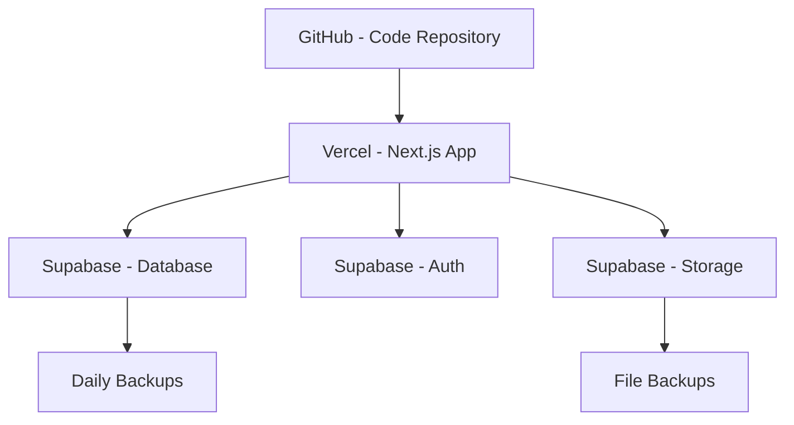
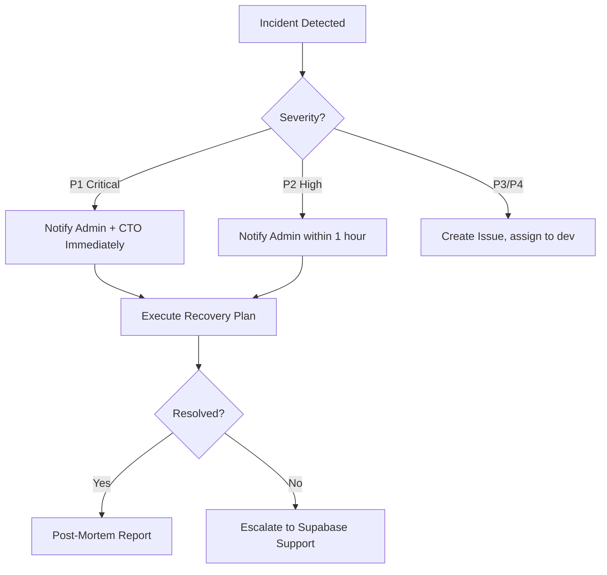

# Disaster Recovery Plan - IPU PY Tesorería

## Overview

This document outlines procedures for recovering from catastrophic failures, data loss, or system compromise in IPU PY Tesorería. The system handles sensitive financial data for 22 churches, making robust disaster recovery critical.

## Recovery Objectives

| Metric | Target | Current |
|--------|--------|---------|
| **RTO** (Recovery Time Objective) | < 4 hours | TBD |
| **RPO** (Recovery Point Objective) | < 1 hour | ~15 minutes |
| **Data Retention** | 7 years (legal requirement) | Unlimited (Supabase) |
| **Backup Frequency** | Continuous + Daily snapshots | Continuous (Supabase) |

## System Architecture

### Critical Components



**Single Points of Failure**:
1. ❌ Supabase database (CRITICAL)
2. ❌ Vercel deployment platform
3. ❌ GitHub repository
4. ⚠️ Google OAuth provider
5. ⚠️ Admin email account

## Backup Strategy

### Database Backups (Supabase)

**Automatic Backups** (Supabase Pro Plan):
- **Point-in-Time Recovery (PITR)**: Continuous WAL archiving
- **Daily Snapshots**: Full database backup every 24 hours
- **Retention**: 7 days for PITR, 30 days for snapshots
- **Storage**: Encrypted S3 buckets (Supabase-managed)

**Manual Backups** (Recommended Monthly):
```bash
# Export full database via pg_dump
pg_dump $DATABASE_URL > backup_$(date +%Y%m%d).sql

# Compress backup
gzip backup_$(date +%Y%m%d).sql

# Upload to secure storage (AWS S3, Google Cloud Storage)
aws s3 cp backup_$(date +%Y%m%d).sql.gz s3://ipupy-backups/monthly/
```

**Backup Verification** (Monthly):
```bash
# 1. Download latest backup
aws s3 cp s3://ipupy-backups/monthly/latest.sql.gz .

# 2. Restore to test database
gunzip latest.sql.gz
psql $TEST_DATABASE_URL < latest.sql

# 3. Verify critical tables
psql $TEST_DATABASE_URL -c "SELECT COUNT(*) FROM monthly_reports;"
psql $TEST_DATABASE_URL -c "SELECT COUNT(*) FROM profiles;"
psql $TEST_DATABASE_URL -c "SELECT COUNT(*) FROM churches;"

# 4. Test RLS policies
# Run test queries with different user contexts
```

### File Storage Backups (Supabase Storage)

**Automatic Backups**:
- Supabase Storage uses S3-compatible object storage
- Files replicated across availability zones
- No automatic export to external storage

**Manual File Export** (Monthly):
```bash
# Export all uploaded receipts and documents
supabase storage download --bucket receipts --dir ./backups/receipts_$(date +%Y%m%d)

# Compress and upload
tar -czf receipts_$(date +%Y%m%d).tar.gz ./backups/receipts_$(date +%Y%m%d)
aws s3 cp receipts_$(date +%Y%m%d).tar.gz s3://ipupy-backups/files/
```

### Code Repository Backups

**GitHub as Primary**:
- All code versioned in GitHub
- Protected main branch
- Required reviews for merges

**Secondary Git Remote** (Optional):
```bash
# Add secondary remote (GitLab, Bitbucket)
git remote add backup https://gitlab.com/ipupy/tesoreria.git

# Push to both remotes
git push origin main
git push backup main
```

## Disaster Scenarios & Recovery

### 1. Database Corruption/Data Loss

**Symptoms**:
- Invalid data returned from queries
- Constraint violations
- Missing records
- RLS policy failures

**Recovery Procedure**:

1. **Immediate Actions** (< 15 minutes)
   ```bash
   # 1. Identify time of last known good state
   # 2. Access Supabase dashboard
   # 3. Navigate to Database → Backups
   # 4. Select PITR restore point
   ```

2. **Point-in-Time Recovery** (15-30 minutes)
   - Select restore timestamp (before corruption)
   - Create new database from restore point
   - Verify data integrity
   - Update DATABASE_URL in Vercel
   - Redeploy application

3. **Verification** (30-45 minutes)
   ```bash
   # Test critical queries
   psql $NEW_DATABASE_URL << EOF
   SELECT COUNT(*) FROM monthly_reports;
   SELECT COUNT(*) FROM profiles WHERE is_active = true;
   SELECT SUM(amount) FROM fund_transactions WHERE created_at > NOW() - INTERVAL '1 month';
   EOF
   ```

4. **Resume Operations** (45-60 minutes)
   - Update Vercel environment variable
   - Trigger deployment
   - Notify users of brief downtime
   - Monitor for issues

**Estimated RTO**: 1-2 hours
**Estimated RPO**: < 15 minutes (PITR granularity)

### 2. Complete Database Loss

**Symptoms**:
- Supabase project deleted
- Database unreachable
- All connection attempts fail

**Recovery Procedure**:

1. **Create New Supabase Project** (0-15 minutes)
   ```bash
   # 1. Create project in Supabase dashboard
   # 2. Note new DATABASE_URL and credentials
   # 3. Configure project settings
   ```

2. **Restore from Latest Backup** (15-45 minutes)
   ```bash
   # Download latest backup
   aws s3 cp s3://ipupy-backups/monthly/latest.sql.gz .
   gunzip latest.sql.gz

   # Restore to new database
   psql $NEW_DATABASE_URL < latest.sql

   # Apply any missing migrations
   for file in migrations/*.sql; do
     psql $NEW_DATABASE_URL < $file
   done
   ```

3. **Reconfigure Application** (45-60 minutes)
   ```bash
   # Update Vercel environment variables
   vercel env add DATABASE_URL production
   vercel env add NEXT_PUBLIC_SUPABASE_URL production
   vercel env add NEXT_PUBLIC_SUPABASE_ANON_KEY production
   vercel env add SUPABASE_SERVICE_KEY production

   # Redeploy
   vercel --prod
   ```

4. **Verify and Monitor** (60-90 minutes)
   - Test login functionality
   - Verify data accessibility
   - Check RLS policies
   - Monitor error logs

**Estimated RTO**: 2-4 hours
**Estimated RPO**: Up to 24 hours (last manual backup)

### 3. Vercel Platform Outage

**Symptoms**:
- Application unreachable
- 502/503 errors
- Vercel status page shows incident

**Recovery Procedure**:

1. **Verify Outage** (0-5 minutes)
   - Check https://www.vercel-status.com
   - Test other Vercel deployments
   - Verify local build works: `npm run build`

2. **Deploy to Alternative Platform** (5-60 minutes)

   **Option A: AWS Amplify**
   ```bash
   # Install Amplify CLI
   npm install -g @aws-amplify/cli

   # Initialize project
   amplify init

   # Add hosting
   amplify add hosting

   # Deploy
   amplify publish
   ```

   **Option B: Netlify**
   ```bash
   # Install Netlify CLI
   npm install -g netlify-cli

   # Login
   netlify login

   # Deploy
   netlify deploy --prod
   ```

   **Option C: Self-Hosted (Docker)**
   ```bash
   # Build Docker image
   docker build -t ipupy-tesoreria .

   # Run container
   docker run -p 3000:3000 \
     -e DATABASE_URL=$DATABASE_URL \
     -e NEXT_PUBLIC_SUPABASE_URL=$NEXT_PUBLIC_SUPABASE_URL \
     ipupy-tesoreria
   ```

3. **Update DNS** (60-120 minutes)
   - Point domain to new hosting
   - Update DNS A/CNAME records
   - Wait for propagation

**Estimated RTO**: 2-4 hours
**Estimated RPO**: 0 (no data loss)

### 4. Security Breach / Unauthorized Access

**Symptoms**:
- Suspicious user activity
- Unauthorized data modifications
- Credential leaks detected
- RLS policy bypass attempts

**Recovery Procedure**:

1. **Immediate Containment** (0-15 minutes)
   ```bash
   # 1. Revoke all active sessions
   # Via Supabase dashboard: Authentication → Users → Sign Out All

   # 2. Disable affected user accounts
   UPDATE profiles SET is_active = false WHERE id = 'compromised_user_id';

   # 3. Rotate all credentials
   # - Generate new Supabase service key
   # - Generate new Google OAuth credentials
   # - Update all environment variables
   ```

2. **Assess Damage** (15-45 minutes)
   ```sql
   -- Review user activity logs
   SELECT * FROM user_activity
   WHERE created_at > NOW() - INTERVAL '24 hours'
   AND user_id = 'compromised_user_id'
   ORDER BY created_at DESC;

   -- Check for unauthorized data modifications
   SELECT * FROM monthly_reports
   WHERE updated_at > NOW() - INTERVAL '24 hours'
   AND updated_by = 'compromised_user_id';

   -- Identify accessed sensitive data
   SELECT * FROM fund_transactions
   WHERE created_at > NOW() - INTERVAL '24 hours';
   ```

3. **Restore Compromised Data** (45-120 minutes)
   ```bash
   # If data was modified/deleted, restore from PITR
   # 1. Identify exact time before compromise
   # 2. Export affected tables from PITR backup
   # 3. Restore only compromised records
   ```

4. **Security Hardening** (2-4 hours)
   - Force password reset for all users
   - Enable 2FA for admin accounts (if available)
   - Review and tighten RLS policies
   - Audit all API endpoints
   - Update security documentation

5. **Notification** (4-24 hours)
   - Notify affected users
   - Report to IPU Paraguay leadership
   - Document incident in security log
   - Create post-mortem report

**Estimated RTO**: 4-6 hours
**Estimated RPO**: Varies (depends on breach scope)

### 5. Data Migration Failure

**Symptoms**:
- Migration script errors
- Schema mismatch
- RLS policies broken
- Data integrity violations

**Recovery Procedure**:

1. **Rollback Migration** (0-15 minutes)
   ```bash
   # Apply rollback migration
   psql $DATABASE_URL < migrations/0XX_rollback.sql

   # Or restore from pre-migration backup
   # Supabase creates automatic snapshot before each migration
   ```

2. **Verify Rollback** (15-30 minutes)
   ```sql
   -- Check schema
   \d+ monthly_reports

   -- Test RLS policies
   SELECT * FROM monthly_reports WHERE church_id = 1;

   -- Verify data integrity
   SELECT COUNT(*) FROM profiles;
   ```

3. **Fix Migration** (30-60 minutes)
   - Identify root cause of failure
   - Correct migration SQL
   - Test on local database
   - Document changes

4. **Reapply Migration** (60-90 minutes)
   ```bash
   # Test on staging
   psql $STAGING_DATABASE_URL < migrations/0XX_fixed.sql

   # Verify in staging
   # Run smoke tests

   # Apply to production
   psql $DATABASE_URL < migrations/0XX_fixed.sql
   ```

**Estimated RTO**: 1-2 hours
**Estimated RPO**: 0 (rollback prevents data loss)

## Escalation Procedures

### Incident Severity Levels

| Level | Description | Response Time | Escalation |
|-------|-------------|---------------|------------|
| **P1 - Critical** | Complete system outage, data loss | < 15 minutes | Admin + CTO |
| **P2 - High** | Partial outage, degraded performance | < 1 hour | Admin |
| **P3 - Medium** | Non-critical feature broken | < 4 hours | Dev team |
| **P4 - Low** | Minor bug, cosmetic issue | < 24 hours | Dev team |

### Contact List

| Role | Name | Email | Phone | Backup |
|------|------|-------|-------|--------|
| **Admin** | IPU Admin | administracion@ipupy.org.py | +595-XXX | - |
| **Technical Lead** | Anthony Birhouse | anthony@ipupy.org.py | +1-XXX | - |
| **Database Admin** | - | - | - | Supabase Support |
| **Security Officer** | - | - | - | - |

### Escalation Flow



## Communication Plan

### Internal Communication

**Incident Announcement** (via email):
```
Subject: [INCIDENT] IPU Tesorería - Database Outage

Priority: HIGH
Status: INVESTIGATING

Summary:
The IPU Tesorería system is currently experiencing a database outage.
Users cannot access financial reports or perform transactions.

Impact:
- All users affected
- Data entry blocked
- Report generation unavailable

ETA for Resolution: 2 hours

Next Update: 30 minutes

Contact: administracion@ipupy.org.py
```

**Resolution Announcement**:
```
Subject: [RESOLVED] IPU Tesorería - Database Outage

Priority: NORMAL
Status: RESOLVED

Summary:
The database outage has been resolved. All systems are operational.

Root Cause:
[Brief explanation]

Actions Taken:
- Restored from Point-in-Time backup
- Verified data integrity
- Redeployed application

Data Loss: None (RPO: 10 minutes)

Post-Mortem: Will be shared within 48 hours

Thank you for your patience.
```

### User Communication

**Status Page** (Future):
- https://status.ipupytesoreria.org
- Real-time incident updates
- Scheduled maintenance notifications

**Email Notifications**:
- Sent to all active users
- Include impact assessment
- Provide workarounds (if available)
- ETA for resolution

## Testing & Drills

### Backup Testing Schedule

| Test Type | Frequency | Last Tested | Next Test |
|-----------|-----------|-------------|-----------|
| **Database Restore** | Monthly | - | - |
| **File Storage Restore** | Quarterly | - | - |
| **Full DR Simulation** | Annually | - | - |
| **Security Breach Drill** | Bi-annually | - | - |

### DR Drill Procedure

**Quarterly Drill** (First Saturday of quarter, 10:00 AM):

1. **Preparation** (1 week before)
   - Notify team of drill date
   - Prepare test scenarios
   - Document baseline metrics

2. **Execution** (2-4 hours)
   - Simulate database failure
   - Follow recovery procedure
   - Time each step
   - Document deviations from plan

3. **Verification** (1 hour)
   - Verify data integrity
   - Test application functionality
   - Confirm RLS policies work

4. **Debrief** (1 hour)
   - Review drill performance
   - Identify bottlenecks
   - Update DR plan
   - Schedule remediation

## Continuous Improvement

### Post-Incident Review

After each incident, conduct **blameless post-mortem**:

1. **Timeline Documentation**
   - Incident detection time
   - Response time
   - Resolution time
   - Communication timeline

2. **Root Cause Analysis**
   - What happened?
   - Why did it happen?
   - What were the contributing factors?

3. **Action Items**
   - Preventive measures
   - Monitoring improvements
   - Documentation updates
   - Training needs

4. **DR Plan Updates**
   - Incorporate lessons learned
   - Update procedures
   - Revise time estimates
   - Add new scenarios

### Metrics Tracking

| Metric | Current | Target | Trend |
|--------|---------|--------|-------|
| **Mean Time to Detect (MTTD)** | - | < 5 min | - |
| **Mean Time to Respond (MTTR)** | - | < 15 min | - |
| **Mean Time to Resolve (MTTR)** | - | < 2 hours | - |
| **Successful DR Drills** | 0% | 95% | - |

---

**Last Updated**: October 2025
**Next Review**: January 2026
