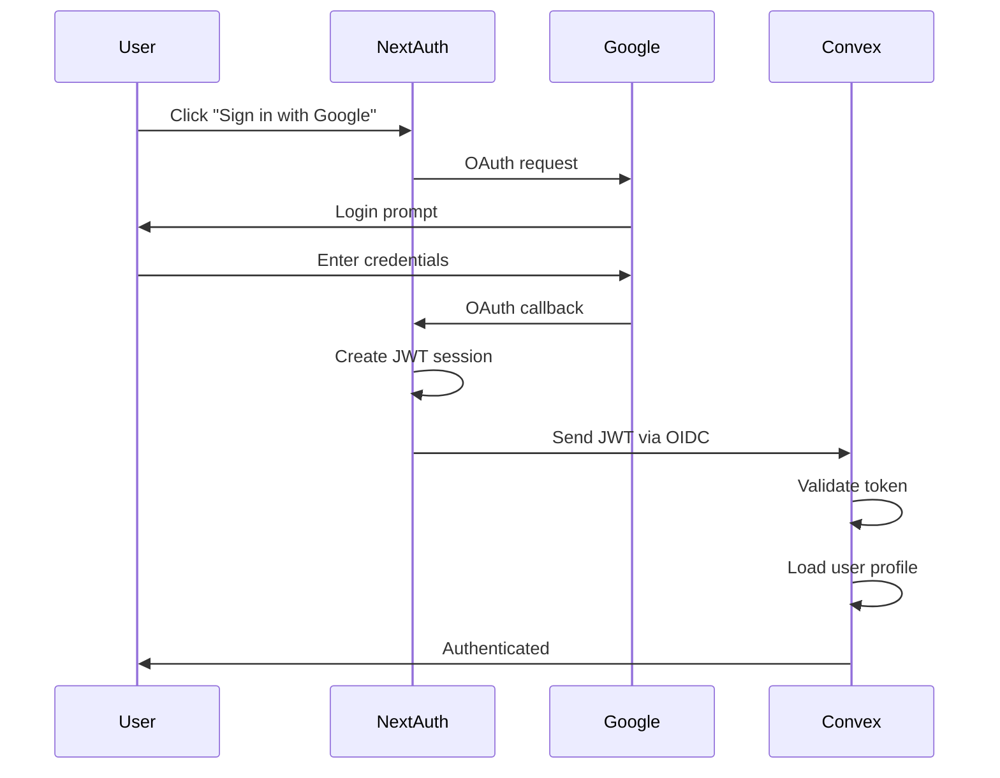

# Security Documentation - IPU PY Tesorería

## Overview

The IPU PY Treasury system implements comprehensive security through NextAuth v5 authentication, Convex OIDC integration, and code-based authorization patterns. This document describes the security architecture after the Convex migration.

## Security Architecture

### Core Security Layers

1. **Authentication Layer** - NextAuth v5 with Google OAuth
2. **OIDC Bridge** - Convex validates NextAuth JWT tokens
3. **Authorization Layer** - Code-based role checking in Convex functions
4. **Transport Layer** - HTTPS and secure headers
5. **Application Layer** - Input validation with Convex validators
6. **Audit Layer** - Complete user activity logging

## Authentication System

### NextAuth v5 + Google OAuth

**Provider**: Google OAuth with domain restriction
**Domain**: Only `@ipupy.org.py` emails allowed
**Session Management**: JWT tokens (server-side)

#### Auth Flow



### OIDC Bridge Configuration

Located in `convex/auth.config.ts`:

```typescript
export default {
  providers: [
    {
      domain: process.env.NEXTAUTH_URL,
      applicationID: "convex",
    },
  ],
};
```

**Key Points**:
- Convex automatically validates JWT tokens from NextAuth
- No additional configuration needed in Convex functions
- `ctx.auth.getUserIdentity()` returns user info from token

### Session Management

**Storage**: JWT tokens in httpOnly cookies
**Expiration**: Configured in NextAuth (default: 30 days)
**Refresh**: Google handles token refresh automatically

## Authorization System

### Role-Based Access Control (RBAC)

**Current Roles** (6 total, hierarchical):

```typescript
type Role =
  | "admin"              // Level 6 - Full system access
  | "national_treasurer" // Level 5 - National treasury operations (obsolete, merged into treasurer)
  | "fund_director"      // Level 4 - Fund-specific management
  | "pastor"             // Level 3 - Church leadership
  | "treasurer"          // Level 6 - National treasury (consolidated role)
  | "church_manager"     // Level 2 - Church administration (view-only)
  | "secretary";         // Level 1 - Administrative support
```

**Note**: The `treasurer` role now has **national scope** (all churches, all funds) after migration 053. This consolidates the former `national_treasurer` role.

### Authorization in Convex

**Critical**: Authorization is implemented in **code**, not database policies.

#### Pattern 1: Require Authentication

```typescript
// convex/helpers/auth.ts
import { QueryCtx, MutationCtx } from "./_generated/server";

export async function requireAuth(ctx: QueryCtx | MutationCtx) {
  const identity = await ctx.auth.getUserIdentity();
  if (!identity) {
    throw new Error("Not authenticated");
  }

  const user = await ctx.db
    .query("profiles")
    .withIndex("by_email", (q) => q.eq("email", identity.email))
    .unique();

  if (!user) {
    throw new Error("User profile not found");
  }

  if (!user.isActive) {
    throw new Error("User account is inactive");
  }

  return user;
}
```

#### Pattern 2: Require Specific Role

```typescript
export async function requireRole(
  ctx: QueryCtx | MutationCtx,
  allowedRoles: string[]
) {
  const user = await requireAuth(ctx);

  if (!allowedRoles.includes(user.role)) {
    throw new Error(
      `Unauthorized: requires one of [${allowedRoles.join(", ")}]`
    );
  }

  return user;
}
```

#### Pattern 3: Church-Scoped Access

```typescript
export async function requireChurchAccess(
  ctx: QueryCtx | MutationCtx,
  churchId: Id<"churches">
) {
  const user = await requireAuth(ctx);

  // Admin and national treasurer see all churches
  if (["admin", "treasurer"].includes(user.role)) {
    return user;
  }

  // Other roles must belong to the church
  if (user.churchId !== churchId) {
    throw new Error("Unauthorized: Can only access your church");
  }

  return user;
}
```

#### Pattern 4: Fund-Level Access

```typescript
export async function requireFundAccess(
  ctx: QueryCtx | MutationCtx,
  fundId: Id<"funds">
) {
  const user = await requireAuth(ctx);

  // Admin and national treasurer access all funds
  if (["admin", "treasurer"].includes(user.role)) {
    return user;
  }

  // Fund directors only access assigned funds
  if (user.role === "fund_director") {
    const assignment = await ctx.db
      .query("fundDirectorAssignments")
      .withIndex("by_user_fund", (q) =>
        q.eq("userId", user._id).eq("fundId", fundId)
      )
      .unique();

    if (!assignment) {
      throw new Error("Unauthorized: Not assigned to this fund");
    }
  }

  return user;
}
```

## Permission Matrix

### Admin Role
**Scope**: System-wide

| Resource | Permissions |
|----------|-------------|
| Churches | View all, edit all, create, delete |
| Reports | View all, approve all, reject all |
| Funds | View all, manage all, create events |
| Users | View all, edit roles, activate/deactivate |
| System Config | View all, edit all |
| Dashboard | View all data |

### Treasurer Role (National)
**Scope**: All churches and funds
**Note**: Consolidated from `national_treasurer` (migration 053)

| Resource | Permissions |
|----------|-------------|
| Churches | View all |
| Reports | View all, approve all, reject all |
| Funds | View all, manage balances, create transactions |
| Fund Events | View all, approve/reject all |
| Transactions | View all, create national-level |
| Dashboard | View national metrics |

### Fund Director Role
**Scope**: Assigned funds only

| Resource | Permissions |
|----------|-------------|
| Fund Events | Create (assigned funds), edit own drafts, submit for approval |
| Funds | View assigned only, view balance |
| Transactions | View transactions for assigned funds |
| Dashboard | View metrics for assigned funds |

### Pastor Role
**Scope**: Own church only

| Resource | Permissions |
|----------|-------------|
| Church | View own, edit own details |
| Reports | View own, create, edit drafts, submit |
| Fund Events | View own church events |
| Members | View church members |
| Dashboard | View own church metrics |

### Church Manager Role
**Scope**: Own church, read-only

| Resource | Permissions |
|----------|-------------|
| Church | View own |
| Reports | View own church reports |
| Dashboard | View own church metrics |

### Secretary Role
**Scope**: Own church, limited write

| Resource | Permissions |
|----------|-------------|
| Church | View own |
| Reports | View own, create drafts (cannot submit) |
| Dashboard | View own church metrics |

## Security Implementation Examples

### Query with Authorization

```typescript
// convex/reports.ts
export const getMonthlyReports = query({
  args: {
    churchId: v.id("churches"),
    year: v.number(),
    month: v.number(),
  },
  handler: async (ctx, { churchId, year, month }) => {
    // 1. Check authentication
    const user = await requireAuth(ctx);

    // 2. Check church access
    await requireChurchAccess(ctx, churchId);

    // 3. Query data (authorization already verified)
    return await ctx.db
      .query("monthlyReports")
      .withIndex("by_church_date", (q) =>
        q.eq("churchId", churchId).eq("year", year).eq("month", month)
      )
      .unique();
  },
});
```

### Mutation with Role Check

```typescript
// convex/reports.ts
export const approveReport = mutation({
  args: {
    reportId: v.id("monthlyReports"),
  },
  handler: async (ctx, { reportId }) => {
    // 1. Require treasurer or admin role
    const user = await requireRole(ctx, ["admin", "treasurer"]);

    // 2. Load report
    const report = await ctx.db.get(reportId);
    if (!report) {
      throw new Error("Report not found");
    }

    // 3. Verify status
    if (report.status !== "submitted") {
      throw new Error("Can only approve submitted reports");
    }

    // 4. Update report
    await ctx.db.patch(reportId, {
      status: "approved",
      approvedBy: user._id,
      approvedAt: Date.now(),
    });

    // 5. Audit log
    await ctx.db.insert("userActivity", {
      userId: user._id,
      action: "report.approve",
      details: { reportId },
      timestamp: Date.now(),
    });

    return await ctx.db.get(reportId);
  },
});
```

### Multi-Level Authorization

```typescript
// convex/fundEvents.ts
export const createFundEvent = mutation({
  args: {
    fundId: v.id("funds"),
    eventName: v.string(),
    eventDate: v.string(),
    budgetItems: v.array(
      v.object({
        description: v.string(),
        estimatedAmount: v.number(),
        category: v.string(),
      })
    ),
  },
  handler: async (ctx, args) => {
    // 1. Authenticate
    const user = await requireAuth(ctx);

    // 2. Load fund details
    const fund = await ctx.db.get(args.fundId);
    if (!fund) {
      throw new Error("Fund not found");
    }

    // 3. Check permissions based on role
    if (user.role === "admin" || user.role === "treasurer") {
      // Full access - can create events for any fund
    } else if (user.role === "fund_director") {
      // Check fund assignment
      await requireFundAccess(ctx, args.fundId);
    } else {
      throw new Error("Unauthorized: Insufficient permissions");
    }

    // 4. Determine church context
    let churchId: Id<"churches"> | undefined = undefined;
    if (fund.isChurchLevel && user.churchId) {
      churchId = user.churchId;
    }

    // 5. Create event
    const eventId = await ctx.db.insert("fundEvents", {
      ...args,
      churchId,
      status: "draft",
      totalBudget: args.budgetItems.reduce((sum, item) => sum + item.estimatedAmount, 0),
      createdBy: user._id,
      createdAt: Date.now(),
      updatedAt: Date.now(),
    });

    return await ctx.db.get(eventId);
  },
});
```

## Input Validation

Convex provides built-in validation through the `v` (validator) API:

```typescript
import { v } from "convex/values";

export const createReport = mutation({
  args: {
    churchId: v.id("churches"),
    month: v.number(),  // Automatically validates it's a number
    year: v.number(),
    diezmos: v.number(),
    ofrendas: v.number(),
  },
  handler: async (ctx, args) => {
    // Additional business logic validation
    if (args.month < 1 || args.month > 12) {
      throw new Error("Month must be between 1 and 12");
    }

    if (args.year < 2020 || args.year > 2100) {
      throw new Error("Year must be between 2020 and 2100");
    }

    if (args.diezmos < 0 || args.ofrendas < 0) {
      throw new Error("Amounts must be non-negative");
    }

    // ... rest of handler
  },
});
```

## Audit Logging

All sensitive operations are logged in the `userActivity` collection:

```typescript
// Helper function
async function logActivity(
  ctx: MutationCtx,
  userId: Id<"profiles">,
  action: string,
  details: any
) {
  await ctx.db.insert("userActivity", {
    userId,
    action,
    details,
    timestamp: Date.now(),
  });
}

// Usage in mutations
await logActivity(ctx, user._id, "report.approve", {
  reportId,
  churchId: report.churchId,
  month: report.month,
  year: report.year,
});
```

**Logged Actions**:
- `report.create`, `report.submit`, `report.approve`, `report.reject`
- `event.create`, `event.submit`, `event.approve`, `event.reject`
- `transaction.create`, `transaction.approve`
- `user.role_change`, `user.activate`, `user.deactivate`
- `config.update`

## Security Best Practices

### 1. Always Verify Authentication

```typescript
// ❌ BAD - No auth check
export const getData = query({
  handler: async (ctx) => {
    return await ctx.db.query("data").collect();
  },
});

// ✅ GOOD - Auth check first
export const getData = query({
  handler: async (ctx) => {
    await requireAuth(ctx);
    return await ctx.db.query("data").collect();
  },
});
```

### 2. Check Permissions Before Operations

```typescript
// ❌ BAD - Only checks role, not resource ownership
export const deleteReport = mutation({
  args: { reportId: v.id("monthlyReports") },
  handler: async (ctx, { reportId }) => {
    const user = await requireRole(ctx, ["admin", "pastor"]);
    await ctx.db.delete(reportId);
  },
});

// ✅ GOOD - Checks both role AND resource ownership
export const deleteReport = mutation({
  args: { reportId: v.id("monthlyReports") },
  handler: async (ctx, { reportId }) => {
    const user = await requireRole(ctx, ["admin", "pastor"]);

    const report = await ctx.db.get(reportId);
    if (!report) throw new Error("Report not found");

    // Pastor can only delete own church reports
    if (user.role === "pastor" && report.churchId !== user.churchId) {
      throw new Error("Unauthorized");
    }

    await ctx.db.delete(reportId);
  },
});
```

### 3. Validate All Inputs

```typescript
// ✅ Use Convex validators
args: {
  email: v.string(),  // Must be string
  amount: v.number(),  // Must be number
  status: v.union(v.literal("draft"), v.literal("submitted")),  // Enum
  items: v.array(v.object({ ... })),  // Structured array
}

// ✅ Add business logic validation
if (!/^[^\s@]+@[^\s@]+\.[^\s@]+$/.test(args.email)) {
  throw new Error("Invalid email format");
}
```

### 4. Use Least Privilege

```typescript
// ❌ BAD - Gives more access than needed
if (["admin", "treasurer", "pastor", "secretary"].includes(user.role)) {
  // Secretary doesn't need this access!
}

// ✅ GOOD - Only roles that actually need access
if (["admin", "treasurer"].includes(user.role)) {
  // Clear and minimal
}
```

### 5. Log Sensitive Operations

```typescript
// ✅ Always log security-relevant actions
await logActivity(ctx, user._id, "user.role_change", {
  targetUserId,
  oldRole: oldUser.role,
  newRole: newRole,
});
```

## Security Checklist

Before deploying new Convex functions:

- [ ] Authentication check at start of handler
- [ ] Role-based authorization implemented
- [ ] Resource ownership verified (if applicable)
- [ ] Input validation with Convex validators
- [ ] Business logic validation for edge cases
- [ ] Audit logging for sensitive operations
- [ ] Error messages don't leak sensitive data
- [ ] No hardcoded secrets in function code
- [ ] Church-scoped access enforced (non-admin roles)
- [ ] Fund-scoped access enforced (fund directors)

## Common Security Patterns

### Pattern: Admin or Own Resource

```typescript
async function canAccessResource(
  ctx: QueryCtx,
  resourceChurchId: Id<"churches"> | undefined
) {
  const user = await requireAuth(ctx);

  // Admin sees everything
  if (user.role === "admin") {
    return user;
  }

  // Others only see own church
  if (resourceChurchId !== user.churchId) {
    throw new Error("Unauthorized");
  }

  return user;
}
```

### Pattern: Status-Based Permissions

```typescript
async function canEditReport(
  ctx: MutationCtx,
  report: Doc<"monthlyReports">
) {
  const user = await requireAuth(ctx);

  // Can only edit drafts
  if (report.status !== "draft") {
    throw new Error("Can only edit draft reports");
  }

  // Must be creator or admin
  if (user.role !== "admin" && report.enteredBy !== user._id) {
    throw new Error("Can only edit own reports");
  }

  return user;
}
```

### Pattern: Cascading Permissions

```typescript
export const viewDashboard = query({
  handler: async (ctx) => {
    const user = await requireAuth(ctx);

    // Different data based on role
    if (user.role === "admin" || user.role === "treasurer") {
      // National dashboard - all churches
      return await ctx.db.query("monthlyReports").collect();
    }

    if (user.role === "fund_director") {
      // Fund director dashboard - assigned funds only
      const assignments = await ctx.db
        .query("fundDirectorAssignments")
        .withIndex("by_user", (q) => q.eq("userId", user._id))
        .collect();

      const fundIds = assignments.map((a) => a.fundId);
      // Return data for assigned funds...
    }

    // Church-scoped roles
    if (!user.churchId) {
      throw new Error("No church assigned");
    }

    return await ctx.db
      .query("monthlyReports")
      .withIndex("by_church", (q) => q.eq("churchId", user.churchId!))
      .collect();
  },
});
```

## Migration from RLS

### Before (Supabase RLS)

```sql
-- PostgreSQL policy
CREATE POLICY "reports_access" ON monthly_reports
  FOR ALL TO authenticated
  USING (
    app_user_is_admin() OR
    church_id = app_current_user_church_id()
  );
```

### After (Convex Authorization)

```typescript
export const listReports = query({
  handler: async (ctx) => {
    const user = await requireAuth(ctx);

    // Admin sees all
    if (user.role === "admin" || user.role === "treasurer") {
      return await ctx.db.query("monthlyReports").collect();
    }

    // Others see own church only
    if (!user.churchId) {
      return [];
    }

    return await ctx.db
      .query("monthlyReports")
      .withIndex("by_church", (q) => q.eq("churchId", user.churchId!))
      .collect();
  },
});
```

**Key Differences**:
- Authorization in **TypeScript code**, not SQL
- More flexible (can implement complex logic)
- Type-safe with full IDE support
- Easier to test and debug

## Environment Security

### Required Environment Variables

```bash
# NextAuth (Server-side)
NEXTAUTH_SECRET=<generate-with-openssl-rand>
NEXTAUTH_URL=https://your-domain.com

# Google OAuth
GOOGLE_CLIENT_ID=<from-google-console>
GOOGLE_CLIENT_SECRET=<from-google-console>

# Convex
CONVEX_DEPLOYMENT=prod:your-deployment
NEXT_PUBLIC_CONVEX_URL=https://your-deployment.convex.cloud
```

**Security Notes**:
- Never commit `.env.local` to git
- Use different secrets for dev/staging/prod
- Rotate `NEXTAUTH_SECRET` periodically
- Restrict Google OAuth to `@ipupy.org.py` domain

## Rate Limiting

API routes can implement rate limiting (Convex has built-in DDoS protection):

```typescript
// src/app/api/reports/route.ts
import { rateLimit } from '@/lib/rate-limit';

export async function POST(req: NextRequest) {
  // Rate limit: 10 requests per minute
  const limiter = rateLimit({
    interval: 60 * 1000, // 1 minute
    uniqueTokenPerInterval: 500,
  });

  try {
    await limiter.check(req, 10, 'CACHE_TOKEN');
  } catch {
    return NextResponse.json(
      { error: 'Rate limit exceeded' },
      { status: 429 }
    );
  }

  // ... rest of handler
}
```

## CORS Configuration

REST API routes enforce strict CORS:

```typescript
// src/lib/cors.ts
export function setCORSHeaders(response: NextResponse) {
  const allowedOrigins = [
    'https://ipupytesoreria.vercel.app',
    process.env.NEXTAUTH_URL,
  ];

  response.headers.set('Access-Control-Allow-Origin', allowedOrigins.join(','));
  response.headers.set('Access-Control-Allow-Methods', 'GET, POST, PUT, DELETE');
  response.headers.set('Access-Control-Allow-Headers', 'Content-Type, Authorization');

  return response;
}
```

## Security Monitoring

### Query Audit Logs

```typescript
// convex/admin.ts
export const getUserActivity = query({
  args: {
    userId: v.optional(v.id("profiles")),
    startDate: v.optional(v.number()),
    endDate: v.optional(v.number()),
  },
  handler: async (ctx, { userId, startDate, endDate }) => {
    await requireRole(ctx, ["admin"]);

    let query = ctx.db.query("userActivity");

    if (userId) {
      query = query.withIndex("by_user", (q) => q.eq("userId", userId));
    } else {
      query = query.withIndex("by_timestamp");
    }

    let results = await query.collect();

    // Filter by date range
    if (startDate || endDate) {
      results = results.filter((log) => {
        if (startDate && log.timestamp < startDate) return false;
        if (endDate && log.timestamp > endDate) return false;
        return true;
      });
    }

    return results;
  },
});
```

## Hardening Backlog (captured October 8, 2025)

| ID | Task | Owner | Target Date | Status | Notes |
|----|------|-------|-------------|--------|-------|
| HB-2025-10-01 | Add Convex index on `(email, active)` for `profiles` lookups | DB Ops (F. Benítez) | 2025-10-31 | Planned | Mirrors recommendation in `docs/archive/audits/SECURITY_REVIEW_SUPABASE_TO_CONVEX_2025-01-08.md`; improves auth lookup latency. |
| HB-2025-10-02 | Stand up dedicated Convex `audit_logs` table with structured events | Platform Eng (S. Duarte) | 2025-11-15 | Planned | Replace ad-hoc logging with schema + retention policy. |
| HB-2025-10-03 | Add integration test asserting inactive users receive 401/403 across critical routes | QA Automation (L. Romero) | 2025-10-25 | In Progress | Harness prototype lives in `tests/integration/auth-inactive-user.test.ts`. |
| HB-2025-10-04 | Inline treasurer national-scope comment on Convex fund event approvals | App Eng (A. Bir) | 2025-10-12 | Planned | Ensures reviewers see intent where `requireMinRole(auth, "treasurer")` is used. |
| HB-2025-10-05 | Revisit NextAuth `session.maxAge` (currently 30 days) and propose shorter expiry | Security Eng (M. Álvarez) | 2025-11-01 | Blocked | Awaiting product sign-off balancing user friction vs. security. |

## References

- [Convex Authentication](https://docs.convex.dev/auth)
- [NextAuth Documentation](https://next-auth.js.org)
- [OIDC Bridge Setup](https://docs.convex.dev/auth/advanced/oidc)
- [ARCHITECTURE.md](./ARCHITECTURE.md)
- [CONVEX_SCHEMA.md](./CONVEX_SCHEMA.md)
- [CONVEX_MIGRATION_PLAN.md](./CONVEX_MIGRATION_PLAN.md)
