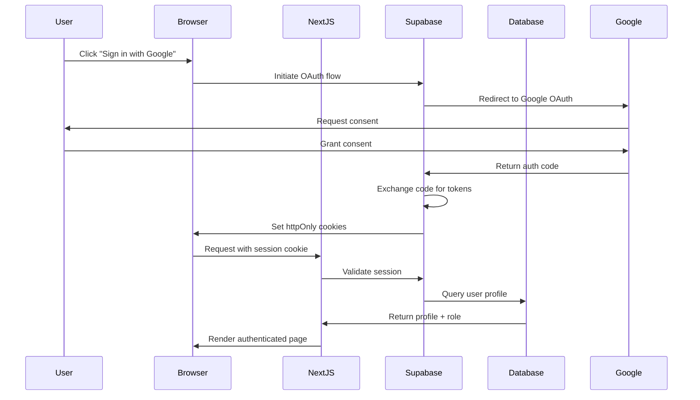

# Authentication & Authorization Architecture

**Last Updated**: 2025-10-06
**Version**: 2.0
**Status**: ✅ Current (Post-Treasurer Consolidation)

---

## Table of Contents

1. [Overview](#overview)
2. [Authentication System](#authentication-system)
3. [Authorization System](#authorization-system)
4. [Row Level Security (RLS)](#row-level-security-rls)
5. [Session Management](#session-management)
6. [Security Best Practices](#security-best-practices)

---

## Overview

IPU PY Tesorería implements a **layered security architecture** combining:

1. **Supabase Auth** - OAuth 2.0 authentication
2. **Role-Based Access Control (RBAC)** - 6-role hierarchy
3. **Row Level Security (RLS)** - PostgreSQL policies
4. **Session Context** - Per-request security context

### Security Principles

- ✅ **Zero Trust**: Every request authenticated & authorized
- ✅ **Least Privilege**: Minimum required permissions per role
- ✅ **Defense in Depth**: Multiple security layers
- ✅ **Audit Trail**: All mutations logged
- ✅ **Data Isolation**: RLS enforces church boundaries

---

## Authentication System

### Technology Stack

**Provider**: Supabase Auth (built on GoTrue)
**Protocol**: OAuth 2.0 / OIDC
**Session Storage**: HTTP-only cookies (not localStorage)
**Token Type**: JWT (server-side validation only)

### Authentication Flow



### Google OAuth Configuration

**Domain Restriction**: Only `@ipupy.org.py` emails allowed

**OAuth Scopes**:
- `openid` - User identification
- `email` - Email address
- `profile` - Basic profile info

**Redirect URLs**:
- Production: `https://ipupytesoreria.vercel.app/api/auth/callback`
- Development: `http://localhost:3000/api/auth/callback`

### Session Cookie Configuration

```typescript
// Cookie attributes (managed by Supabase)
{
  httpOnly: true,        // Not accessible via JavaScript
  secure: true,          // HTTPS only in production
  sameSite: 'lax',       // CSRF protection
  maxAge: 3600,          // 1 hour
  path: '/',
  domain: '.ipupytesoreria.vercel.app'
}
```

### Authentication Helper Functions

Located in `src/lib/auth-supabase.ts`:

```typescript
// Require authentication (throws 401 if not authenticated)
export async function requireAuth(req: NextRequest): Promise<AuthContext> {
  const auth = await getAuthContext(req);
  if (!auth) {
    throw new UnauthorizedError('Authentication required');
  }
  return auth;
}

// Optional authentication (returns null if not authenticated)
export async function getAuthContext(req: NextRequest): Promise<AuthContext | null> {
  const supabase = await createServerClient();
  const { data: { session }, error } = await supabase.auth.getSession();

  if (error || !session) {
    return null;
  }

  // Fetch user profile with role from database
  const profile = await fetchUserProfile(session.user.id);

  return {
    userId: session.user.id,
    email: session.user.email!,
    role: profile.role,
    churchId: profile.church_id
  };
}
```

### Auth Context Object

```typescript
interface AuthContext {
  userId: string;           // UUID from auth.users
  email: string;            // User email (@ipupy.org.py)
  role: RoleType;           // See Authorization section
  churchId: number | null;  // Church ID (null for admin, treasurer)
}

type RoleType =
  | 'admin'
  | 'treasurer'             // National scope (all churches)
  | 'fund_director'
  | 'pastor'
  | 'church_manager'
  | 'secretary';
```

---

## Authorization System

### Role Hierarchy (Post-Consolidation)

After migrations 051-054 (October 2025), the system uses **6 hierarchical roles**:

| Level | Role | Scope | Description |
|-------|------|-------|-------------|
| 7 | `admin` | System | Full system access, user management |
| 6 | `treasurer` | **All churches (national)** | **National treasury operations, report approval** |
| 5 | `fund_director` | Assigned funds | Fund event management, budget approval |
| 4 | `pastor` | Single church | Church leadership, report submission |
| 2 | `church_manager` | Single church | View-only administration |
| 1 | `secretary` | Single church | Basic data entry |

### Key Changes (Migrations 051-054)

**Migration 051**: Eliminated `church_treasurer` role
**Migration 053**: Merged `national_treasurer` into `treasurer` role

**Before**: 3 treasurer-related roles
- `national_treasurer` (all churches)
- `church_treasurer` (single church)
- Old `treasurer` role

**After**: Single `treasurer` role with national scope
- Operates across all churches
- Has report approval authority
- Cleaner, more powerful permission model
- `churchId` field is null for treasurer role

### Role-Based Permissions

#### Admin (Level 7)

**Capabilities**:
- ✅ Full system access
- ✅ User management (create, update, delete users)
- ✅ System configuration
- ✅ View all churches and reports
- ✅ Approve/reject reports
- ✅ Manage fund directors
- ✅ Access audit logs

**Restrictions**:
- ❌ Cannot modify own role
- ❌ Cannot delete own account

#### Treasurer (Level 6) - National Scope

**Capabilities** (Consolidated national_treasurer + church_treasurer functionality):
- ✅ View all churches
- ✅ View all reports (cross-church)
- ✅ Approve/reject submitted reports
- ✅ Create manual reports for any church
- ✅ Manage national fund
- ✅ Month-end reconciliation
- ✅ Export consolidated data
- ✅ View all transactions
- ✅ Manage church transactions
- ✅ Record offerings and tithes
- ✅ Upload deposit receipts
- ✅ Manage providers (all churches)

**Restrictions**:
- ❌ Cannot modify system configuration
- ❌ Cannot manage users
- ❌ Cannot assign fund directors

#### Fund Director (Level 5)

**Capabilities**:
- ✅ Create fund events (assigned funds only)
- ✅ Manage event budgets
- ✅ Record actual income/expenses
- ✅ Submit events for approval
- ✅ View assigned fund balances
- ✅ Manage providers

**Restrictions**:
- ❌ Cannot approve own events (requires treasurer or admin)
- ❌ Cannot access other funds
- ❌ Cannot view church financial reports
- ❌ Scope limited by fund_director_assignments table

#### Pastor (Level 4)

**Capabilities**:
- ✅ View church dashboard
- ✅ Submit monthly reports (own church)
- ✅ View church reports history
- ✅ Manage church users (church_manager, secretary)
- ✅ View church transactions
- ✅ Upload supporting documents

**Restrictions**:
- ❌ Cannot approve own reports (requires treasurer)
- ❌ Cannot modify approved reports
- ❌ Cannot access other churches
- ❌ Cannot assign admin or treasurer roles

#### Church Manager (Level 2)

**Capabilities**:
- ✅ View church dashboard (read-only)
- ✅ View church reports (read-only)
- ✅ View church statistics
- ✅ Generate church reports

**Restrictions**:
- ❌ Cannot create or modify reports
- ❌ Cannot manage transactions
- ❌ Cannot manage users
- ❌ View-only access

#### Secretary (Level 1)

**Capabilities**:
- ✅ Record worship attendance
- ✅ Basic data entry
- ✅ View limited church info

**Restrictions**:
- ❌ Cannot view financial data
- ❌ Cannot create reports
- ❌ Cannot manage transactions
- ❌ Minimal access

### Permission Check Functions

Located in `src/lib/permissions.ts`:

```typescript
// Check if user has required role level
export function hasRoleLevel(
  userRole: RoleType,
  requiredLevel: number
): boolean {
  const levels = {
    admin: 7,
    treasurer: 6,         // National scope
    fund_director: 5,
    pastor: 4,
    church_manager: 2,
    secretary: 1
  };

  return levels[userRole] >= requiredLevel;
}

// Check if user can access church data
export function canAccessChurch(
  auth: AuthContext,
  churchId: number
): boolean {
  // Admin and treasurer see all churches
  if (['admin', 'treasurer'].includes(auth.role)) {
    return true;
  }

  // Church-scoped roles only see own church
  return auth.churchId === churchId;
}

// Check if user can approve reports
export function canApproveReports(auth: AuthContext): boolean {
  return ['admin', 'treasurer'].includes(auth.role);
}

// Check if user can manage fund events
export function canManageFundEvents(auth: AuthContext): boolean {
  return hasRoleLevel(auth.role, 5); // fund_director or higher
}
```

---

## Row Level Security (RLS)

### RLS Architecture

PostgreSQL Row Level Security enforces **database-level authorization** independent of application code.

**Key Components**:
1. **Session Context Variables** - Store user context per connection
2. **Helper Functions** - Retrieve context in policies
3. **RLS Policies** - Enforce access rules per table

### Session Context Variables

Set before every database query via `setDatabaseContext()`:

```typescript
// src/lib/db-context.ts
export async function setDatabaseContext(
  auth: AuthContext,
  client: Client
): Promise<void> {
  await client.query(`
    SELECT
      set_config('app.current_user_id', $1, false),
      set_config('app.current_user_role', $2, false),
      set_config('app.current_user_church_id', $3, false)
  `, [
    auth.userId,
    auth.role,
    auth.churchId?.toString() ?? ''
  ]);
}
```

**Context Variables**:
- `app.current_user_id` - UUID of authenticated user
- `app.current_user_role` - User's role
- `app.current_user_church_id` - User's church (empty string for system roles)

### RLS Helper Functions

Located in database (migration 010):

```sql
-- Get current user ID from session context
CREATE OR REPLACE FUNCTION app_current_user_id()
RETURNS UUID AS $$
  SELECT NULLIF(current_setting('app.current_user_id', true), '')::UUID;
$$ LANGUAGE SQL STABLE;

-- Get current user role from session context (secure fallback to empty string)
CREATE OR REPLACE FUNCTION app_current_user_role()
RETURNS TEXT AS $$
  SELECT COALESCE(NULLIF(current_setting('app.current_user_role', true), ''), '');
$$ LANGUAGE SQL STABLE;

-- Get current user church ID from session context
CREATE OR REPLACE FUNCTION app_current_user_church_id()
RETURNS INTEGER AS $$
  SELECT NULLIF(current_setting('app.current_user_church_id', true), '')::INTEGER;
$$ LANGUAGE SQL STABLE;

-- Get role hierarchy level
CREATE OR REPLACE FUNCTION get_role_level(role_name TEXT)
RETURNS INTEGER AS $$
  SELECT CASE role_name
    WHEN 'admin' THEN 7
    WHEN 'treasurer' THEN 6         -- National scope (consolidated from national_treasurer)
    WHEN 'fund_director' THEN 5
    WHEN 'pastor' THEN 4
    WHEN 'church_manager' THEN 2
    WHEN 'secretary' THEN 1
    ELSE 0
  END;
$$ LANGUAGE SQL IMMUTABLE;
```

### Example RLS Policies

#### Monthly Reports Table

```sql
-- View policy: See own church reports OR system-wide for admin/treasurer
CREATE POLICY monthly_reports_select_policy ON monthly_reports
FOR SELECT
USING (
  -- Admin and treasurer see all (national scope, level 6+)
  get_role_level(app_current_user_role()) >= 6
  OR
  -- Church-scoped users see own church only
  (
    church_id = app_current_user_church_id()
    AND get_role_level(app_current_user_role()) >= 1
  )
);

-- Insert policy: Pastor or higher can create reports for own church
CREATE POLICY monthly_reports_insert_policy ON monthly_reports
FOR INSERT
WITH CHECK (
  get_role_level(app_current_user_role()) >= 4
  AND (
    -- Admin/treasurer can create for any church (national scope, level 6+)
    get_role_level(app_current_user_role()) >= 6
    OR
    -- Pastor creates for own church only
    church_id = app_current_user_church_id()
  )
);

-- Update policy: Can update own church's draft reports
CREATE POLICY monthly_reports_update_policy ON monthly_reports
FOR UPDATE
USING (
  church_id = app_current_user_church_id()
  AND get_role_level(app_current_user_role()) >= 4  -- Pastor level
  AND estado = 'draft' -- Can only update draft reports
)
WITH CHECK (
  church_id = app_current_user_church_id()
  AND get_role_level(app_current_user_role()) >= 4  -- Pastor level
);
```

#### Fund Events Table

```sql
-- View policy: Fund directors see assigned funds, admin/treasurer see all
CREATE POLICY fund_events_select_policy ON fund_events
FOR SELECT
USING (
  -- Admin and treasurer see all (national scope, level 6+)
  get_role_level(app_current_user_role()) >= 6
  OR
  -- Fund directors see assigned funds (checked via fund_director_assignments)
  (
    app_current_user_role() = 'fund_director'
    AND fund_id IN (
      SELECT fund_id
      FROM fund_director_assignments
      WHERE profile_id = app_current_user_id()
        AND (church_id IS NULL OR church_id = app_current_user_church_id())
    )
  )
);

-- Insert policy: Fund directors can create events for assigned funds
CREATE POLICY fund_events_insert_policy ON fund_events
FOR INSERT
WITH CHECK (
  get_role_level(app_current_user_role()) >= 5  -- Fund director level
  AND (
    -- Admin/treasurer can create for any fund (national scope, level 6+)
    get_role_level(app_current_user_role()) >= 6
    OR
    -- Fund director creates for assigned funds only
    fund_id IN (
      SELECT fund_id
      FROM fund_director_assignments
      WHERE profile_id = app_current_user_id()
    )
  )
);
```

### RLS Execution Pattern

All database queries **must** use `executeWithContext()`:

```typescript
// src/lib/db.ts
export async function executeWithContext<T = unknown>(
  auth: AuthContext,
  query: string,
  params?: unknown[]
): Promise<QueryResult<T>> {
  const client = await pool.connect();

  try {
    // Set RLS context
    await setDatabaseContext(auth, client);

    // Execute query with RLS enforcement
    const result = await client.query<T>(query, params);

    return result;
  } finally {
    client.release();
  }
}

// Transaction variant
export async function executeTransaction<T>(
  auth: AuthContext,
  callback: (client: Client) => Promise<T>
): Promise<T> {
  const client = await pool.connect();

  try {
    await client.query('BEGIN');
    await setDatabaseContext(auth, client);

    const result = await callback(client);

    await client.query('COMMIT');
    return result;
  } catch (error) {
    await client.query('ROLLBACK');
    throw error;
  } finally {
    client.release();
  }
}
```

**Security Guarantee**: RLS policies enforce access control even if application code is bypassed.

---

## Session Management

### Session Lifecycle

1. **Creation**: OAuth callback creates session
2. **Storage**: HttpOnly cookie stores session token
3. **Validation**: Middleware validates on each request
4. **Refresh**: Auto-refresh before expiration
5. **Termination**: Explicit logout or timeout

### Session Timeout

- **Idle Timeout**: 1 hour of inactivity
- **Absolute Timeout**: 8 hours maximum
- **Refresh Window**: Last 15 minutes of session

### Middleware Protection

Located in `src/middleware.ts`:

```typescript
export async function middleware(req: NextRequest) {
  const { pathname } = req.nextUrl;

  // Public routes (no auth required)
  const publicPaths = ['/login', '/api/health'];
  if (publicPaths.some(path => pathname.startsWith(path))) {
    return NextResponse.next();
  }

  // Validate session
  const supabase = await createServerClient();
  const { data: { session }, error } = await supabase.auth.getSession();

  if (error || !session) {
    // Redirect to login
    return NextResponse.redirect(new URL('/login', req.url));
  }

  // Auto-refresh if expiring soon
  const expiresAt = new Date(session.expires_at! * 1000);
  const now = new Date();
  const fifteenMinutes = 15 * 60 * 1000;

  if (expiresAt.getTime() - now.getTime() < fifteenMinutes) {
    await supabase.auth.refreshSession();
  }

  return NextResponse.next();
}

export const config = {
  matcher: ['/((?!_next/static|_next/image|favicon.ico).*)']
};
```

### Session Invalidation

```typescript
// User logout
await supabase.auth.signOut();

// Admin force logout (invalidate all sessions)
await supabase.auth.admin.signOut(userId);
```

---

## Security Best Practices

### Authentication

1. ✅ **Domain Restriction**: Only `@ipupy.org.py` emails
2. ✅ **HttpOnly Cookies**: No JavaScript access to tokens
3. ✅ **HTTPS Only**: Secure transport in production
4. ✅ **CSRF Protection**: SameSite=Lax cookies
5. ✅ **Session Timeout**: Automatic expiration
6. ✅ **Refresh Tokens**: Secure token rotation

### Authorization

1. ✅ **Least Privilege**: Minimum required permissions
2. ✅ **Role Hierarchy**: Clear permission escalation
3. ✅ **Church Isolation**: Data segregation via RLS
4. ✅ **Permission Checks**: Server-side validation
5. ✅ **Audit Trail**: All permission changes logged

### Database Security

1. ✅ **RLS Enforcement**: All tables have policies
2. ✅ **Context Validation**: Session context required
3. ✅ **Prepared Statements**: SQL injection prevention
4. ✅ **Connection Pooling**: Resource management
5. ✅ **Secure Defaults**: Empty string fallback (not 'viewer')

### API Security

1. ✅ **Rate Limiting**: Prevent abuse
2. ✅ **CORS Restrictions**: Allowed origins only
3. ✅ **Input Validation**: Zod schema validation
4. ✅ **Error Sanitization**: No sensitive data in errors
5. ✅ **Audit Logging**: All mutations logged

### Development Security

1. ✅ **Environment Variables**: Never commit secrets
2. ✅ **Type Safety**: Strict TypeScript mode
3. ✅ **Code Review**: Security review required
4. ✅ **Dependency Scanning**: Regular security audits
5. ✅ **Pre-commit Hooks**: Automated security checks

---

## Security Incident Response

### Suspected Breach

1. **Immediate Actions**:
   - Invalidate all sessions
   - Review audit logs
   - Check for unauthorized access

2. **Investigation**:
   - Identify compromised accounts
   - Trace attack vector
   - Assess data exposure

3. **Remediation**:
   - Patch vulnerabilities
   - Reset compromised credentials
   - Notify affected users

4. **Post-Incident**:
   - Document lessons learned
   - Update security policies
   - Enhance monitoring

### Contact

**Security Team**: administracion@ipupy.org.py
**Escalation**: Immediate for any suspected breach

---

## Related Documentation

- [Database RLS Policies](../database/RLS_POLICIES.md)
- [Role System Evolution](../ROLE_SYSTEM_EVOLUTION.md)
- [Security Audit 2025-09-28](../../SECURITY_AUDIT_2025-09-28.md)
- [API Authentication](../api/API_COMPLETE_REFERENCE.md#authentication)

---

**Document Version**: 2.0
**Last Updated**: 2025-10-06
**Next Review**: 2026-01-06
**Maintained By**: Security Team
