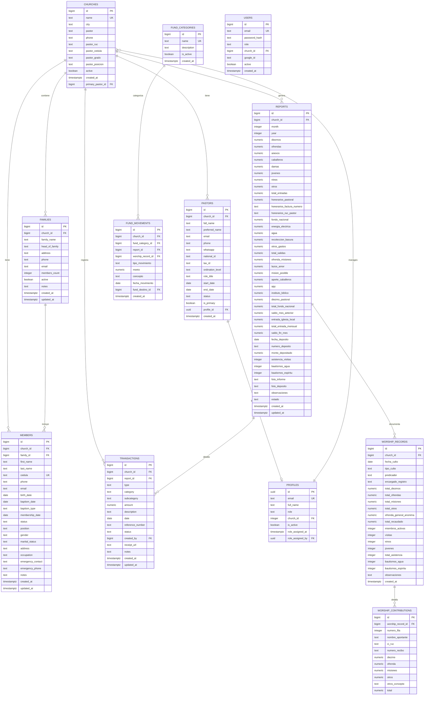

# Database Schema - IPU PY Tesorería

## Descripción General

El Sistema de Tesorería IPU PY utiliza PostgreSQL 16 como base de datos principal, diseñada específicamente para manejar las operaciones financieras de 22 iglesias de la Iglesia Pentecostal Unida del Paraguay.

**Características del Schema:**
- 🗄️ **8 Tablas principales** con relaciones optimizadas
- 📊 **Datos pre-cargados** de 22 iglesias IPU Paraguay
- 🔄 **Migraciones versionadas** para actualizaciones
- 🔍 **Índices optimizados** para consultas frecuentes
- 🛡️ **Constraints** para integridad de datos

## Diagrama de Relaciones (ERD)



## Tablas Principales

### 1. CHURCHES - Iglesias

**Descripción**: Registro de las 22 iglesias IPU Paraguay con información completa pastoral y legal.

```sql
CREATE TABLE churches (
  id BIGSERIAL PRIMARY KEY,
  name TEXT NOT NULL UNIQUE,
  city TEXT NOT NULL,
  pastor TEXT NOT NULL,
  phone TEXT,
  pastor_ruc TEXT,
  pastor_cedula TEXT,
  pastor_grado TEXT,
  pastor_posicion TEXT,
  primary_pastor_id BIGINT REFERENCES pastors(id) ON DELETE SET NULL,
  active BOOLEAN DEFAULT TRUE,
  created_at TIMESTAMPTZ DEFAULT NOW(),
  updated_at TIMESTAMPTZ DEFAULT NOW()
);
```

**Campos Clave:**
- `id`: Identificador único autoincremental
- `primary_pastor_id`: Referencia al registro activo en `pastors` (permite historial y reemplazos)
- `name`: Nombre oficial de la iglesia (único)
- `pastor_grado` / `pastor_posicion`: Campos legacy mantenidos para retrocompatibilidad mientras la UI migra totalmente al modelo normalizado.
- `pastor_ruc` / `pastor_cedula`: Datos fiscales/legales aún replicados para reportes rápidos (future deprecation)

**Datos Pre-cargados**: 22 iglesias con información completa

**Índices:**
```sql
CREATE INDEX idx_churches_active ON churches(active);
CREATE INDEX idx_churches_city ON churches(city);
CREATE INDEX idx_churches_primary_pastor ON churches(primary_pastor_id) WHERE primary_pastor_id IS NOT NULL;
CREATE INDEX idx_churches_pastor_ruc ON churches(pastor_ruc);
```

### 1B. PASTORS - Liderazgo pastoral normalizado

**Descripción**: Tabla que centraliza la información de pastores principales y asistentes, permitiendo histórico, auditoría, y múltiples asignaciones por iglesia.

```sql
CREATE TABLE pastors (
  id BIGSERIAL PRIMARY KEY,
  church_id BIGINT NOT NULL REFERENCES churches(id) ON DELETE CASCADE,
  full_name TEXT NOT NULL,
  preferred_name TEXT,
  email TEXT,
  phone TEXT,
  whatsapp TEXT,
  national_id TEXT,
  tax_id TEXT,
  ordination_level TEXT,
  role_title TEXT,
  start_date DATE,
  end_date DATE,
  status TEXT NOT NULL DEFAULT 'active' CHECK (status IN ('active','inactive','transition','emeritus','retired')),
  is_primary BOOLEAN NOT NULL DEFAULT TRUE,
  notes TEXT,
  photo_url TEXT,
  created_at TIMESTAMPTZ NOT NULL DEFAULT now(),
  updated_at TIMESTAMPTZ NOT NULL DEFAULT now(),
  created_by UUID REFERENCES profiles(id) ON DELETE SET NULL,
  updated_by UUID REFERENCES profiles(id) ON DELETE SET NULL
);
```

**Consideraciones:**
- Índice parcial `idx_pastors_primary_active` asegura un solo pastor principal activo por iglesia.
- Vista `church_primary_pastors` expone el pastor principal para listados públicos.
- RLS concede lectura pública de pastores activos y mutaciones sólo a administradores o líderes de la propia iglesia.

### 2. REPORTS - Reportes Mensuales

**Descripción**: Reportes financieros mensuales de cada iglesia con estructura contable completa.

```sql
CREATE TABLE reports (
  id BIGSERIAL PRIMARY KEY,
  church_id BIGINT NOT NULL,
  month INTEGER NOT NULL,
  year INTEGER NOT NULL,

  -- ENTRADAS DEL MES
  diezmos NUMERIC(18,2) DEFAULT 0,
  ofrendas NUMERIC(18,2) DEFAULT 0,
  anexos NUMERIC(18,2) DEFAULT 0,
  caballeros NUMERIC(18,2) DEFAULT 0,
  damas NUMERIC(18,2) DEFAULT 0,
  jovenes NUMERIC(18,2) DEFAULT 0,
  ninos NUMERIC(18,2) DEFAULT 0,
  otros NUMERIC(18,2) DEFAULT 0,
  total_entradas NUMERIC(18,2) DEFAULT 0,

  -- SALIDAS DEL MES
  honorarios_pastoral NUMERIC(18,2) DEFAULT 0,
  honorarios_factura_numero TEXT,
  honorarios_ruc_pastor TEXT,
  fondo_nacional NUMERIC(18,2) DEFAULT 0,
  energia_electrica NUMERIC(18,2) DEFAULT 0,
  agua NUMERIC(18,2) DEFAULT 0,
  recoleccion_basura NUMERIC(18,2) DEFAULT 0,
  otros_gastos NUMERIC(18,2) DEFAULT 0,
  total_salidas NUMERIC(18,2) DEFAULT 0,

  -- OFRENDAS DIRECTAS FONDO NACIONAL
  ofrenda_misiones NUMERIC(18,2) DEFAULT 0,
  lazos_amor NUMERIC(18,2) DEFAULT 0,
  mision_posible NUMERIC(18,2) DEFAULT 0,
  aporte_caballeros NUMERIC(18,2) DEFAULT 0,
  apy NUMERIC(18,2) DEFAULT 0,
  instituto_biblico NUMERIC(18,2) DEFAULT 0,
  diezmo_pastoral NUMERIC(18,2) DEFAULT 0,
  total_fondo_nacional NUMERIC(18,2) DEFAULT 0,

  -- EXISTENCIA EN CAJA
  saldo_mes_anterior NUMERIC(18,2) DEFAULT 0,
  entrada_iglesia_local NUMERIC(18,2) DEFAULT 0,
  total_entrada_mensual NUMERIC(18,2) DEFAULT 0,
  saldo_fin_mes NUMERIC(18,2) DEFAULT 0,

  -- DEPÓSITO BANCARIO
  fecha_deposito DATE,
  numero_deposito TEXT,
  monto_depositado NUMERIC(18,2) DEFAULT 0,

  -- ASISTENCIAS Y BAUTISMOS
  asistencia_visitas INTEGER DEFAULT 0,
  bautismos_agua INTEGER DEFAULT 0,
  bautismos_espiritu INTEGER DEFAULT 0,

  -- ARCHIVOS Y OBSERVACIONES
  foto_informe TEXT,
  foto_deposito TEXT,
  observaciones TEXT,
  estado TEXT DEFAULT 'pendiente',

  created_at TIMESTAMPTZ DEFAULT NOW(),
  updated_at TIMESTAMPTZ DEFAULT NOW(),

  UNIQUE (church_id, month, year),
  FOREIGN KEY (church_id) REFERENCES churches (id)
);
```

**Campos Calculados Automáticamente:**
- `total_entradas`: Suma de todos los ingresos
- `fondo_nacional`: 10% automático de (diezmos + ofrendas)
- `total_fondo_nacional`: Fondo nacional + ofrendas directas
- `entrada_iglesia_local`: Total entradas - fondo nacional
- `saldo_fin_mes`: Saldo anterior + entrada local - salidas

**Estados del Reporte:**
- `pendiente`: Recién creado, esperando revisión
- `aprobado`: Revisado y aceptado
- `rechazado`: Requiere correcciones
- `en_correccion`: Siendo modificado

**Índices:**
```sql
CREATE INDEX idx_reports_church_month_year ON reports(church_id, month, year);
CREATE INDEX idx_reports_year_month ON reports(year, month);
CREATE INDEX idx_reports_estado ON reports(estado);
CREATE INDEX idx_reports_fecha_deposito ON reports(fecha_deposito);
```

### 3. USERS - Sistema de Usuarios

**Descripción**: Autenticación y autorización con roles diferenciados.

```sql
CREATE TABLE users (
  id BIGSERIAL PRIMARY KEY,
  email TEXT NOT NULL UNIQUE,
  password_hash TEXT NOT NULL,
  role TEXT DEFAULT 'church',
  church_id BIGINT,
  google_id TEXT UNIQUE,
  active BOOLEAN DEFAULT TRUE,
  created_at TIMESTAMPTZ DEFAULT NOW(),

  FOREIGN KEY (church_id) REFERENCES churches (id)
);
```

**Roles del Sistema:**
- `admin`: Acceso completo, todas las iglesias
- `church`: Acceso limitado a su iglesia asignada

**Autenticación Soportada:**
- Password hash con bcrypt (rounds: 12)
- Google OAuth para dominio @ipupy.org.py
- JWT tokens con expiración configurable

**Índices:**
```sql
CREATE INDEX idx_users_email ON users(email);
CREATE INDEX idx_users_role ON users(role);
CREATE INDEX idx_users_church_id ON users(church_id);
CREATE INDEX idx_users_google_id ON users(google_id);
```

### 4. MEMBERS - Miembros de Iglesias

**Descripción**: Registro completo de miembros con información espiritual y personal.

```sql
CREATE TABLE members (
  id BIGSERIAL PRIMARY KEY,
  church_id BIGINT NOT NULL,
  family_id BIGINT,
  first_name TEXT NOT NULL,
  last_name TEXT NOT NULL,
  cedula TEXT UNIQUE,
  phone TEXT,
  email TEXT,
  birth_date DATE,
  baptism_date DATE,
  baptism_type TEXT,
  membership_date DATE,
  status TEXT DEFAULT 'active',
  position TEXT,
  gender TEXT,
  marital_status TEXT,
  address TEXT,
  occupation TEXT,
  emergency_contact TEXT,
  emergency_phone TEXT,
  notes TEXT,
  created_at TIMESTAMPTZ DEFAULT NOW(),
  updated_at TIMESTAMPTZ DEFAULT NOW(),

  FOREIGN KEY (church_id) REFERENCES churches (id),
  FOREIGN KEY (family_id) REFERENCES families (id)
);
```

**Estados de Membresía:**
- `active`: Miembro activo
- `inactive`: Miembro inactivo temporal
- `transferred`: Transferido a otra iglesia
- `deceased`: Fallecido

**Tipos de Bautismo:**
- `agua`: Bautismo en agua por inmersión
- `espiritu`: Bautismo del Espíritu Santo
- `ambos`: Ambos bautismos registrados

**Índices:**
```sql
CREATE INDEX idx_members_church_id ON members(church_id);
CREATE INDEX idx_members_family_id ON members(family_id);
CREATE INDEX idx_members_cedula ON members(cedula);
CREATE INDEX idx_members_status ON members(status);
CREATE INDEX idx_members_baptism_date ON members(baptism_date);
```

### 5. FAMILIES - Familias

**Descripción**: Organización familiar para mejor administración pastoral.

```sql
CREATE TABLE families (
  id BIGSERIAL PRIMARY KEY,
  church_id BIGINT NOT NULL,
  family_name TEXT NOT NULL,
  head_of_family TEXT NOT NULL,
  address TEXT,
  phone TEXT,
  email TEXT,
  members_count INTEGER DEFAULT 0,
  active BOOLEAN DEFAULT TRUE,
  notes TEXT,
  created_at TIMESTAMPTZ DEFAULT NOW(),
  updated_at TIMESTAMPTZ DEFAULT NOW(),

  FOREIGN KEY (church_id) REFERENCES churches (id)
);
```

**Funcionalidades:**
- Agrupación de miembros por núcleo familiar
- Contacto centralizado por familia
- Estadísticas familiares automáticas
- Organización de eventos y visitas pastorales

**Índices:**
```sql
CREATE INDEX idx_families_church_id ON families(church_id);
CREATE INDEX idx_families_active ON families(active);
```

### 6. TRANSACTIONS - Transacciones Financieras

**Descripción**: Registro detallado de todos los movimientos financieros.

```sql
CREATE TABLE transactions (
  id BIGSERIAL PRIMARY KEY,
  church_id BIGINT NOT NULL,
  report_id BIGINT,
  type TEXT NOT NULL,
  category TEXT NOT NULL,
  subcategory TEXT,
  amount NUMERIC(18,2) NOT NULL,
  description TEXT,
  date DATE NOT NULL,
  reference_number TEXT,
  status TEXT DEFAULT 'confirmed',
  created_by BIGINT NOT NULL,
  receipt_url TEXT,
  notes TEXT,
  created_at TIMESTAMPTZ DEFAULT NOW(),
  updated_at TIMESTAMPTZ DEFAULT NOW(),

  FOREIGN KEY (church_id) REFERENCES churches (id),
  FOREIGN KEY (report_id) REFERENCES reports (id),
  FOREIGN KEY (created_by) REFERENCES users (id),
  CHECK (type IN ('entrada', 'salida', 'transferencia')),
  CHECK (amount > 0)
);
```

**Tipos de Transacciones:**
- `entrada`: Ingresos (diezmos, ofrendas, donaciones)
- `salida`: Gastos (honorarios, servicios, gastos operativos)
- `transferencia`: Movimientos entre fondos

**Categorías de Entradas:**
- `diezmos`, `ofrendas`, `anexos`, `departamentos`, `eventos`, `donaciones`

**Categorías de Salidas:**
- `honorarios`, `servicios_basicos`, `gastos_administrativos`, `construccion`, `ayuda_social`

**Índices:**
```sql
CREATE INDEX idx_transactions_church_id ON transactions(church_id);
CREATE INDEX idx_transactions_report_id ON transactions(report_id);
CREATE INDEX idx_transactions_type ON transactions(type);
CREATE INDEX idx_transactions_date ON transactions(date);
CREATE INDEX idx_transactions_category ON transactions(category);
```

### 7. WORSHIP_RECORDS - Registros de Cultos

**Descripción**: Registro detallado de cada culto con asistencia y ofrendas.

```sql
CREATE TABLE worship_records (
  id BIGSERIAL PRIMARY KEY,
  church_id BIGINT NOT NULL,
  fecha_culto DATE NOT NULL,
  tipo_culto TEXT NOT NULL,
  predicador TEXT,
  encargado_registro TEXT,

  -- TOTALES DEL CULTO
  total_diezmos NUMERIC(18,2) DEFAULT 0,
  total_ofrendas NUMERIC(18,2) DEFAULT 0,
  total_misiones NUMERIC(18,2) DEFAULT 0,
  total_otros NUMERIC(18,2) DEFAULT 0,
  ofrenda_general_anonima NUMERIC(18,2) DEFAULT 0,
  total_recaudado NUMERIC(18,2) DEFAULT 0,

  -- ASISTENCIA
  miembros_activos INTEGER DEFAULT 0,
  visitas INTEGER DEFAULT 0,
  ninos INTEGER DEFAULT 0,
  jovenes INTEGER DEFAULT 0,
  total_asistencia INTEGER DEFAULT 0,
  bautismos_agua INTEGER DEFAULT 0,
  bautismos_espiritu INTEGER DEFAULT 0,

  observaciones TEXT,
  created_at TIMESTAMPTZ DEFAULT NOW(),

  FOREIGN KEY (church_id) REFERENCES churches (id)
);
```

**Tipos de Cultos:**
- `domingo_manana`, `domingo_noche`, `miercoles`, `viernes`, `especial`

**Índices:**
```sql
CREATE INDEX idx_worship_records_church_id ON worship_records(church_id);
CREATE INDEX idx_worship_records_fecha ON worship_records(fecha_culto);
CREATE INDEX idx_worship_records_tipo ON worship_records(tipo_culto);
```

### 8. FUND_CATEGORIES - Categorías de Fondos

**Descripción**: Categorización de fondos especiales para control detallado.

```sql
CREATE TABLE fund_categories (
  id BIGSERIAL PRIMARY KEY,
  name TEXT NOT NULL UNIQUE,
  description TEXT,
  is_active BOOLEAN DEFAULT TRUE,
  created_at TIMESTAMPTZ DEFAULT NOW()
);
```

**Categorías Pre-cargadas:**
- `fondo_nacional`: Fondo nacional IPU (10% automático)
- `construccion`: Fondo para construcción
- `misiones`: Fondo misionero
- `ayuda_social`: Asistencia social
- `emergencia`: Fondo de emergencias

## Triggers y Funciones Automáticas

### 1. Cálculo Automático de Totales

```sql
-- Trigger para calcular totales en reportes
CREATE OR REPLACE FUNCTION calculate_report_totals()
RETURNS TRIGGER AS $$
BEGIN
  -- Calcular total de entradas
  NEW.total_entradas := COALESCE(NEW.diezmos, 0) +
                       COALESCE(NEW.ofrendas, 0) +
                       COALESCE(NEW.anexos, 0) +
                       COALESCE(NEW.caballeros, 0) +
                       COALESCE(NEW.damas, 0) +
                       COALESCE(NEW.jovenes, 0) +
                       COALESCE(NEW.ninos, 0) +
                       COALESCE(NEW.otros, 0);

  -- Calcular fondo nacional automático (10%)
  NEW.fondo_nacional := ROUND((COALESCE(NEW.diezmos, 0) + COALESCE(NEW.ofrendas, 0)) * 0.10, 2);

  -- Calcular total fondo nacional
  NEW.total_fondo_nacional := COALESCE(NEW.fondo_nacional, 0) +
                             COALESCE(NEW.ofrenda_misiones, 0) +
                             COALESCE(NEW.lazos_amor, 0) +
                             COALESCE(NEW.mision_posible, 0) +
                             COALESCE(NEW.aporte_caballeros, 0) +
                             COALESCE(NEW.apy, 0) +
                             COALESCE(NEW.instituto_biblico, 0) +
                             COALESCE(NEW.diezmo_pastoral, 0);

  -- Calcular total de salidas
  NEW.total_salidas := COALESCE(NEW.honorarios_pastoral, 0) +
                      COALESCE(NEW.energia_electrica, 0) +
                      COALESCE(NEW.agua, 0) +
                      COALESCE(NEW.recoleccion_basura, 0) +
                      COALESCE(NEW.otros_gastos, 0);

  -- Calcular entrada iglesia local
  NEW.entrada_iglesia_local := NEW.total_entradas - NEW.fondo_nacional;

  -- Calcular total entrada mensual
  NEW.total_entrada_mensual := COALESCE(NEW.saldo_mes_anterior, 0) + NEW.entrada_iglesia_local;

  -- Calcular saldo fin de mes
  NEW.saldo_fin_mes := NEW.total_entrada_mensual - NEW.total_salidas;

  -- Actualizar timestamp
  NEW.updated_at := NOW();

  RETURN NEW;
END;
$$ LANGUAGE plpgsql;

CREATE TRIGGER trg_calculate_report_totals
  BEFORE INSERT OR UPDATE ON reports
  FOR EACH ROW
  EXECUTE FUNCTION calculate_report_totals();
```

### 2. Actualización de Contadores

```sql
-- Trigger para actualizar contador de miembros en familias
CREATE OR REPLACE FUNCTION update_family_member_count()
RETURNS TRIGGER AS $$
BEGIN
  IF TG_OP = 'INSERT' THEN
    UPDATE families
    SET members_count = members_count + 1,
        updated_at = NOW()
    WHERE id = NEW.family_id;
    RETURN NEW;
  ELSIF TG_OP = 'DELETE' THEN
    UPDATE families
    SET members_count = members_count - 1,
        updated_at = NOW()
    WHERE id = OLD.family_id;
    RETURN OLD;
  ELSIF TG_OP = 'UPDATE' THEN
    IF OLD.family_id != NEW.family_id THEN
      UPDATE families
      SET members_count = members_count - 1,
          updated_at = NOW()
      WHERE id = OLD.family_id;

      UPDATE families
      SET members_count = members_count + 1,
          updated_at = NOW()
      WHERE id = NEW.family_id;
    END IF;
    RETURN NEW;
  END IF;
  RETURN NULL;
END;
$$ LANGUAGE plpgsql;

CREATE TRIGGER trg_update_family_member_count
  AFTER INSERT OR UPDATE OR DELETE ON members
  FOR EACH ROW
  EXECUTE FUNCTION update_family_member_count();
```

## Vistas (Views) para Reportes

### 1. Vista de Resumen Mensual por Iglesia

```sql
CREATE VIEW v_monthly_summary AS
SELECT
  c.id as church_id,
  c.name as church_name,
  c.city,
  c.pastor,
  r.month,
  r.year,
  r.total_entradas,
  r.total_salidas,
  r.total_fondo_nacional,
  r.saldo_fin_mes,
  r.fecha_deposito,
  r.numero_deposito,
  r.estado,
  r.created_at
FROM churches c
LEFT JOIN reports r ON c.id = r.church_id
WHERE c.active = true
ORDER BY r.year DESC, r.month DESC, c.name;
```

### 2. Vista de Estadísticas Anuales

```sql
CREATE VIEW v_annual_stats AS
SELECT
  c.id as church_id,
  c.name as church_name,
  EXTRACT(YEAR FROM r.created_at) as year,
  COUNT(r.id) as reports_count,
  SUM(r.total_entradas) as total_annual_income,
  AVG(r.total_entradas) as avg_monthly_income,
  SUM(r.total_fondo_nacional) as total_fondo_nacional,
  SUM(r.asistencia_visitas) as total_visitors,
  SUM(r.bautismos_agua) as total_baptisms_water,
  SUM(r.bautismos_espiritu) as total_baptisms_spirit
FROM churches c
JOIN reports r ON c.id = r.church_id
WHERE c.active = true AND r.estado = 'aprobado'
GROUP BY c.id, c.name, EXTRACT(YEAR FROM r.created_at)
ORDER BY year DESC, total_annual_income DESC;
```

### 3. Vista de Dashboard Ejecutivo

```sql
CREATE VIEW v_dashboard_summary AS
SELECT
  (SELECT COUNT(*) FROM churches WHERE active = true) as total_churches,
  (SELECT COUNT(*) FROM reports WHERE estado = 'pendiente') as pending_reports,
  (SELECT COALESCE(SUM(total_entradas), 0)
   FROM reports
   WHERE month = EXTRACT(month FROM CURRENT_DATE)
   AND year = EXTRACT(year FROM CURRENT_DATE)) as current_month_income,
  (SELECT COALESCE(SUM(total_fondo_nacional), 0)
   FROM reports
   WHERE month = EXTRACT(month FROM CURRENT_DATE)
   AND year = EXTRACT(year FROM CURRENT_DATE)) as current_month_fondo_nacional,
  (SELECT COUNT(*) FROM members WHERE status = 'active') as total_active_members,
  (SELECT COUNT(*) FROM families WHERE active = true) as total_active_families;
```

## Índices de Performance

### Índices Principales

```sql
-- Índices para consultas frecuentes de reportes
CREATE INDEX idx_reports_church_year_month ON reports(church_id, year, month);
CREATE INDEX idx_reports_year_month_estado ON reports(year, month, estado);
CREATE INDEX idx_reports_fecha_deposito_notnull ON reports(fecha_deposito) WHERE fecha_deposito IS NOT NULL;

-- Índices para búsquedas de miembros
CREATE INDEX idx_members_church_active ON members(church_id, status);
CREATE INDEX idx_members_name_search ON members(lower(first_name), lower(last_name));
CREATE INDEX idx_members_baptism_year ON members(EXTRACT(year FROM baptism_date));

-- Índices para transacciones
CREATE INDEX idx_transactions_church_date ON transactions(church_id, date);
CREATE INDEX idx_transactions_type_category ON transactions(type, category);
CREATE INDEX idx_transactions_amount_range ON transactions(amount) WHERE amount > 1000000;

-- Índices para autenticación
CREATE INDEX idx_users_email_active ON users(email, active);
CREATE INDEX idx_users_church_role ON users(church_id, role);

-- Índices para familias
CREATE INDEX idx_families_church_active ON families(church_id, active);
CREATE INDEX idx_families_members_count ON families(members_count) WHERE members_count > 0;
```

### Índices Parciales para Optimización

```sql
-- Solo reportes aprobados (los más consultados)
CREATE INDEX idx_reports_approved_church_date ON reports(church_id, year, month)
WHERE estado = 'aprobado';

-- Solo miembros activos
CREATE INDEX idx_members_active_church ON members(church_id, baptism_date)
WHERE status = 'active';

-- Solo transacciones del año actual
CREATE INDEX idx_transactions_current_year ON transactions(church_id, type, amount)
WHERE date >= DATE_TRUNC('year', CURRENT_DATE);
```

## Procedimientos Almacenados

### 1. Generar Reporte Mensual Consolidado

```sql
CREATE OR REPLACE FUNCTION generate_monthly_consolidated_report(
  p_month INTEGER,
  p_year INTEGER
)
RETURNS TABLE (
  church_name TEXT,
  total_income NUMERIC,
  total_expenses NUMERIC,
  fondo_nacional NUMERIC,
  net_balance NUMERIC,
  deposit_status TEXT
) AS $$
BEGIN
  RETURN QUERY
  SELECT
    c.name,
    COALESCE(r.total_entradas, 0),
    COALESCE(r.total_salidas, 0),
    COALESCE(r.total_fondo_nacional, 0),
    COALESCE(r.saldo_fin_mes, 0),
    CASE
      WHEN r.fecha_deposito IS NOT NULL AND r.numero_deposito IS NOT NULL THEN 'Depositado'
      WHEN r.id IS NOT NULL THEN 'Pendiente Depósito'
      ELSE 'Sin Reporte'
    END
  FROM churches c
  LEFT JOIN reports r ON c.id = r.church_id
    AND r.month = p_month
    AND r.year = p_year
  WHERE c.active = true
  ORDER BY c.name;
END;
$$ LANGUAGE plpgsql;
```

### 2. Calcular Estadísticas de Crecimiento

```sql
CREATE OR REPLACE FUNCTION calculate_growth_stats(
  p_church_id BIGINT,
  p_months INTEGER DEFAULT 12
)
RETURNS TABLE (
  metric TEXT,
  current_value NUMERIC,
  previous_value NUMERIC,
  growth_rate NUMERIC,
  trend TEXT
) AS $$
DECLARE
  current_period_start DATE;
  previous_period_start DATE;
  previous_period_end DATE;
BEGIN
  current_period_start := DATE_TRUNC('month', CURRENT_DATE - INTERVAL '1 month' * (p_months - 1));
  previous_period_start := current_period_start - INTERVAL '1 month' * p_months;
  previous_period_end := current_period_start - INTERVAL '1 day';

  RETURN QUERY
  WITH current_stats AS (
    SELECT
      AVG(total_entradas) as avg_income,
      AVG(asistencia_visitas) as avg_attendance,
      SUM(bautismos_agua) as total_baptisms
    FROM reports
    WHERE church_id = p_church_id
      AND created_at >= current_period_start
      AND estado = 'aprobado'
  ),
  previous_stats AS (
    SELECT
      AVG(total_entradas) as avg_income,
      AVG(asistencia_visitas) as avg_attendance,
      SUM(bautismos_agua) as total_baptisms
    FROM reports
    WHERE church_id = p_church_id
      AND created_at >= previous_period_start
      AND created_at <= previous_period_end
      AND estado = 'aprobado'
  )
  SELECT
    'Ingresos Promedio',
    COALESCE(c.avg_income, 0),
    COALESCE(p.avg_income, 0),
    CASE
      WHEN p.avg_income > 0 THEN ROUND(((c.avg_income - p.avg_income) / p.avg_income) * 100, 2)
      ELSE 0
    END,
    CASE
      WHEN c.avg_income > p.avg_income THEN 'Crecimiento'
      WHEN c.avg_income < p.avg_income THEN 'Decrecimiento'
      ELSE 'Estable'
    END
  FROM current_stats c, previous_stats p

  UNION ALL

  SELECT
    'Asistencia Promedio',
    COALESCE(c.avg_attendance, 0),
    COALESCE(p.avg_attendance, 0),
    CASE
      WHEN p.avg_attendance > 0 THEN ROUND(((c.avg_attendance - p.avg_attendance) / p.avg_attendance) * 100, 2)
      ELSE 0
    END,
    CASE
      WHEN c.avg_attendance > p.avg_attendance THEN 'Crecimiento'
      WHEN c.avg_attendance < p.avg_attendance THEN 'Decrecimiento'
      ELSE 'Estable'
    END
  FROM current_stats c, previous_stats p;
END;
$$ LANGUAGE plpgsql;
```

## Backup y Mantenimiento

### Estrategia de Backup

```sql
-- Backup diario automático (configurado en Supabase)
-- Retention: 7 días para plan gratuito, 30 días para plan pro

-- Backup manual de datos críticos
CREATE OR REPLACE FUNCTION export_critical_data()
RETURNS TEXT AS $$
DECLARE
  backup_info TEXT;
BEGIN
  -- Crear backup de iglesias
  COPY churches TO '/tmp/backup_churches.csv' DELIMITER ',' CSV HEADER;

  -- Crear backup de reportes aprobados
  COPY (
    SELECT * FROM reports WHERE estado = 'aprobado'
  ) TO '/tmp/backup_reports_approved.csv' DELIMITER ',' CSV HEADER;

  -- Crear backup de usuarios
  COPY (
    SELECT id, email, role, church_id, active, created_at
    FROM users
  ) TO '/tmp/backup_users.csv' DELIMITER ',' CSV HEADER;

  backup_info := 'Backup completed at ' || NOW();
  RETURN backup_info;
END;
$$ LANGUAGE plpgsql;
```

### Mantenimiento Automático

```sql
-- Limpieza de datos obsoletos
CREATE OR REPLACE FUNCTION cleanup_old_data()
RETURNS TEXT AS $$
DECLARE
  cleanup_summary TEXT;
  deleted_count INTEGER;
BEGIN
  -- Eliminar tokens de sesión expirados (si existe tabla de tokens)
  -- DELETE FROM user_tokens WHERE expires_at < NOW();

  -- Archivar reportes muy antiguos (más de 5 años)
  WITH archived_reports AS (
    DELETE FROM reports
    WHERE created_at < NOW() - INTERVAL '5 years'
    AND estado = 'aprobado'
    RETURNING id
  )
  SELECT COUNT(*) INTO deleted_count FROM archived_reports;

  cleanup_summary := 'Archived ' || deleted_count || ' old reports';

  RETURN cleanup_summary;
END;
$$ LANGUAGE plpgsql;
```

## Migraciones y Versionado

### Script de Migración Template

```sql
-- migrations/008_nueva_funcionalidad.sql
-- Migration: Agregar nueva funcionalidad
-- Author: Equipo Técnico IPU PY
-- Date: 2024-12-20

BEGIN;

-- Registrar migración
INSERT INTO migration_history (version, description, applied_at)
VALUES ('008', 'Agregar nueva funcionalidad', NOW());

-- Crear nueva tabla
CREATE TABLE nueva_tabla (
  id BIGSERIAL PRIMARY KEY,
  -- definición de campos
  created_at TIMESTAMPTZ DEFAULT NOW()
);

-- Agregar índices
CREATE INDEX idx_nueva_tabla_campo ON nueva_tabla(campo);

-- Actualizar permisos si es necesario
-- GRANT SELECT, INSERT, UPDATE, DELETE ON nueva_tabla TO authenticated;

-- Verificar integridad
DO $$
DECLARE
  table_count INTEGER;
BEGIN
  SELECT COUNT(*) INTO table_count FROM information_schema.tables
  WHERE table_name = 'nueva_tabla';

  IF table_count = 0 THEN
    RAISE EXCEPTION 'Migration failed: table not created';
  END IF;
END $$;

COMMIT;
```

## Monitoreo y Performance

### Queries de Monitoreo

```sql
-- Monitorear performance de queries
SELECT
  query,
  calls,
  total_time,
  mean_time,
  stddev_time,
  rows
FROM pg_stat_statements
WHERE query LIKE '%reports%' OR query LIKE '%churches%'
ORDER BY mean_time DESC
LIMIT 10;

-- Monitorear tamaño de tablas
SELECT
  schemaname,
  tablename,
  attname,
  n_distinct,
  correlation
FROM pg_stats
WHERE tablename IN ('churches', 'reports', 'members', 'transactions')
ORDER BY tablename, attname;

-- Monitorear locks y conexiones activas
SELECT
  datname,
  usename,
  application_name,
  client_addr,
  state,
  query_start,
  query
FROM pg_stat_activity
WHERE state = 'active'
AND datname = current_database();
```

### Alertas de Integridad de Datos

```sql
-- Verificar integridad referencial
CREATE OR REPLACE FUNCTION check_data_integrity()
RETURNS TABLE (
  table_name TEXT,
  issue_type TEXT,
  issue_count BIGINT,
  severity TEXT
) AS $$
BEGIN
  -- Reportes sin iglesia válida
  RETURN QUERY
  SELECT
    'reports'::TEXT,
    'Invalid church_id'::TEXT,
    COUNT(*)::BIGINT,
    'HIGH'::TEXT
  FROM reports r
  LEFT JOIN churches c ON r.church_id = c.id
  WHERE c.id IS NULL;

  -- Usuarios sin iglesia asignada (rol church)
  RETURN QUERY
  SELECT
    'users'::TEXT,
    'Church user without church_id'::TEXT,
    COUNT(*)::BIGINT,
    'MEDIUM'::TEXT
  FROM users
  WHERE role = 'church' AND church_id IS NULL;

  -- Miembros con familia inválida
  RETURN QUERY
  SELECT
    'members'::TEXT,
    'Invalid family_id'::TEXT,
    COUNT(*)::BIGINT,
    'LOW'::TEXT
  FROM members m
  LEFT JOIN families f ON m.family_id = f.id
  WHERE m.family_id IS NOT NULL AND f.id IS NULL;
END;
$$ LANGUAGE plpgsql;
```

---

## Pastor-Profile Linkage Model (Migration 032)

### Concepto

El sistema separa la **identidad pastoral** (directorio de pastores) de la **cuenta de usuario** (acceso al sistema):

- **Tabla `pastors`**: Información pastoral (nombre, ordenación, contacto, iglesia)
- **Tabla `profiles`**: Cuentas de usuario con roles y permisos del sistema

### Relación

```sql
ALTER TABLE pastors ADD COLUMN profile_id UUID REFERENCES profiles(id) ON DELETE SET NULL;
```

- **Un pastor** puede tener **una cuenta de usuario** (o ninguna)
- **Una cuenta** puede estar vinculada a **un solo pastor**
- Al eliminar el perfil, el registro del pastor se preserva (`SET NULL`)

### Vista de Acceso

```sql
CREATE VIEW pastor_user_access AS
SELECT
  p.id AS pastor_id,
  p.full_name AS pastor_name,
  c.name AS church_name,
  p.profile_id,
  prof.role AS platform_role,
  CASE
    WHEN prof.id IS NULL THEN 'no_access'
    WHEN prof.is_active = FALSE THEN 'revoked'
    ELSE 'active'
  END AS access_status
FROM pastors p
LEFT JOIN churches c ON c.id = p.church_id
LEFT JOIN profiles prof ON prof.id = p.profile_id
WHERE p.is_primary = TRUE AND p.status = 'active';
```

### Auditoría

Trigger automático registra cambios de vinculación en `user_activity`:
- `pastor.access_granted` - Perfil vinculado
- `pastor.access_revoked` - Perfil desvinculado
- `pastor.access_changed` - Perfil cambiado

### Flujo de Gestión

1. **Otorgar Acceso**: Admin vincula pastor a perfil (existente o nuevo)
2. **Cambiar Rol**: Admin actualiza `profiles.role` del perfil vinculado
3. **Revocar Acceso**: Admin desvincula perfil (preserva registro pastoral)

Ver: [`/docs/guides/PASTOR_USER_MANAGEMENT.md`](../guides/PASTOR_USER_MANAGEMENT.md)

---

## Conclusión

El esquema de base de datos del Sistema IPU PY Tesorería está diseñado para:

1. **Integridad**: Constraints y triggers garantizan consistencia
2. **Performance**: Índices optimizados para consultas frecuentes
3. **Escalabilidad**: Estructura preparada para crecimiento
4. **Auditabilidad**: Timestamps y triggers para trazabilidad
5. **Flexibilidad**: Extensible para nuevas funcionalidades
6. **Seguridad**: Separación clara entre identidad pastoral y acceso al sistema

Este diseño proporciona una base sólida para las operaciones financieras de IPU Paraguay, con capacidad para manejar el crecimiento y evolución futura del sistema.

---

**Documentado por**: Equipo Técnico IPU PY
**Última actualización**: Octubre 2025
**Versión de Schema**: v2.1.0 (con Pastor-Profile Linkage)
**SGBD**: PostgreSQL 16 (Supabase)