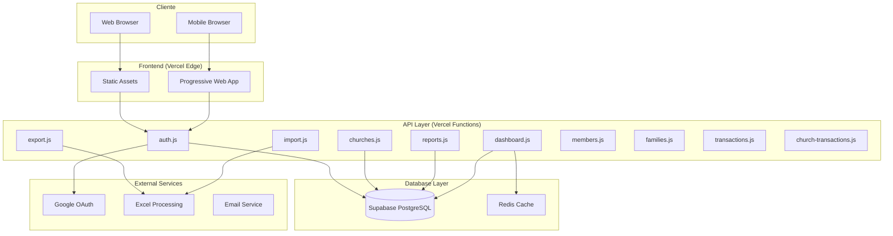
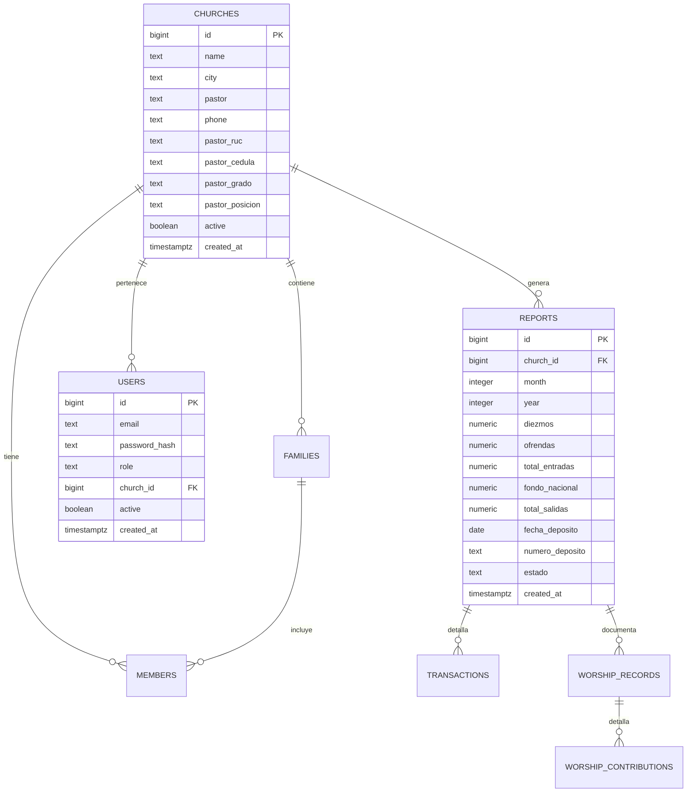

# System Architecture - IPU PY Tesorería

## Descripción General

El Sistema de Tesorería IPU PY es una aplicación web moderna diseñada específicamente para gestionar las finanzas de las 22 iglesias de la Iglesia Pentecostal Unida del Paraguay. Utiliza una arquitectura serverless optimizada para el cumplimiento normativo y la eficiencia operacional.

## Arquitectura de Alto Nivel



## Stack Tecnológico

### Frontend
- **HTML5/CSS3**: Interfaz responsive y accesible
- **JavaScript ES6+**: Funcionalidad moderna sin frameworks
- **Progressive Web App**: Instalación offline y notificaciones
- **Responsive Design**: Optimizado para móviles y escritorio

### Backend
- **Node.js 20.x**: Runtime de servidor
- **Vercel Serverless Functions**: 10 funciones optimizadas
- **Express.js 5.x**: Framework web minimalista
- **JWT**: Autenticación stateless
- **bcrypt**: Hash seguro de contraseñas

### Base de Datos
- **PostgreSQL 16**: Base de datos principal (Supabase)
- **Connection Pooling**: Gestión eficiente de conexiones
- **SSL/TLS**: Encriptación en tránsito
- **Backups Automáticos**: Respaldos diarios

### Servicios Externos
- **Google OAuth 2.0**: Autenticación corporativa
- **Excel.js**: Procesamiento de archivos XLSX
- **Vercel Analytics**: Métricas de rendimiento

## Arquitectura de Datos

### Modelo de Datos Principal



### Categorías de Datos

#### 1. Datos Eclesiásticos
- **22 Iglesias IPU Paraguay**: Información completa y actualizada
- **Pastores**: Grados ministeriales, documentos legales
- **Miembros**: Registro completo con bautismos y membresía
- **Familias**: Organización por núcleos familiares

#### 2. Datos Financieros
- **Ingresos**: Diezmos, ofrendas, departamentos (caballeros, damas, jóvenes, niños)
- **Gastos**: Honorarios pastorales, servicios básicos, otros
- **Fondo Nacional**: 10% automático + ofrendas directas
- **Control Bancario**: Depósitos y conciliaciones

#### 3. Datos Operativos
- **Reportes Mensuales**: 12 reportes anuales por iglesia
- **Transacciones**: Registro detallado de movimientos
- **Estadísticas**: Asistencia, bautismos, crecimiento
- **Auditoría**: Trazabilidad completa de cambios

## Patrones de Diseño Implementados

### 1. Repository Pattern
```javascript
// Abstracción de acceso a datos
class ChurchRepository {
  async findById(id) {
    return await db.query('SELECT * FROM churches WHERE id = $1', [id]);
  }

  async findActive() {
    return await db.query('SELECT * FROM churches WHERE active = true');
  }
}
```

### 2. Service Layer Pattern
```javascript
// Lógica de negocio separada
class ReportService {
  calculateFondoNacional(diezmos, ofrendas) {
    return (diezmos + ofrendas) * 0.10;
  }

  validateMonthlyReport(reportData) {
    // Validaciones específicas IPU
  }
}
```

### 3. Factory Pattern
```javascript
// Creación de objetos especializados
class ExportFactory {
  static createExporter(type) {
    switch(type) {
      case 'monthly_report': return new MonthlyReportExporter();
      case 'annual_summary': return new AnnualSummaryExporter();
      default: throw new Error('Tipo de exportación no soportado');
    }
  }
}
```

## Seguridad y Autenticación

### Niveles de Seguridad

#### 1. Autenticación Multi-Factor
```javascript
// JWT + Google OAuth
const authFlow = {
  primary: 'JWT_TOKEN',
  secondary: 'GOOGLE_OAUTH',
  fallback: 'EMAIL_PASSWORD'
};
```

#### 2. Autorización por Roles
```javascript
const roles = {
  admin: {
    permissions: ['read', 'write', 'delete', 'approve'],
    scope: 'all_churches'
  },
  church: {
    permissions: ['read', 'write'],
    scope: 'own_church_only'
  }
};
```

#### 3. Validación de Datos
```javascript
// Validación estricta de entrada
const validateReportData = (data) => {
  const schema = {
    diezmos: 'number|min:0|max:999999999',
    ofrendas: 'number|min:0|max:999999999',
    month: 'integer|min:1|max:12',
    year: 'integer|min:2020|max:2030'
  };
  return validate(data, schema);
};
```

## Optimizaciones de Rendimiento

### 1. Caching Strategy
```javascript
// Cache en múltiples niveles
const cacheStrategy = {
  browser: 'Service Worker + LocalStorage',
  edge: 'Vercel Edge Cache',
  database: 'PostgreSQL Query Cache',
  application: 'Redis Cache'
};
```

### 2. Database Optimization
```sql
-- Índices optimizados para consultas frecuentes
CREATE INDEX idx_reports_church_month_year ON reports(church_id, month, year);
CREATE INDEX idx_transactions_date_church ON transactions(date, church_id);
CREATE INDEX idx_members_church_active ON members(church_id, active);
```

### 3. API Response Optimization
```javascript
// Paginación y filtrado eficiente
const paginatedQuery = `
  SELECT * FROM reports
  WHERE church_id = $1
  ORDER BY year DESC, month DESC
  LIMIT $2 OFFSET $3
`;
```

## Escalabilidad y Disponibilidad

### Arquitectura Serverless
- **Auto-scaling**: Escalado automático según demanda
- **Cold Start Optimization**: Funciones optimizadas para arranque rápido
- **Global Distribution**: CDN global de Vercel
- **High Availability**: 99.9% uptime garantizado

### Database Scaling
- **Connection Pooling**: Pool de conexiones eficiente
- **Read Replicas**: Para consultas de solo lectura
- **Partitioning**: Particionado por año para reportes históricos
- **Archival Strategy**: Archivado de datos antiguos

## Cumplimiento Normativo

### Paraguay Compliance
- **Formato Contable**: Cumple normas contables paraguayas
- **Documentación Legal**: RUC, cédulas, facturación
- **Moneda Local**: Guaraní paraguayo (PYG)
- **Reportes Oficiales**: Formatos requeridos por autoridades

### Data Privacy
- **GDPR Compliance**: Protección de datos personales
- **Audit Trail**: Registro completo de accesos y cambios
- **Data Retention**: Políticas de retención de datos
- **Encryption**: Encriptación en reposo y tránsito

## Monitoreo y Observabilidad

### Métricas de Sistema
```javascript
const metrics = {
  performance: {
    response_time: 'avg < 200ms',
    throughput: '1000 req/min',
    error_rate: '< 0.1%'
  },
  business: {
    monthly_reports: 'completion_rate',
    user_activity: 'daily_active_users',
    data_accuracy: 'validation_success_rate'
  }
};
```

### Logging Strategy
```javascript
const logging = {
  levels: ['ERROR', 'WARN', 'INFO', 'DEBUG'],
  destinations: ['Console', 'Vercel Logs', 'External Monitor'],
  format: 'Structured JSON',
  retention: '30 days'
};
```

## Disaster Recovery

### Backup Strategy
- **Database Backups**: Diarios automáticos (Supabase)
- **Code Repository**: GitHub con historial completo
- **Configuration**: Variables de entorno respaldadas
- **Documentation**: Documentación técnica versionada

### Recovery Procedures
1. **RTO** (Recovery Time Objective): < 4 horas
2. **RPO** (Recovery Point Objective): < 1 hora
3. **Automated Failover**: Switching automático de regiones
4. **Data Validation**: Verificación de integridad post-recovery

## Roadmap Técnico

### Próximas Mejoras

#### Q1 2025
- [ ] Implementación de Redis para cache
- [ ] Optimización de queries complejas
- [ ] Mejoras en el sistema de notificaciones
- [ ] API rate limiting avanzado

#### Q2 2025
- [ ] Migration a PostgreSQL 17
- [ ] Implementación de Event Sourcing
- [ ] Real-time updates con WebSockets
- [ ] Advanced analytics dashboard

#### Q3 2025
- [ ] Mobile app nativa (React Native)
- [ ] AI-powered financial insights
- [ ] Blockchain para auditoría inmutable
- [ ] Integration con bancos paraguayos

## Consideraciones de Mantenimiento

### Code Maintenance
- **ESLint**: Linting automático
- **Prettier**: Formato consistente
- **Jest**: Testing unitario e integración
- **Husky**: Git hooks para quality gates

### Database Maintenance
- **Migrations**: Versionado de esquema
- **Seeding**: Datos iniciales automatizados
- **Cleanup**: Limpieza de datos obsoletos
- **Optimization**: Análisis periódico de performance

### Security Maintenance
- **Dependency Updates**: Actualizaciones de seguridad
- **Vulnerability Scanning**: Escaneo automático
- **Penetration Testing**: Testing trimestral
- **Security Headers**: Headers de seguridad actualizados

---

## Conclusión

La arquitectura del Sistema IPU PY Tesorería está diseñada para:

1. **Simplicidad**: Fácil mantenimiento y extensión
2. **Seguridad**: Protección robusta de datos eclesiásticos
3. **Escalabilidad**: Crecimiento sin degradación de performance
4. **Confiabilidad**: Alta disponibilidad para operaciones críticas
5. **Compliance**: Cumplimiento normativo paraguayo

Esta arquitectura proporciona una base sólida para el crecimiento futuro mientras mantiene la estabilidad operacional requerida por una institución religiosa de importancia nacional.

---

**Documentado por**: Equipo Técnico IPU PY
**Última actualización**: Diciembre 2024
**Versión**: 2.0.0