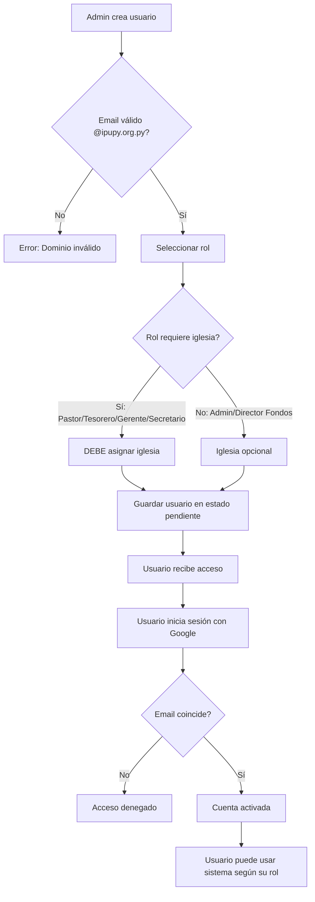

# Guía de Gestión de Usuarios - IPU PY Tesorería
> ⚠️ **DOCUMENTO DESACTUALIZADO**  
> **Última verificación vigente:** pre-migración 051 (antes de la consolidación del tesorero).  
> Describe un modelo de **7 roles** y flujos NextAuth reemplazados por Convex Auth.  
> Para información actual, revisa [`docs/ROLE_SYSTEM_REFERENCE.md`](../../ROLE_SYSTEM_REFERENCE.md) y la UI en `src/app/admin/users/page.tsx`.

**Última actualización**: 2025-10-05
**Versión**: 2.0 (Migration 040 - Tesorero Nacional Agregado)

---

## 📋 Resumen

Esta guía explica cómo crear y gestionar usuarios en el sistema IPU PY Tesorería, incluyendo la asignación de roles y iglesias.

---

## 🔑 Roles Disponibles

El sistema tiene **7 roles jerárquicos** (de mayor a menor privilegio):

### 1. 👑 Administrador
- **Alcance**: NACIONAL (todo el sistema)
- **Asignación de iglesia**: OPCIONAL (no requerida)
- **Capacidades**:
  - ✅ Gestionar todos los usuarios
  - ✅ Aprobar reportes de todas las iglesias
  - ✅ Configurar el sistema
  - ✅ Acceder a todas las iglesias
  - ✅ Llenar formularios para iglesias sin usuarios
- **Cuándo usar**: Para personal administrativo nacional

### 2. 🏛️ Tesorero Nacional
- **Alcance**: NACIONAL (TODOS los fondos nacionales)
- **Asignación de iglesia**: OPCIONAL (no requerida)
- **Capacidades**:
  - ✅ Aprobar eventos de TODOS los fondos nacionales
  - ✅ Ver y gestionar TODOS los 9 fondos nacionales
  - ✅ Crear y editar eventos de cualquier fondo
  - ✅ Supervisar trabajo de todos los directores de fondos
  - ✅ Ver todas las transacciones de fondos
  - ✅ Dashboard consolidado de tesorería nacional
  - ❌ NO puede gestionar usuarios (solo admin)
  - ❌ NO puede aprobar reportes de iglesias (solo admin)
- **Cuándo usar**: Para el Tesorero Nacional electo que supervisa todos los fondos
- **⚠️ IMPORTANTE**: Solo debe haber UN tesorero nacional (posición única electa)

### 3. 💼 Director de Fondos
- **Alcance**: NACIONAL (fondos asignados)
- **Asignación de iglesia**: NO REQUERIDA
- **Capacidades**:
  - ✅ Crear eventos para fondos nacionales
  - ✅ Enviar eventos para aprobación
  - ✅ Ver balance de fondos asignados
  - ✅ Registrar gastos reales post-evento
- **Cuándo usar**: Para directores de fondos específicos (Misiones, APY, etc.)

### 4. ⛪ Pastor
- **Alcance**: IGLESIA LOCAL (solo su iglesia)
- **Asignación de iglesia**: **REQUERIDA**
- **Capacidades**:
  - ✅ Crear reportes mensuales de su iglesia
  - ✅ Ver datos de su iglesia
  - ✅ Gestionar miembros de su iglesia
- **Cuándo usar**: Para pastores de iglesias locales

### 5. 💰 Tesorero
- **Alcance**: IGLESIA LOCAL (solo su iglesia)
- **Asignación de iglesia**: **REQUERIDA**
- **Capacidades**:
  - ✅ Crear reportes mensuales de su iglesia
  - ✅ Registrar transacciones financieras
  - ✅ Ver balance de fondos de su iglesia
- **Cuándo usar**: Para tesoreros de iglesias locales

### 6. 📊 Gerente de Iglesia
- **Alcance**: IGLESIA LOCAL (solo su iglesia)
- **Asignación de iglesia**: **REQUERIDA**
- **Capacidades**:
  - ✅ Ver miembros de su iglesia
  - ✅ Ver reportes de su iglesia
  - ✅ Ver iglesias (lectura)
- **Cuándo usar**: Para personal administrativo de iglesia

### 7. 📝 Secretario
- **Alcance**: IGLESIA LOCAL (solo su iglesia)
- **Asignación de iglesia**: **REQUERIDA**
- **Capacidades**:
  - ✅ Gestionar miembros
  - ✅ Editar perfil propio
- **Cuándo usar**: Para secretarios de iglesias locales

---

## 🚀 Cómo Crear un Usuario

### Paso 1: Acceder al Diálogo de Creación
1. Iniciar sesión como **Administrador**
2. Ir a **Configuración** → **Usuarios**
3. Hacer clic en **"Crear nuevo usuario"**

### Paso 2: Llenar Información del Usuario

#### Email (Requerido)
- **Formato**: `usuario@ipupy.org.py`
- **Validación**: Solo emails del dominio `@ipupy.org.py` son permitidos
- **Ejemplo**: `tesorero@ipupy.org.py`

#### Nombre Completo (Opcional)
- **Ejemplo**: `Anthony Bir`

#### Rol (Requerido)
Seleccionar uno de los 7 roles:
- **Administrador** - Gestión nacional completa
- **Tesorero Nacional** - Supervisión de todos los fondos (posición electa)
- **Director de Fondos** - Gestión de fondos nacionales
- **Pastor** - Liderazgo de iglesia local
- **Tesorero** - Finanzas de iglesia local
- **Gerente de Iglesia** - Administración de iglesia
- **Secretario** - Soporte administrativo

#### Iglesia (Condicional)
- **REQUERIDA para**: Pastor, Tesorero, Gerente de Iglesia, Secretario
- **OPCIONAL para**: Administrador, Tesorero Nacional, Director de Fondos
- **Opciones**:
  - "Sin asignar" (para roles nacionales)
  - Lista de 38 iglesias disponibles

#### Teléfono (Opcional)
- **Formato**: `(+595) 999 123456`

### Paso 3: Guardar y Activar

1. Hacer clic en **"Crear usuario"**
2. El usuario recibirá un perfil en estado "pendiente"
3. **IMPORTANTE**: El usuario debe:
   - Ir a [ipupytesoreria.vercel.app](https://ipupytesoreria.vercel.app)
   - Hacer clic en "Iniciar sesión con Google"
   - Usar su email `@ipupy.org.py`
   - Esto activa su cuenta y sincroniza con Supabase

---

## 📊 Ejemplos de Casos de Uso

### Caso 1: Crear Tesorero para Iglesia de Asunción
```
✅ Email: tesorero.asuncion@ipupy.org.py
✅ Nombre: María González
✅ Rol: Tesorero
✅ Iglesia: Asunción Central ← REQUERIDO
✅ Teléfono: (+595) 981 123456
```
**Resultado**: María puede crear reportes mensuales SOLO para Asunción Central

### Caso 2: Crear Administrador Nacional
```
✅ Email: admin.nacional@ipupy.org.py
✅ Nombre: Carlos Benítez
✅ Rol: Administrador
✅ Iglesia: Sin asignar ← OPCIONAL para admin
✅ Teléfono: (+595) 971 654321
```
**Resultado**: Carlos tiene acceso completo al sistema (todas las 38 iglesias)

### Caso 3: Crear Director de Fondo de Misiones
```
✅ Email: misiones.director@ipupy.org.py
✅ Nombre: Pedro Ramírez
✅ Rol: Director de Fondos
✅ Iglesia: Sin asignar ← No necesita iglesia
✅ Teléfono: (+595) 961 789012
```
**Resultado**: Pedro gestiona eventos del Fondo de Misiones (nivel nacional)

### Caso 4: Crear Tesorero Nacional (Posición Electa)
```
✅ Email: tesoreria.nacional@ipupy.org.py
✅ Nombre: Roberto Sánchez
✅ Rol: Tesorero Nacional
✅ Iglesia: Sin asignar ← No necesita iglesia
✅ Teléfono: (+595) 971 456789
```
**Resultado**: Roberto supervisa TODOS los 9 fondos nacionales y aprueba eventos de todos los directores de fondos
**⚠️ IMPORTANTE**: Esta es una posición única electa - solo debe haber UN tesorero nacional en el sistema

---

## ⚠️ Errores Comunes y Soluciones

### Error: "El email debe ser del dominio @ipupy.org.py"
**Causa**: Email no termina en `@ipupy.org.py`
**Solución**: Usar solo emails institucionales de IPU Paraguay

### Error: Dropdown de iglesia vacío
**Causa**: El usuario tiene rol de Pastor/Tesorero pero no hay iglesias cargadas
**Solución**: Contactar al administrador para cargar iglesias en el sistema

### Error: Usuario no puede iniciar sesión
**Causa**: El usuario no ha activado su cuenta
**Solución**:
1. Ir a [ipupytesoreria.vercel.app](https://ipupytesoreria.vercel.app)
2. Iniciar sesión con Google
3. Usar el email `@ipupy.org.py` asignado

### Error: Tesorero no ve opción de crear reportes
**Causa**: No tiene iglesia asignada
**Solución**:
1. Editar usuario
2. Asignar una iglesia específica
3. Guardar cambios

---

## 🔒 Seguridad y Permisos

### Restricciones de Dominio
- ✅ Solo emails `@ipupy.org.py` pueden autenticarse
- ❌ Emails de Gmail, Outlook, etc. son rechazados automáticamente

### Control de Acceso por Rol
| Rol | Puede crear usuarios | Puede aprobar reportes | Puede aprobar eventos | Alcance de datos |
|-----|---------------------|------------------------|----------------------|------------------|
| Administrador | ✅ | ✅ | ✅ | TODAS las iglesias y fondos |
| Tesorero Nacional | ❌ | ❌ | ✅ | TODOS los fondos nacionales |
| Director de Fondos | ❌ | ❌ | ❌ | Fondos asignados |
| Pastor | ❌ | ❌ | ❌ | Solo su iglesia |
| Tesorero | ❌ | ❌ | ❌ | Solo su iglesia |
| Gerente de Iglesia | ❌ | ❌ | ❌ | Solo su iglesia |
| Secretario | ❌ | ❌ | ❌ | Solo su iglesia |

### Auditoría
Todas las acciones de usuarios son registradas en `user_activity`:
- Creación de usuarios
- Cambios de rol
- Aprobación de reportes
- Modificaciones de datos

---

## ❓ Preguntas Frecuentes

### ¿Puedo tener múltiples administradores?
✅ **SÍ** - El sistema permite múltiples usuarios con rol de Administrador. No hay límite técnico.

### ¿Un usuario puede tener múltiples roles?
❌ **NO** - Cada usuario tiene exactamente UN rol. Si necesita capacidades de múltiples roles, asigne el rol de mayor privilegio.

### ¿Qué pasa si asigno una iglesia a un Administrador?
✅ **Funciona normalmente** - El administrador seguirá teniendo acceso a TODAS las iglesias. La iglesia asignada solo sirve como referencia opcional.

### ¿Un tesorero puede gestionar múltiples iglesias?
❌ **NO** - Los roles de iglesia local (Pastor, Tesorero, Gerente, Secretario) solo pueden gestionar UNA iglesia. Para gestión multi-iglesia, use rol de Administrador.

### ¿Cómo asigno fondos a un Director de Fondos?
📝 **Pendiente**: La asignación de fondos se realiza por separado después de crear el usuario. Contactar al administrador del sistema.

### ¿Puedo cambiar el rol de un usuario existente?
✅ **SÍ** - Los administradores pueden editar usuarios y cambiar su rol en cualquier momento.

---

## 🔄 Flujo Completo de Creación de Usuario



---

## 📞 Soporte

**Problemas técnicos**: `administracion@ipupy.org.py`

**Documentación técnica**:
- [ROLES_AND_PERMISSIONS.md](./ROLES_AND_PERMISSIONS.md) - Sistema de permisos detallado
- [FINAL_VERIFICATION_2025-10-05.md](./FINAL_VERIFICATION_2025-10-05.md) - Estado actual del sistema
# Guía de Gestión de Usuarios - IPU PY Tesorería
> ⚠️ **DOCUMENTO DESACTUALIZADO**  
> **Última verificación vigente:** pre-migración 051 (antes de la consolidación del tesorero).  
> Este archivo describe un modelo de **7 roles** y procesos NextAuth que ya no existen.  
> Consulta la fuente de verdad actualizada en [`docs/ROLE_SYSTEM_REFERENCE.md`](../../ROLE_SYSTEM_REFERENCE.md) y la UI moderna en `src/app/admin/users/page.tsx`.
