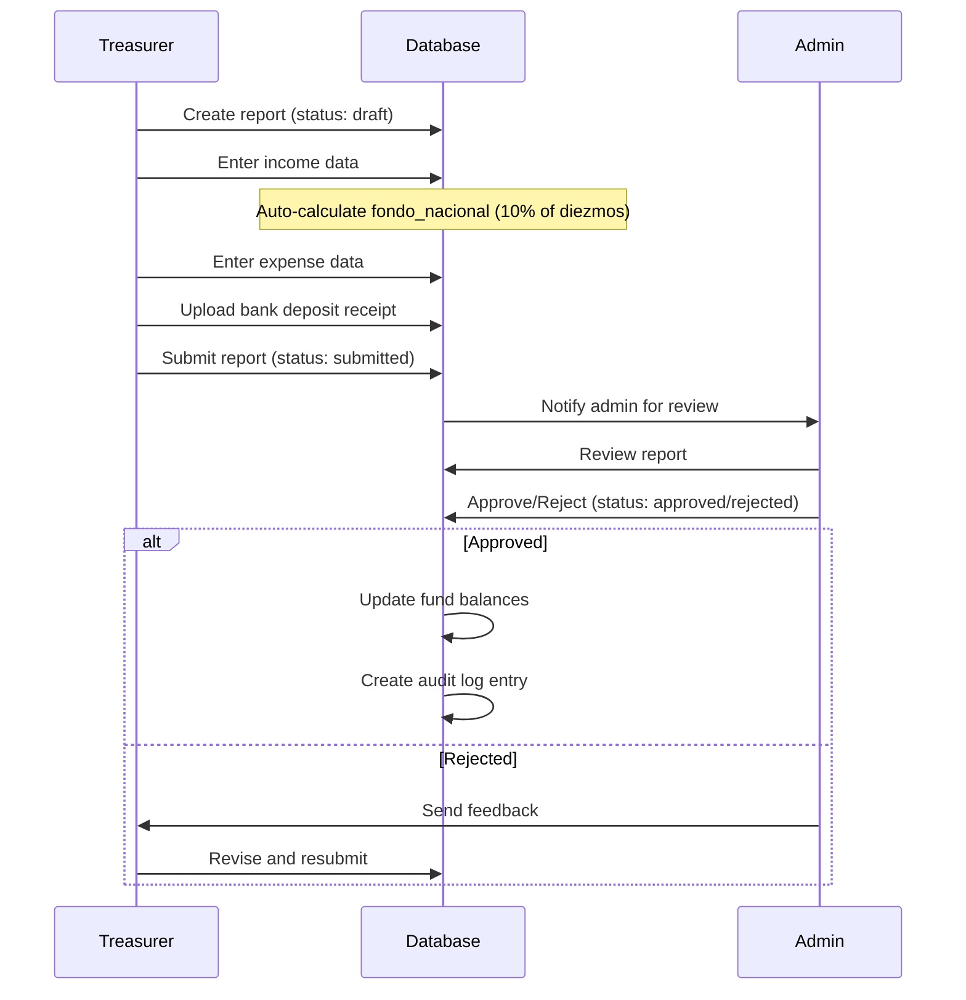
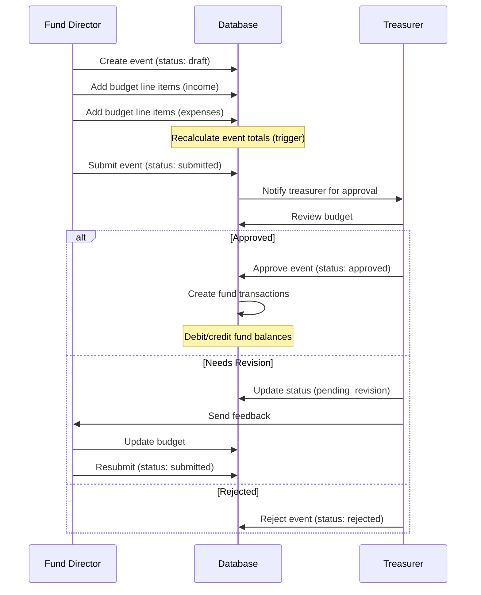
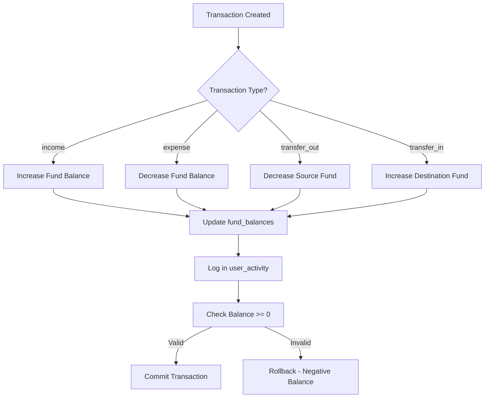
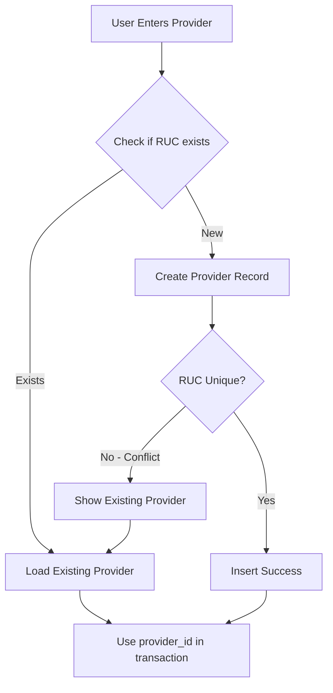
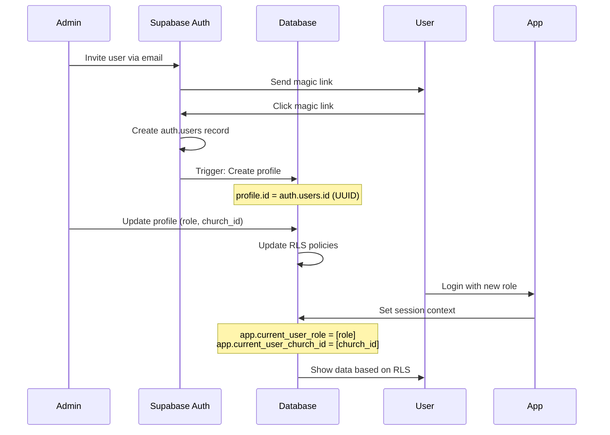
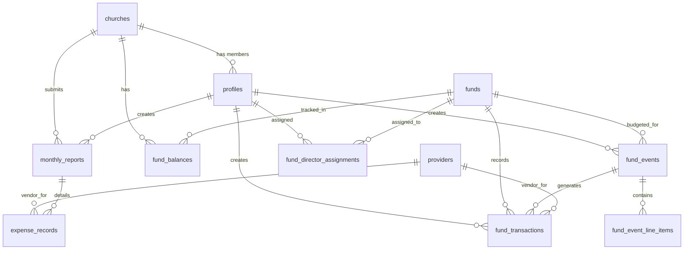

# Business Logic & Workflows - IPU PY Tesorería

## Overview

This document describes the business logic, workflows, and data relationships in IPU PY Tesorería. Understanding these workflows is essential for maintaining data integrity and implementing new features.

---

## Core Workflows

### 1. Monthly Report Submission

**Actors**: Treasurer, Pastor, Admin
**Frequency**: Monthly (due by 5th of following month)



**Database Operations**:

1. **Create Draft**:
```sql
INSERT INTO monthly_reports (
  church_id, month, year, status, created_by
) VALUES ($1, $2, $3, 'draft', $4);
```

2. **Auto-Calculate Fondo Nacional**:
```sql
-- GENERATED column in schema
fondo_nacional NUMERIC(18,2) GENERATED ALWAYS AS (diezmos * 0.10) STORED
```

3. **Submit for Approval**:
```sql
UPDATE monthly_reports
SET status = 'submitted', submitted_at = NOW()
WHERE id = $1 AND created_by = $2;
```

4. **Admin Approval**:
```sql
UPDATE monthly_reports
SET status = 'approved', approved_by = $1, approved_at = NOW()
WHERE id = $2;
```

**Business Rules**:
- ✅ Only ONE report per church/month/year (UNIQUE constraint)
- ✅ Fondo nacional = 10% of diezmos (auto-calculated)
- ✅ Bank deposit receipt required for approval
- ✅ Treasurer/pastor can create, only admin can approve
- ✅ Cannot modify after approval (status-based RLS)

---

### 2. Fund Event Planning & Approval

**Actors**: Fund Director, Treasurer, Admin
**Use Case**: Plan budgeted events (conferences, youth camps, missions)



**Database Operations**:

1. **Create Event**:
```sql
INSERT INTO fund_events (
  fund_id, church_id, name, event_date, status, created_by
) VALUES ($1, $2, $3, $4, 'draft', $5);
```

2. **Add Budget Line Items**:
```sql
INSERT INTO fund_event_line_items (
  event_id, category, description, budget_amount
) VALUES ($1, $2, $3, $4);

-- Trigger: recalculate_event_totals_on_line_item_change
-- Updates parent event's total_budget_income/total_budget_expense
```

3. **Treasurer Approval**:
```sql
UPDATE fund_events
SET 
  status = 'approved',
  approved_by = $1,
  approved_at = NOW()
WHERE id = $2;

-- Trigger: create_fund_transactions_on_event_approval
-- Creates ledger entries based on budget
```

4. **Post-Event Actuals** (after event):
```sql
-- Update line items with actual amounts
UPDATE fund_event_line_items
SET actual_amount = $1
WHERE id = $2;

-- Trigger recalculates event's total_actual_income/total_actual_expense
```

**Business Rules**:
- ✅ Fund director can ONLY create events for assigned funds
- ✅ Only treasurer can approve events
- ✅ Budget totals calculated automatically (trigger)
- ✅ Transactions created ONLY on approval
- ✅ Variance analysis: budget vs actuals
- ✅ Fund balance updated on transaction creation

---

### 3. Fund Transaction Ledger

**Actors**: Treasurer, Pastor, Fund Director, System
**Purpose**: Track all fund movements with automatic balance updates



**Database Operations**:

1. **Record Income**:
```sql
INSERT INTO fund_transactions (
  church_id, fund_id, transaction_type, amount, description, transaction_date, created_by
) VALUES ($1, $2, 'income', $3, $4, $5, $6);

-- Trigger: update_fund_balance_on_transaction
-- UPDATE fund_balances SET balance = balance + $3 WHERE church_id = $1 AND fund_id = $2
```

2. **Record Expense**:
```sql
INSERT INTO fund_transactions (
  church_id, fund_id, transaction_type, amount, description, transaction_date, provider_id, created_by
) VALUES ($1, $2, 'expense', $3, $4, $5, $6, $7);

-- Trigger: update_fund_balance_on_transaction
-- UPDATE fund_balances SET balance = balance - $3 WHERE church_id = $1 AND fund_id = $2

-- Trigger: prevent_negative_balance
-- RAISE EXCEPTION IF new_balance < 0
```

3. **Fund Transfer**:
```sql
-- Create transfer_out transaction
INSERT INTO fund_transactions (
  church_id, fund_id, transaction_type, amount, description, transaction_date, created_by
) VALUES ($1, $2, 'transfer_out', $3, 'Transfer to ' || $4, $5, $6)
RETURNING id INTO transfer_out_id;

-- Create transfer_in transaction (linked)
INSERT INTO fund_transactions (
  church_id, fund_id, transaction_type, amount, description, transaction_date, related_transaction_id, created_by
) VALUES ($1, $4, 'transfer_in', $3, 'Transfer from ' || $2, $5, transfer_out_id, $6);

-- Both triggers update respective fund balances
```

**Business Rules**:
- ✅ All transactions update fund_balances automatically (trigger)
- ✅ Negative balances prevented (CHECK constraint + trigger)
- ✅ Transfers create TWO linked transactions
- ✅ Provider reference optional (expense transactions)
- ✅ Related event reference optional (event-based transactions)
- ✅ Transaction type immutable (no UPDATE, only soft delete)

---

### 4. Provider Registry & Deduplication

**Actors**: Treasurer, Secretary, System
**Purpose**: Centralized vendor management with RUC deduplication



**Database Operations**:

1. **Check for Duplicate**:
```sql
-- Helper function from migration 027
SELECT * FROM find_provider_by_ruc('80012345-6');

-- Returns existing provider or empty result
```

2. **Create Provider**:
```sql
INSERT INTO providers (
  ruc, nombre, tipo_identificacion, categoria, created_by
) VALUES ($1, $2, $3, $4, $5)
ON CONFLICT (ruc) DO UPDATE
  SET nombre = EXCLUDED.nombre,
      updated_at = NOW()
RETURNING id;

-- UNIQUE constraint prevents RUC duplicates
```

3. **Search Providers** (autocomplete):
```sql
-- Helper function
SELECT * FROM search_providers('ANDE', 'servicios_publicos', 20);

-- Full-text search on nombre + RUC + razon_social
-- GIN index for performance
```

4. **Link to Transaction**:
```sql
INSERT INTO fund_transactions (
  ...,
  provider_id,
  ...
) VALUES (..., provider_id_from_above, ...);
```

**Business Rules**:
- ✅ RUC must be unique (database-level UNIQUE constraint)
- ✅ Special providers: ANDE (NIS), ESSAP (ISSAN)
- ✅ All transaction creators can create providers
- ✅ Only admin/treasurer can modify providers
- ✅ Soft delete via is_active flag (preserve referential integrity)

---

### 5. User Management & Role Assignment

**Actors**: Admin
**Purpose**: Create users and assign roles/churches



**Database Operations**:

1. **Create Profile** (trigger on auth.users insert):
```sql
-- Automatic via Supabase trigger
INSERT INTO profiles (id, email, role, is_active)
VALUES (auth_user_id, auth_email, 'member', true);
```

2. **Assign Role & Church**:
```sql
UPDATE profiles
SET 
  role = $1,
  church_id = $2,
  full_name = $3
WHERE id = $4;
```

3. **Fund Director Assignment**:
```sql
-- Assign fund director to specific fund
INSERT INTO fund_director_assignments (
  profile_id, fund_id, church_id, created_by
) VALUES ($1, $2, $3, $4)
ON CONFLICT (profile_id, fund_id, church_id) DO NOTHING;
```

4. **Deactivate User**:
```sql
-- Soft delete (preserve audit trail)
UPDATE profiles
SET is_active = false, updated_at = NOW()
WHERE id = $1;

-- User can no longer login (handled by auth middleware)
```

**Business Rules**:
- ✅ Profile created automatically when user signs up (Supabase trigger)
- ✅ Default role: `member` (read-only access)
- ✅ Admin assigns role + church
- ✅ Fund directors require additional assignment record
- ✅ Soft delete preserves audit trail
- ✅ Email must be unique across organization

---

## Data Integrity Rules

### Automatic Calculations

#### 1. Fondo Nacional (National Fund)

**Formula**: 10% of diezmos (tithes)

```sql
-- GENERATED column (cannot be manually set)
fondo_nacional NUMERIC(18,2) GENERATED ALWAYS AS (diezmos * 0.10) STORED

-- Total national fund includes direct offerings
total_fondo_nacional NUMERIC(18,2) GENERATED ALWAYS AS (
  COALESCE(fondo_nacional, 0) + 
  COALESCE(ofrenda_misiones, 0) + 
  COALESCE(lazos_amor, 0) + 
  COALESCE(mision_posible, 0) + 
  COALESCE(aporte_caballeros, 0) + 
  COALESCE(apy, 0) + 
  COALESCE(instituto_biblico, 0) + 
  COALESCE(diezmo_pastoral, 0)
) STORED
```

#### 2. Report Totals

```sql
-- Auto-calculated income
total_entradas NUMERIC(18,2) GENERATED ALWAYS AS (
  diezmos + ofrendas + anexos + caballeros + damas + jovenes + ninos + otros_ingresos
) STORED

-- Manual expense total (summed from expense_records)
total_salidas NUMERIC(18,2) DEFAULT 0
```

#### 3. Event Budget Totals

**Trigger**: `recalculate_event_totals_on_line_item_change`

```sql
-- Fired on INSERT/UPDATE/DELETE of fund_event_line_items
UPDATE fund_events
SET 
  total_budget_income = (
    SELECT SUM(budget_amount) FROM fund_event_line_items
    WHERE event_id = NEW.event_id AND category = 'income'
  ),
  total_budget_expense = (
    SELECT SUM(budget_amount) FROM fund_event_line_items
    WHERE event_id = NEW.event_id AND category = 'expense'
  )
WHERE id = NEW.event_id;
```

### Balance Constraints

#### 1. Fund Balance Non-Negative

**Trigger**: `prevent_negative_balance`

```sql
CREATE TRIGGER prevent_negative_balance
BEFORE INSERT OR UPDATE ON fund_transactions
FOR EACH ROW
EXECUTE FUNCTION check_fund_balance();

-- Function logic:
-- IF transaction_type = 'expense' AND new_balance < 0 THEN
--   RAISE EXCEPTION 'Insufficient fund balance'
-- END IF;
```

#### 2. Fund Balance Auto-Update

**Trigger**: `update_fund_balance_on_transaction`

```sql
CREATE TRIGGER update_fund_balance_on_transaction
AFTER INSERT OR UPDATE OR DELETE ON fund_transactions
FOR EACH ROW
EXECUTE FUNCTION update_fund_balance();

-- Function logic:
-- ON INSERT:
--   IF type = 'income' OR type = 'transfer_in': balance += amount
--   IF type = 'expense' OR type = 'transfer_out': balance -= amount
-- ON DELETE:
--   Reverse the balance change
```

### Audit Trail

#### 1. User Activity Logging

**All mutations logged**:
```sql
-- Logged automatically via executeWithContext()
INSERT INTO user_activity (
  user_id, action, resource_type, resource_id, details, ip_address
) VALUES ($1, $2, $3, $4, $5, $6);
```

**Logged Actions**:
- `create`, `update`, `delete`: CRUD operations
- `approve`, `reject`: Workflow actions
- `login`, `logout`: Authentication events
- `export`, `import`: Data operations

#### 2. Timestamp Maintenance

**Trigger**: `update_updated_at_column`

```sql
-- Applied to all tables with updated_at column
CREATE TRIGGER update_[table]_updated_at
BEFORE UPDATE ON [table]
FOR EACH ROW
EXECUTE FUNCTION update_updated_at_column();

-- Sets updated_at = NOW() automatically
```

---

## Data Relationships

### Core Entity Relationships



### Key Foreign Key Relationships

| Child Table | Parent Table | Relationship | ON DELETE |
|-------------|--------------|--------------|-----------|
| **monthly_reports** | churches | church_id | CASCADE |
| **monthly_reports** | profiles (created_by) | created_by | SET NULL |
| **monthly_reports** | profiles (approved_by) | approved_by | SET NULL |
| **fund_balances** | churches | church_id | CASCADE |
| **fund_balances** | funds | fund_id | CASCADE |
| **fund_transactions** | churches | church_id | CASCADE |
| **fund_transactions** | funds | fund_id | RESTRICT |
| **fund_transactions** | providers | provider_id | SET NULL |
| **fund_transactions** | fund_events | related_event_id | SET NULL |
| **fund_events** | funds | fund_id | RESTRICT |
| **fund_events** | profiles (created_by) | created_by | SET NULL |
| **fund_event_line_items** | fund_events | event_id | CASCADE |
| **fund_director_assignments** | profiles | profile_id | CASCADE |
| **fund_director_assignments** | funds | fund_id | CASCADE |
| **expense_records** | churches | church_id | CASCADE |
| **expense_records** | monthly_reports | report_id | CASCADE |
| **expense_records** | providers | provider_id | SET NULL |

**Delete Behavior**:
- **CASCADE**: Delete child records (fund_event_line_items when event deleted)
- **RESTRICT**: Prevent deletion if children exist (cannot delete fund with transactions)
- **SET NULL**: Preserve record, nullify reference (created_by when user deleted)

---

## Complex Business Logic

### 1. Event Approval Workflow

**State Machine**:
```
draft → submitted → approved
  ↓         ↓          ↓
pending_revision    rejected
  ↓
submitted
```

**State Transitions**:
| From | To | Actor | Condition |
|------|-----|-------|-----------|
| draft | submitted | Fund Director | Budget complete |
| draft | cancelled | Fund Director | Anytime |
| submitted | approved | Treasurer | Budget valid |
| submitted | rejected | Treasurer | Budget invalid |
| submitted | pending_revision | Treasurer | Needs changes |
| pending_revision | submitted | Fund Director | Changes made |
| approved | - | - | FINAL STATE |

**Database Enforcement**:
```sql
-- Status CHECK constraint
status TEXT CHECK (status IN (
  'draft', 'pending_revision', 'submitted', 'approved', 'rejected', 'cancelled'
))

-- RLS policy prevents modification after approval
CREATE POLICY "Cannot modify approved events"
ON fund_events FOR UPDATE
USING (
  app_current_user_role() = 'admin' OR
  (app_current_user_role() = 'treasurer' AND status != 'approved') OR
  (app_user_is_fund_director() AND status IN ('draft', 'pending_revision'))
);
```

### 2. Monthly Report Reconciliation

**Auto-Reconciliation** (via trigger):

1. **Calculate Total Income**:
```sql
total_entradas = diezmos + ofrendas + anexos + caballeros + damas + jovenes + ninos + otros_ingresos
```

2. **Calculate Fondo Nacional**:
```sql
fondo_nacional = diezmos * 0.10
```

3. **Verify Bank Deposit**:
```sql
-- Business rule: monto_depositado should equal total_fondo_nacional
-- Validated on approval by admin
IF ABS(monto_depositado - total_fondo_nacional) > 100 THEN
  RAISE WARNING 'Deposit amount mismatch'
END IF
```

4. **Update Fund Balances** (on approval):
```sql
-- Transfer fondo_nacional to national fund
INSERT INTO fund_transactions (
  church_id, fund_id, transaction_type, amount, description, transaction_date
) VALUES (
  report.church_id, 
  [national_fund_id], 
  'income', 
  report.total_fondo_nacional, 
  'Fondo Nacional - ' || report.month || '/' || report.year,
  report.fecha_deposito
);
```

### 3. Fund Transfer Logic

**Atomic Two-Transaction Pattern**:

```typescript
// Application-level transaction
async function transferFunds(
  sourceChurch: number,
  sourceFund: number,
  destFund: number,
  amount: number,
  description: string,
  auth: AuthContext
) {
  return await executeWithContext(auth, async (client) => {
    await client.query('BEGIN');

    try {
      // 1. Create transfer_out transaction
      const outResult = await client.query(
        `INSERT INTO fund_transactions (
          church_id, fund_id, transaction_type, amount, description, transaction_date, created_by
        ) VALUES ($1, $2, 'transfer_out', $3, $4, CURRENT_DATE, $5)
        RETURNING id`,
        [sourceChurch, sourceFund, amount, `Transfer to fund ${destFund}: ${description}`, auth.userId]
      );

      const transferOutId = outResult.rows[0].id;

      // 2. Create transfer_in transaction (linked)
      await client.query(
        `INSERT INTO fund_transactions (
          church_id, fund_id, transaction_type, amount, description, transaction_date, related_transaction_id, created_by
        ) VALUES ($1, $2, 'transfer_in', $3, $4, CURRENT_DATE, $5, $6)`,
        [sourceChurch, destFund, amount, `Transfer from fund ${sourceFund}: ${description}`, transferOutId, auth.userId]
      );

      // 3. Triggers update fund_balances for both funds
      // 4. Verify source fund balance not negative
      const balanceCheck = await client.query(
        `SELECT balance FROM fund_balances WHERE church_id = $1 AND fund_id = $2`,
        [sourceChurch, sourceFund]
      );

      if (balanceCheck.rows[0].balance < 0) {
        throw new Error('Transfer would result in negative balance');
      }

      await client.query('COMMIT');
    } catch (error) {
      await client.query('ROLLBACK');
      throw error;
    }
  });
}
```

---

## Performance Considerations

### Indexed Queries

**Most Common Queries**:

1. **Get church reports for year**:
```sql
SELECT * FROM monthly_reports
WHERE church_id = $1 AND year = $2
ORDER BY month;

-- Index: idx_monthly_reports_church_year (church_id, year)
```

2. **Get fund balance for church**:
```sql
SELECT * FROM fund_balances
WHERE church_id = $1 AND fund_id = $2;

-- Index: unique_church_fund (church_id, fund_id) - UNIQUE
```

3. **Get recent transactions for fund**:
```sql
SELECT * FROM fund_transactions
WHERE church_id = $1 AND fund_id = $2
ORDER BY transaction_date DESC, created_at DESC
LIMIT 50;

-- Index: idx_fund_transactions_church_fund_date (church_id, fund_id, transaction_date DESC)
```

4. **Search providers by name**:
```sql
SELECT * FROM providers
WHERE to_tsvector('spanish', nombre) @@ plainto_tsquery('spanish', $1)
AND es_activo = TRUE
LIMIT 20;

-- Index: idx_providers_nombre (GIN on to_tsvector('spanish', nombre))
```

### Query Optimization Tips

1. **Use EXISTS instead of IN for subqueries**:
```sql
-- ✅ GOOD
SELECT * FROM fund_events e
WHERE EXISTS (
  SELECT 1 FROM fund_director_assignments fda
  WHERE fda.fund_id = e.fund_id AND fda.profile_id = $1
);

-- ❌ SLOW
SELECT * FROM fund_events e
WHERE fund_id IN (
  SELECT fund_id FROM fund_director_assignments WHERE profile_id = $1
);
```

2. **Avoid SELECT * in joins**:
```sql
-- ✅ GOOD
SELECT e.id, e.name, e.event_date, f.name as fund_name
FROM fund_events e
JOIN funds f ON e.fund_id = f.id;

-- ❌ WASTEFUL
SELECT e.*, f.*
FROM fund_events e
JOIN funds f ON e.fund_id = f.id;
```

3. **Use CTEs for complex aggregations**:
```sql
-- ✅ READABLE & EFFICIENT
WITH event_totals AS (
  SELECT 
    event_id,
    SUM(CASE WHEN category = 'income' THEN budget_amount ELSE 0 END) as budget_income,
    SUM(CASE WHEN category = 'expense' THEN budget_amount ELSE 0 END) as budget_expense
  FROM fund_event_line_items
  GROUP BY event_id
)
SELECT e.*, et.budget_income, et.budget_expense
FROM fund_events e
JOIN event_totals et ON e.id = et.event_id;
```

---

## Edge Cases & Error Handling

### 1. Concurrent Report Submission

**Problem**: Two users try to create report for same church/month/year

**Solution**: UNIQUE constraint + ON CONFLICT handling

```sql
-- Database prevents duplicates
CONSTRAINT unique_church_month_year UNIQUE (church_id, month, year)

-- Application handles conflict
INSERT INTO monthly_reports (church_id, month, year, ...)
VALUES ($1, $2, $3, ...)
ON CONFLICT (church_id, month, year) DO UPDATE
  SET updated_at = NOW()
RETURNING id;
```

### 2. Fund Balance Race Condition

**Problem**: Two transactions try to withdraw from same fund simultaneously

**Solution**: Row-level locking + balance check

```sql
-- Lock fund_balances row for update
SELECT balance FROM fund_balances
WHERE church_id = $1 AND fund_id = $2
FOR UPDATE;

-- Check balance sufficient
IF balance - withdrawal_amount < 0 THEN
  RAISE EXCEPTION 'Insufficient funds'
END IF;

-- Deduct balance (locked, no race condition)
UPDATE fund_balances
SET balance = balance - withdrawal_amount
WHERE church_id = $1 AND fund_id = $2;
```

### 3. Orphaned Event Line Items

**Problem**: Event deleted, line items remain

**Solution**: CASCADE foreign key

```sql
-- Foreign key with CASCADE
fund_event_line_items.event_id REFERENCES fund_events(id) ON DELETE CASCADE

-- When event deleted, all line items automatically deleted
DELETE FROM fund_events WHERE id = $1;
-- Line items deleted automatically
```

### 4. Provider RUC Conflicts

**Problem**: Same provider added by multiple users

**Solution**: UNIQUE constraint + ON CONFLICT

```sql
-- Database enforces uniqueness
CONSTRAINT providers_ruc_unique UNIQUE (ruc)

-- Application handles duplicate gracefully
INSERT INTO providers (ruc, nombre, ...)
VALUES ($1, $2, ...)
ON CONFLICT (ruc) DO UPDATE
  SET nombre = EXCLUDED.nombre, updated_at = NOW()
RETURNING id;
```

---

## Resources

- [Schema Reference](./SCHEMA_REFERENCE.md)
- [RLS Policies](./RLS_POLICIES.md)
- [API Documentation](../API_REFERENCE.md)
- [Migration History](../../migrations/)

---

**Last Updated**: October 2025
**Next Review**: January 2026
