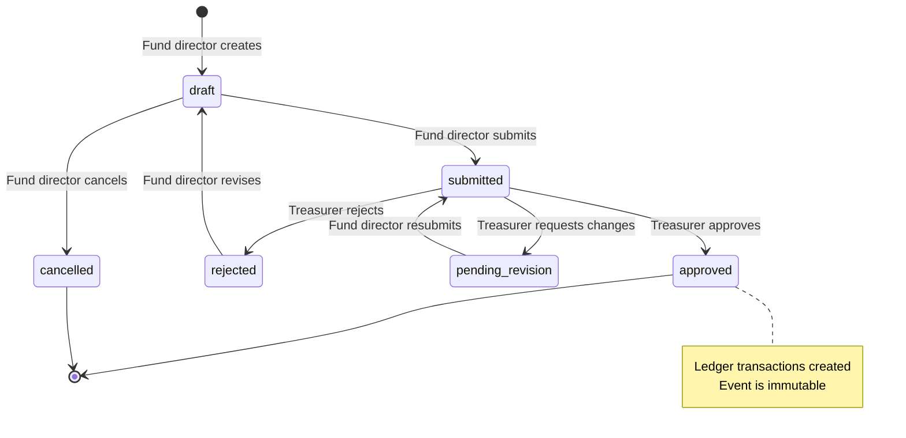
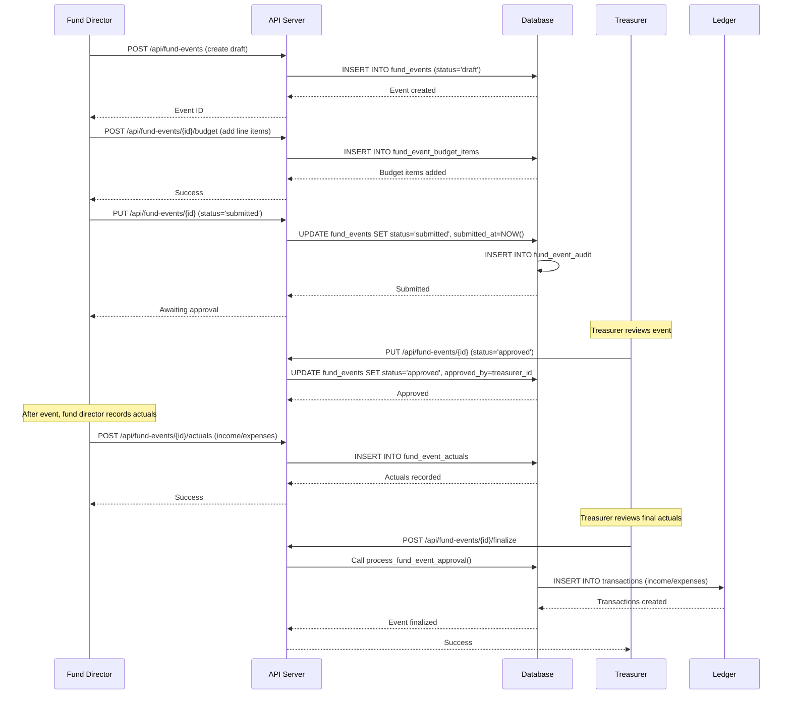

# Fund Events Feature Guide

**Document Version**: 1.0.0
**Last Updated**: 2025-10-06
**Target Audience**: Fund Directors, Treasurers, Administrators

---

## Table of Contents

- [Overview](#overview)
- [Feature Purpose](#feature-purpose)
- [User Roles and Permissions](#user-roles-and-permissions)
- [Event Lifecycle](#event-lifecycle)
- [Creating an Event Budget](#creating-an-event-budget)
- [Budget Categories](#budget-categories)
- [Recording Actual Income and Expenses](#recording-actual-income-and-expenses)
- [Treasurer Approval Workflow](#treasurer-approval-workflow)
- [Variance Analysis](#variance-analysis)
- [Automatic Ledger Transactions](#automatic-ledger-transactions)
- [Fund Director Restrictions](#fund-director-restrictions)
- [Common Scenarios](#common-scenarios)
- [Troubleshooting](#troubleshooting)
- [Technical Reference](#technical-reference)
- [See Also](#see-also)

---

## Overview

The **Fund Events** (Eventos de Fondos) system enables **fund directors** to plan events, track budgets, and manage actual income/expenses with **treasurer approval**. This feature was introduced in **migration 026** and consolidated with the treasurer role in **migration 053**.

### Key Capabilities

- 📋 Event budget planning with line items
- 💵 Actual income/expense tracking post-event
- ✅ Draft → Submitted → Approved workflow
- 👤 Treasurer approval requirement
- 📊 Budget vs actuals variance analysis
- 🔗 Automatic ledger transaction creation on approval
- 🔒 Fund-level access restrictions

### Architecture

```
┌──────────────┐     ┌──────────────┐     ┌──────────────┐
│ fund_events  │────▶│ budget_items │────▶│   actuals    │
│   (header)   │     │  (projected) │     │   (actual)   │
└──────────────┘     └──────────────┘     └──────────────┘
       │
       │ Approval
       ▼
┌──────────────┐
│ transactions │
│   (ledger)   │
└──────────────┘
```

---

## Feature Purpose

### Why Fund Events Exist

1. **Event Planning**: Enable fund directors to plan events with projected budgets
2. **Budget Control**: Require treasurer pre-approval before spending funds
3. **Financial Accountability**: Track actual income/expenses against budgets
4. **Variance Analysis**: Identify budget overruns or savings
5. **Automated Accounting**: Auto-create ledger transactions on approval

### Business Requirements

**Fund directors** are responsible for specific national funds (e.g., Missions Fund, Youth Fund, Bible Institute Fund). They plan events (conferences, retreats, training sessions) that require budget approval from the **national treasurer**.

**Workflow**:
1. Fund director creates event with projected budget
2. Fund director submits event for approval
3. Treasurer reviews and approves/rejects budget
4. Fund director records actual income/expenses
5. Treasurer reviews actuals and approves final event
6. System creates ledger transactions automatically

---

## User Roles and Permissions

### Role-Based Access Matrix

| Role | View Events | Create Event | Edit Budget | Submit Event | Approve Event | Record Actuals |
|------|-------------|--------------|-------------|--------------|---------------|----------------|
| **admin** | All funds | ✅ Any fund | ✅ Any fund | ✅ | ✅ | ✅ |
| **treasurer** | All funds | ✅ Any fund | ✅ Any fund | ✅ | ✅ | ✅ |
| **fund_director** | Assigned funds only | ✅ Assigned | ✅ Assigned (draft only) | ✅ | ❌ | ✅ |
| **pastor** | ❌ No access | ❌ | ❌ | ❌ | ❌ | ❌ |
| **church_manager** | ❌ No access | ❌ | ❌ | ❌ | ❌ | ❌ |
| **secretary** | ❌ No access | ❌ | ❌ | ❌ | ❌ | ❌ |

**Key Points**:
- **fund_director** is a **national-level role** (level 5)
- Church-scoped roles (pastor, church_manager, secretary) have NO access to fund events
- **treasurer** is the approving authority (national-level, level 6)
- **admin** has full override access (level 7)

### Fund Director Assignments

Fund directors are assigned to specific funds via the `fund_director_assignments` table:

```typescript
interface FundDirectorAssignment {
  profile_id: UUID;         // Fund director user
  fund_id: number | null;   // Assigned fund (null = all funds)
  church_id: number | null; // Optional church scope
  notes: string;            // Assignment notes
}
```

**Assignment Examples**:
```
Director: María González
Fund: Missions Fund (fund_id = 2)
Church: null (all churches)

Director: Juan Ramírez
Fund: Youth Fund (fund_id = 9)
Church: Asunción Central (church_id = 5)

Director: Admin Override
Fund: null (all funds)
Church: null (all churches)
```

### Authorization Helpers

The system provides authorization helpers in `src/lib/fund-event-authz.ts`:

```typescript
// Check if user can view fund event
canViewFundEvent(auth, fundId);

// Check if user can create/edit fund event
canMutateFundEvent(auth, fundId);

// Check if user can approve fund event
canApproveFundEvent(auth);

// Check if user has any fund event access
hasFundEventAccess(auth);
```

---

## Event Lifecycle

Fund events follow a strict workflow with defined states:



### Event States

| State | Spanish | Description | Who Can Set | Editable |
|-------|---------|-------------|-------------|----------|
| `draft` | Borrador | Fund director is planning | System (on create) | ✅ |
| `pending_revision` | Pendiente de Revisión | Treasurer requested changes | Treasurer | ✅ |
| `submitted` | Enviado | Awaiting treasurer approval | Fund director | ❌ |
| `approved` | Aprobado | Treasurer approved | Treasurer | ❌ |
| `rejected` | Rechazado | Treasurer rejected | Treasurer | ❌ |
| `cancelled` | Cancelado | Event cancelled | Fund director/Admin | ❌ |

### State Transition Rules

**From `draft` → `submitted`**:
- ✅ At least one budget item exists
- ✅ Event date is set
- ✅ Event name and description provided
- ⚠️ Budget items can be zero (planning stage)

**From `submitted` → `approved`**:
- ✅ Treasurer reviews budget
- ✅ Budget is reasonable
- ✅ Fund has sufficient balance (treasurer checks)
- 🔒 **CRITICAL**: Once approved, automatic transactions created

**From `submitted` → `pending_revision`**:
- Treasurer requests changes
- Fund director edits and resubmits
- Preserves all data and comments

**From `submitted` → `rejected`**:
- Treasurer rejects event entirely
- Includes rejection reason
- Event cannot be resubmitted (final)

---

## Creating an Event Budget

### Step-by-Step Process (Fund Director)

#### 1. Navigate to Fund Events

```
Dashboard → Eventos de Fondos → Nuevo Evento
```

#### 2. Select Fund

```
Fondo: [dropdown - Missions Fund, Youth Fund, etc.]
```

**Validation**: Fund director can only select assigned funds.

#### 3. Enter Event Details

```typescript
interface EventBasicInfo {
  name: string;              // Event name (e.g., "Youth Conference 2025")
  description: string;       // Event description
  event_date: Date;          // Planned event date
  church_id: number | null;  // Optional church scope
}
```

**Example**:
```
Name: Conferencia Juvenil Nacional 2025
Description: Conferencia anual de jóvenes con seminarios y actividades
Event Date: 2025-12-15
Church: null (national event)
```

#### 4. Add Budget Line Items

Each budget item represents a projected expense:

```typescript
interface BudgetItem {
  category: 'venue' | 'materials' | 'food' | 'transport' | 'honoraria' | 'marketing' | 'other';
  description: string;
  projected_amount: number;  // Projected cost in Guaraníes
  notes: string | null;      // Optional notes
}
```

**Example Budget**:
```
Category: venue
Description: Alquiler de salón de conferencias
Projected Amount: ₱5,000,000
Notes: Incluye equipamiento de audio/video

Category: food
Description: Almuerzo para 200 participantes
Projected Amount: ₱6,000,000
Notes: ₱30,000 por persona

Category: materials
Description: Materiales didácticos y carpetas
Projected Amount: ₱1,000,000
Notes: -

Total Budget: ₱12,000,000
```

#### 5. Save as Draft

Event is saved with `status = 'draft'`. Fund director can continue editing.

#### 6. Submit for Approval

```typescript
PUT /api/fund-events/{id}
{
  "status": "submitted"
}
```

System validates:
- Event has name, date, description
- At least one budget item exists
- All amounts are non-negative

#### 7. Await Treasurer Approval

Treasurer receives notification and reviews event. See [Treasurer Approval Workflow](#treasurer-approval-workflow).

---

## Budget Categories

Seven standardized expense categories:

### 1. Venue (Lugar / Alquiler)

**Description**: Location rental, room fees, facility costs

**Examples**:
- Conference hall rental
- Church auditorium fee
- Hotel meeting room
- Outdoor venue permit

**Typical Range**: ₱2,000,000 - ₱10,000,000

---

### 2. Materials (Materiales)

**Description**: Physical materials, supplies, equipment

**Examples**:
- Training manuals
- Participant folders
- Pens and notebooks
- Name tags and certificates
- Banners and signage

**Typical Range**: ₱500,000 - ₱3,000,000

---

### 3. Food (Alimentación)

**Description**: Meals, snacks, beverages

**Examples**:
- Lunch for participants
- Coffee breaks
- Welcome dinner
- Closing banquet

**Calculation**: ₱20,000 - ₱40,000 per person per meal

**Typical Range**: ₱3,000,000 - ₱8,000,000 (for 100-200 people)

---

### 4. Transport (Transporte)

**Description**: Transportation costs, fuel, vehicle rental

**Examples**:
- Bus rental for participants
- Fuel reimbursement
- Speaker transportation
- Parking fees

**Typical Range**: ₱1,000,000 - ₱5,000,000

---

### 5. Honoraria (Honorarios)

**Description**: Speaker fees, performer payments, consultant fees

**Examples**:
- Guest speaker honorarium
- Worship band payment
- Trainer fees
- Technical support

**Typical Range**: ₱500,000 - ₱4,000,000

---

### 6. Marketing (Publicidad / Marketing)

**Description**: Promotional materials, advertising, communications

**Examples**:
- Social media ads
- Printed posters
- Email marketing
- Registration platform fees

**Typical Range**: ₱300,000 - ₱2,000,000

---

### 7. Other (Otros)

**Description**: Miscellaneous expenses not fitting other categories

**Examples**:
- Insurance
- Security
- First aid supplies
- Emergency contingency

**Typical Range**: ₱500,000 - ₱2,000,000

---

## Recording Actual Income and Expenses

After the event occurs, the fund director records actual amounts:

### Actual Line Items

```typescript
interface EventActual {
  line_type: 'income' | 'expense';
  description: string;
  amount: number;              // Actual amount in Guaraníes
  receipt_url: string | null;  // Optional receipt/invoice URL
  notes: string | null;        // Optional notes
  recorded_at: timestamp;      // Auto-set
  recorded_by: UUID;           // Auto-set to current user
}
```

### Recording Income

**Income Types**:
- Participant registration fees
- Donations received
- Offerings collected
- Sponsor contributions

**Example**:
```
Line Type: income
Description: Inscripciones de participantes (180 personas)
Amount: ₱5,400,000
Receipt URL: null
Notes: ₱30,000 por inscripción
```

### Recording Expenses

**Expense Types**:
- Venue payment
- Food vendor invoice
- Speaker honorarium
- Material purchases
- Transportation costs

**Example**:
```
Line Type: expense
Description: Pago al hotel por alquiler de salón
Amount: ₱5,200,000
Receipt URL: https://storage/receipts/hotel-invoice.pdf
Notes: Pagado con cheque #12345
```

### Variance from Budget

System automatically calculates variance:

```typescript
const variance = {
  budgeted: 5_000_000,
  actual: 5_200_000,
  difference: -200_000,           // Negative = overspent
  percentage: -4.0                // -4% overspent
};
```

---

## Treasurer Approval Workflow

### Treasurer Review Process



### Treasurer Actions

#### Action 1: Approve Budget

```typescript
PUT /api/fund-events/{id}
{
  "status": "approved"
}
```

**System Actions**:
1. Update event status to `approved`
2. Set `approved_by = treasurer_user_id`
3. Set `approved_at = NOW()`
4. Record audit trail
5. Notify fund director

**Result**: Fund director can proceed with event planning.

---

#### Action 2: Request Revision

```typescript
PUT /api/fund-events/{id}
{
  "status": "pending_revision",
  "rejection_reason": "Please reduce venue budget to ₱4,000,000"
}
```

**System Actions**:
1. Update event status to `pending_revision`
2. Save rejection reason
3. Record audit trail
4. Notify fund director

**Result**: Fund director edits budget and resubmits.

---

#### Action 3: Reject Event

```typescript
PUT /api/fund-events/{id}
{
  "status": "rejected",
  "rejection_reason": "Fund balance insufficient for this event"
}
```

**System Actions**:
1. Update event status to `rejected`
2. Save rejection reason
3. Record audit trail
4. Notify fund director

**Result**: Event is permanently rejected (cannot be resubmitted).

---

### Finalize Event (After Actuals Recorded)

Once actuals are recorded, treasurer can finalize the event:

```typescript
POST /api/fund-events/{id}/finalize
```

**System Actions**:
1. Calculate total income from actuals
2. Calculate total expenses from actuals
3. Create ledger transactions (see [Automatic Ledger Transactions](#automatic-ledger-transactions))
4. Mark event as fully processed
5. Update fund balance

**Database Function** (migration 026):
```sql
SELECT process_fund_event_approval(
  p_event_id := '{event_id}'::UUID,
  p_approved_by := '{treasurer_user_id}'::UUID
);
```

---

## Variance Analysis

### Budget vs Actuals Comparison

The system automatically calculates variance for each event:

```typescript
interface EventVariance {
  budgeted: {
    total: number;              // Total projected budget
    item_count: number;         // Number of budget items
  };
  actuals: {
    income: number;             // Total actual income
    expense: number;            // Total actual expenses
    net: number;                // Net (income - expenses)
    item_count: number;         // Number of actual line items
  };
  variance: {
    amount: number;             // Net actuals - budgeted
    percentage: number;         // Variance percentage
  };
}
```

### Example Variance Analysis

**Event**: Youth Conference 2025

```
BUDGET (Projected):
  Total Budget:               ₱12,000,000

ACTUALS (Recorded):
  Income:
    - Registrations:           ₱5,400,000
    - Donations:               ₱1,000,000
    Total Income:              ₱6,400,000

  Expenses:
    - Venue:                   ₱5,200,000  (budgeted: ₱5,000,000) 🔴 +₱200,000
    - Food:                    ₱5,800,000  (budgeted: ₱6,000,000) 🟢 -₱200,000
    - Materials:                 ₱900,000  (budgeted: ₱1,000,000) 🟢 -₱100,000
    Total Expenses:           ₱11,900,000  (budgeted: ₱12,000,000)

  Net Result:                  -₱5,500,000

VARIANCE ANALYSIS:
  Budget vs Actuals:
    - Expenses: -₱100,000 (saved)
    - Net vs Budget: -₱5,500,000 vs -₱5,600,000 expected
    - Variance: +₱100,000 (0.8% better than budget) ✅
```

### Variance Thresholds

**Acceptable Variance** (treasurer discretion):
- ±5% of total budget: 🟢 Acceptable
- ±10% of total budget: 🟡 Review required
- >10% of total budget: 🔴 Investigation required

### Variance Report

Fund directors can generate variance reports:

```typescript
GET /api/fund-events/{id}/summary

Response:
{
  event_id: "uuid",
  name: "Youth Conference 2025",
  status: "approved",
  event_date: "2025-12-15",
  budget: {
    total: 12_000_000,
    item_count: 3
  },
  actuals: {
    income: 6_400_000,
    expense: 11_900_000,
    net: -5_500_000,
    item_count: 8
  },
  variance: {
    amount: 100_000,
    percentage: 0.8
  }
}
```

---

## Automatic Ledger Transactions

### Transaction Creation on Finalization

When a treasurer finalizes an event (after actuals recorded), the system automatically creates ledger transactions:

```typescript
// Database function: process_fund_event_approval()
// Source: migrations/026_fund_director_events.sql:391-475

function process_fund_event_approval(event_id, approved_by) {
  // Get event details
  const event = getEvent(event_id);

  // Calculate totals from actuals
  const total_income = SUM(actuals WHERE line_type='income');
  const total_expense = SUM(actuals WHERE line_type='expense');
  const net_amount = total_income - total_expense;

  // Create transaction for income (if any)
  if (total_income > 0) {
    INSERT INTO transactions (
      fund_id: event.fund_id,
      church_id: event.church_id,
      concept: `Evento: ${event.name} - Ingresos`,
      amount_in: total_income,
      amount_out: 0,
      date: event.event_date,
      created_by: 'system'
    );
  }

  // Create transaction for expenses (if any)
  if (total_expense > 0) {
    INSERT INTO transactions (
      fund_id: event.fund_id,
      church_id: event.church_id,
      concept: `Evento: ${event.name} - Gastos`,
      amount_in: 0,
      amount_out: total_expense,
      date: event.event_date,
      created_by: 'system'
    );
  }

  // Update fund balance
  UPDATE funds SET current_balance = current_balance + net_amount
  WHERE id = event.fund_id;

  // Update event status
  UPDATE fund_events
  SET status = 'approved',
      approved_by = approved_by,
      approved_at = NOW();
}
```

### Transaction Examples

**Event**: Youth Conference 2025
**Fund**: Youth Fund (fund_id = 9)

**Transaction 1: Income**
```
fund_id: 9
church_id: null (national event)
concept: "Evento: Youth Conference 2025 - Ingresos"
amount_in: ₱6,400,000
amount_out: ₱0
date: 2025-12-15
created_by: 'system'
```

**Transaction 2: Expenses**
```
fund_id: 9
church_id: null
concept: "Evento: Youth Conference 2025 - Gastos"
amount_in: ₱0
amount_out: ₱11,900,000
date: 2025-12-15
created_by: 'system'
```

**Net Effect on Youth Fund**:
```
Previous Balance: ₱50,000,000
- Expenses: ₱11,900,000
+ Income: ₱6,400,000
New Balance: ₱44,500,000
```

---

## Fund Director Restrictions

### Fund-Level Access Control

Fund directors are restricted to their assigned funds:

```typescript
// src/lib/fund-event-authz.ts:26-43
export function canViewFundEvent(auth: AuthContext, fundId: number): boolean {
  // National-level roles: unrestricted access
  if (auth.role === 'admin' || auth.role === 'treasurer') {
    return true;
  }

  // Fund directors: only assigned funds
  if (auth.role === 'fund_director') {
    return hasFundAccess(auth, fundId);
  }

  // Church-scoped roles: NO ACCESS
  return false;
}
```

### Assignment-Based Filtering

API routes enforce fund access:

```typescript
// src/app/api/fund-events/route.ts:12-52
GET /api/fund-events

// Fund directors see only assigned funds (RLS enforced)
// Admin/treasurer see all funds

SELECT fe.*
FROM fund_events fe
WHERE (
  -- Fund directors: check assignment
  (app_user_is_fund_director() AND app_user_has_fund_access(fe.fund_id))
  OR
  -- National roles: see all
  app_current_user_role() IN ('admin', 'treasurer')
)
```

### Church-Scoped Events

Events can optionally be scoped to a church:

```typescript
interface FundEvent {
  fund_id: number;         // Required: which fund
  church_id: number | null; // Optional: which church
}
```

**Use Cases**:

**Church-Scoped Event**:
```
Event: Missions Conference Asunción Central
Fund: Missions Fund (fund_id = 2)
Church: Asunción Central (church_id = 5)
```

**National Event**:
```
Event: National Youth Conference
Fund: Youth Fund (fund_id = 9)
Church: null (all churches)
```

### Permission Enforcement

RLS policies enforce fund access at database level:

```sql
-- migration 026: Fund events RLS policies

CREATE POLICY "Fund directors manage events for assigned funds"
ON fund_events FOR ALL
USING (
  (app_user_is_fund_director() AND app_user_has_fund_access(fund_id))
  OR
  app_current_user_role() IN ('admin', 'treasurer')
);
```

**Attempted unauthorized access**:
```typescript
// Fund director assigned to Youth Fund (fund_id = 9)
// Attempts to view Missions Fund event (fund_id = 2)

GET /api/fund-events?fund_id=2

// RLS policy blocks query at database level
// Returns: []  (empty array, not error)
```

---

## Common Scenarios

### Scenario 1: Planning a Youth Conference

**Actor**: Fund Director for Youth Fund

**Steps**:
1. Navigate to "Eventos de Fondos"
2. Click "Nuevo Evento"
3. Select "Fondo Jóvenes" (Youth Fund)
4. Enter:
   - Name: "Conferencia Juvenil Nacional 2025"
   - Date: "2025-12-15"
   - Description: "Conferencia anual con seminarios y actividades"
5. Add budget items:
   - Venue: ₱5,000,000
   - Food: ₱6,000,000
   - Materials: ₱1,000,000
6. Save as draft
7. Review budget with team
8. Submit for approval
9. Treasurer approves
10. Plan event execution

---

### Scenario 2: Recording Actuals After Event

**Actor**: Fund Director for Missions Fund

**Context**: Event approved, event occurred, now recording actuals

**Steps**:
1. Navigate to event: "Missions Conference 2025"
2. Click "Registrar Ingresos y Gastos"
3. Add income line items:
   - Registrations: ₱4,000,000
   - Donations: ₱500,000
4. Add expense line items:
   - Venue: ₱3,200,000 (budgeted ₱3,000,000)
   - Food: ₱2,800,000 (budgeted ₱3,000,000)
   - Materials: ₱900,000 (budgeted ₱1,000,000)
5. Upload receipts/invoices
6. Submit actuals
7. Treasurer reviews and finalizes
8. System creates ledger transactions

---

### Scenario 3: Budget Revision Request

**Actor**: Treasurer

**Context**: Submitted event has excessive venue budget

**Steps**:
1. Treasurer reviews event: "Youth Retreat 2025"
2. Sees venue budget: ₱10,000,000
3. Fund balance: ₱15,000,000 (not enough for other events)
4. Requests revision:
   ```typescript
   PUT /api/fund-events/{id}
   {
     "status": "pending_revision",
     "rejection_reason": "Please reduce venue budget to ₱6,000,000. Current fund balance requires we limit spending."
   }
   ```
5. Fund director receives notification
6. Fund director edits venue budget to ₱6,000,000
7. Fund director resubmits
8. Treasurer approves

---

### Scenario 4: Event Cancellation

**Actor**: Fund Director

**Context**: Event must be cancelled due to unforeseen circumstances

**Steps**:
1. Navigate to event: "District Training 2025"
2. Click "Cancelar Evento"
3. Confirm cancellation
4. System sets `status = 'cancelled'`
5. Budget items preserved for audit trail
6. No ledger transactions created

---

### Scenario 5: Overspent Budget

**Actor**: Fund Director, Treasurer

**Context**: Event expenses exceeded budget by 15%

**Steps**:
1. Fund director records actuals:
   - Budgeted: ₱10,000,000
   - Actual expenses: ₱11,500,000
   - Overspent: ₱1,500,000 (15%)
2. System flags variance: 🔴 >10% overspent
3. Fund director adds note: "Emergency equipment rental required"
4. Treasurer reviews variance
5. Treasurer decides:
   - **Option A**: Approve with warning for next time
   - **Option B**: Reject and require additional documentation
   - **Option C**: Request fund director to cover overage from next event
6. If approved, transactions created as normal

---

## Troubleshooting

### Problem 1: "No tiene acceso a este fondo"

**Symptom**: Fund director cannot view/edit event.

**Cause**: Fund director not assigned to that fund.

**Solution**:
1. Contact admin to check assignments:
   ```sql
   SELECT * FROM fund_director_assignments
   WHERE profile_id = '{user_id}';
   ```
2. Admin adds assignment:
   ```typescript
   POST /api/admin/fund-assignments
   {
     "profile_id": "{user_id}",
     "fund_id": 9,  // Youth Fund
     "church_id": null
   }
   ```
3. Fund director can now access Youth Fund events

---

### Problem 2: "Cannot submit event without budget items"

**Symptom**: Submit button disabled or API returns error.

**Cause**: Event has no budget line items.

**Solution**:
1. Add at least one budget item:
   ```typescript
   POST /api/fund-events/{id}/budget
   {
     "category": "other",
     "description": "General budget",
     "projected_amount": 1000000
   }
   ```
2. Try submitting again

---

### Problem 3: Transactions Not Created After Finalization

**Symptom**: Event approved but no transactions in ledger.

**Cause**: `process_fund_event_approval()` function failed.

**Diagnosis**:
1. Check event status:
   ```sql
   SELECT status, approved_by, approved_at
   FROM fund_events WHERE id = '{event_id}';
   ```
2. Check for transactions:
   ```sql
   SELECT * FROM transactions
   WHERE created_by = 'system'
   AND concept LIKE '%{event_name}%';
   ```

**Solution**:
1. Manually call finalization function:
   ```sql
   SELECT process_fund_event_approval(
     '{event_id}'::UUID,
     '{treasurer_user_id}'::UUID
   );
   ```
2. If error persists, check database logs
3. Contact system administrator

---

### Problem 4: Cannot Edit Approved Event

**Symptom**: Edit button disabled for approved event.

**Cause**: Approved events are immutable by design.

**Rationale**: Once approved and transactions created, editing would corrupt audit trail and fund balance.

**Solution**:
- **For minor corrections**: Treasurer can reject event back to `pending_revision`, fund director edits, resubmits
- **For major changes**: Cancel event and create new one
- **For accounting corrections**: Create manual ledger adjustment transaction

---

## Technical Reference

### API Endpoints

#### GET /api/fund-events

List fund events with filters.

**Query Parameters**:
- `status`: Filter by status (draft, submitted, approved, etc.)
- `fund_id`: Filter by fund
- `church_id`: Filter by church
- `date_from`: Filter by event date range start
- `date_to`: Filter by event date range end
- `limit`: Pagination limit (default: 50)
- `offset`: Pagination offset (default: 0)

**Response**:
```typescript
{
  success: true,
  data: [
    {
      id: "uuid",
      fund_id: 9,
      fund_name: "Youth Fund",
      church_id: null,
      church_name: null,
      name: "Youth Conference 2025",
      description: "Annual youth conference",
      event_date: "2025-12-15",
      status: "approved",
      created_by: "uuid",
      created_by_name: "María González",
      approved_by: "uuid",
      approved_at: "2025-09-20T10:30:00Z",
      total_budget: 12000000,
      total_income: 6400000,
      total_expense: 11900000
    }
  ],
  pagination: {
    total: 25,
    limit: 50,
    offset: 0
  },
  stats: {
    draft: 5,
    submitted: 3,
    approved: 15,
    rejected: 2
  }
}
```

---

#### POST /api/fund-events

Create new fund event.

**Request Body**:
```typescript
{
  fund_id: 9,
  church_id: null,
  name: "Youth Conference 2025",
  description: "Annual youth conference with seminars",
  event_date: "2025-12-15",
  budget_items: [
    {
      category: "venue",
      description: "Conference hall rental",
      projected_amount: 5000000,
      notes: "Includes audio/video equipment"
    },
    {
      category: "food",
      description: "Lunch for 200 participants",
      projected_amount: 6000000
    }
  ]
}
```

**Response**:
```typescript
{
  success: true,
  data: {
    id: "uuid",
    fund_id: 9,
    status: "draft",
    ...
  },
  message: "Event created successfully"
}
```

**Errors**:
- `400`: Invalid fund_id or validation error
- `401`: Not authenticated
- `403`: No access to specified fund

---

#### POST /api/fund-events/{id}/budget

Add budget line item to event.

**URL Parameters**:
- `id`: Event UUID

**Request Body**:
```typescript
{
  category: "materials",
  description: "Training manuals and folders",
  projected_amount: 1000000,
  notes: "Includes printing costs"
}
```

**Response**:
```typescript
{
  success: true,
  data: {
    id: "uuid",
    event_id: "uuid",
    category: "materials",
    description: "Training manuals and folders",
    projected_amount: 1000000,
    notes: "Includes printing costs",
    created_at: "2025-09-15T14:20:00Z"
  }
}
```

---

#### POST /api/fund-events/{id}/actuals

Record actual income or expense.

**URL Parameters**:
- `id`: Event UUID

**Request Body**:
```typescript
{
  line_type: "expense",
  description: "Hotel venue payment",
  amount: 5200000,
  receipt_url: "https://storage/receipts/hotel-invoice.pdf",
  notes: "Paid with check #12345"
}
```

**Response**:
```typescript
{
  success: true,
  data: {
    id: "uuid",
    event_id: "uuid",
    line_type: "expense",
    description: "Hotel venue payment",
    amount: 5200000,
    receipt_url: "https://storage/receipts/hotel-invoice.pdf",
    notes: "Paid with check #12345",
    recorded_at: "2025-12-20T10:00:00Z",
    recorded_by: "uuid"
  }
}
```

---

### Database Schema

#### fund_events Table

```sql
CREATE TABLE fund_events (
  id UUID PRIMARY KEY DEFAULT gen_random_uuid(),
  fund_id INTEGER NOT NULL REFERENCES funds(id),
  church_id INTEGER REFERENCES churches(id),
  name TEXT NOT NULL,
  description TEXT,
  event_date DATE NOT NULL,
  status TEXT NOT NULL DEFAULT 'draft'
    CHECK (status IN ('draft', 'pending_revision', 'submitted', 'approved', 'rejected', 'cancelled')),

  -- Audit trail
  created_by UUID REFERENCES profiles(id),
  approved_by UUID REFERENCES profiles(id),
  approved_at TIMESTAMPTZ,
  submitted_at TIMESTAMPTZ,

  -- Metadata
  rejection_reason TEXT,
  created_at TIMESTAMPTZ NOT NULL DEFAULT NOW(),
  updated_at TIMESTAMPTZ NOT NULL DEFAULT NOW()
);
```

---

#### fund_event_budget_items Table

```sql
CREATE TABLE fund_event_budget_items (
  id UUID PRIMARY KEY DEFAULT gen_random_uuid(),
  event_id UUID NOT NULL REFERENCES fund_events(id) ON DELETE CASCADE,
  category TEXT NOT NULL
    CHECK (category IN ('venue', 'materials', 'food', 'transport', 'honoraria', 'marketing', 'other')),
  description TEXT NOT NULL,
  projected_amount NUMERIC(15,2) NOT NULL DEFAULT 0 CHECK (projected_amount >= 0),
  notes TEXT,
  created_at TIMESTAMPTZ NOT NULL DEFAULT NOW(),
  updated_at TIMESTAMPTZ NOT NULL DEFAULT NOW()
);
```

---

#### fund_event_actuals Table

```sql
CREATE TABLE fund_event_actuals (
  id UUID PRIMARY KEY DEFAULT gen_random_uuid(),
  event_id UUID NOT NULL REFERENCES fund_events(id) ON DELETE CASCADE,
  line_type TEXT NOT NULL CHECK (line_type IN ('income', 'expense')),
  description TEXT NOT NULL,
  amount NUMERIC(15,2) NOT NULL DEFAULT 0 CHECK (amount >= 0),
  receipt_url TEXT,
  notes TEXT,
  recorded_at TIMESTAMPTZ NOT NULL DEFAULT NOW(),
  recorded_by UUID REFERENCES profiles(id)
);
```

---

### RLS Policies

```sql
-- Fund directors manage events for assigned funds
CREATE POLICY "Fund directors manage events for assigned funds"
ON fund_events FOR ALL
USING (
  (app_user_is_fund_director() AND app_user_has_fund_access(fund_id))
  OR app_current_user_role() IN ('admin', 'treasurer')
);

-- Budget items inherit event access
CREATE POLICY "Budget items inherit event access"
ON fund_event_budget_items FOR ALL
USING (
  EXISTS (
    SELECT 1 FROM fund_events
    WHERE id = event_id
    AND (
      (app_user_is_fund_director() AND app_user_has_fund_access(fund_id))
      OR app_current_user_role() IN ('admin', 'treasurer')
    )
  )
);

-- Actuals inherit event access
CREATE POLICY "Actuals inherit event access"
ON fund_event_actuals FOR ALL
USING (
  EXISTS (
    SELECT 1 FROM fund_events
    WHERE id = event_id
    AND (
      (app_user_is_fund_director() AND app_user_has_fund_access(fund_id))
      OR app_current_user_role() IN ('admin', 'treasurer')
    )
  )
);
```

---

## See Also

### Related Documentation

- **[Monthly Reports Guide](./MONTHLY_REPORTS.md)**: Church financial reporting
- **[Transaction Ledger Guide](./TRANSACTION_LEDGER.md)**: How transactions are recorded
- **[Provider Registry Guide](./PROVIDER_REGISTRY.md)**: Vendor management
- **[Roles and Permissions](../ROLES_AND_PERMISSIONS.md)**: Complete role hierarchy
- **[Database Business Logic](../database/BUSINESS_LOGIC.md)**: Core calculations

### Migration History

- **Migration 026**: Fund director events system introduced
- **Migration 049**: RLS policy refinement
- **Migration 051**: Treasurer national access restored
- **Migration 053**: Treasurer consolidation (national-scoped)
- **Migration 054**: Treasurer merge data fixes

### Related Files

**API Routes**:
- `/src/app/api/fund-events/route.ts` - Main events API
- `/src/app/api/fund-events/[id]/budget/route.ts` - Budget management
- `/src/app/api/fund-events/[id]/actuals/route.ts` - Actuals management

**Authorization**:
- `/src/lib/fund-event-authz.ts` - Permission helpers

**Migrations**:
- `/migrations/026_fund_director_events.sql` - Initial system

---

**Document End** | For questions or corrections, contact: `administracion@ipupy.org.py`
