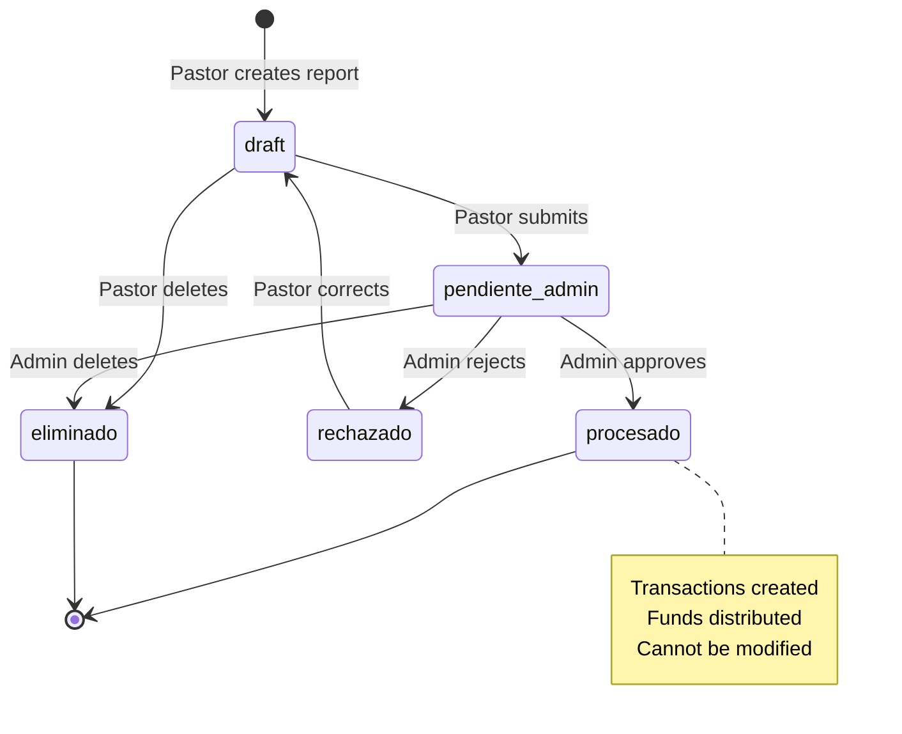
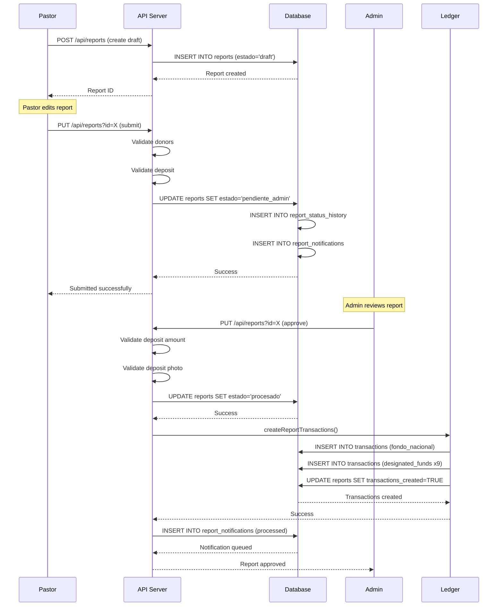

# Monthly Reports Feature Guide

**Document Version**: 1.0.0
**Last Updated**: 2025-10-06
**Target Audience**: End Users, Administrators, Developers

---

## Table of Contents

- [Overview](#overview)
- [Feature Purpose](#feature-purpose)
- [User Roles and Permissions](#user-roles-and-permissions)
- [Report Lifecycle](#report-lifecycle)
- [Creating a Monthly Report](#creating-a-monthly-report)
- [Financial Calculations](#financial-calculations)
- [Bank Deposit Tracking](#bank-deposit-tracking)
- [Donor Registry](#donor-registry)
- [Approval Workflow](#approval-workflow)
- [Report Submission Methods](#report-submission-methods)
- [Common Use Cases](#common-use-cases)
- [Troubleshooting](#troubleshooting)
- [Technical Reference](#technical-reference)
- [See Also](#see-also)

---

## Overview

The **Monthly Reports** (Informes Mensuales) feature is the core financial reporting system for IPU Paraguay churches. Each of the 22 local churches submits monthly financial reports to the national administration, detailing income, expenses, tithes, offerings, and designated funds.

### Key Capabilities

- 📊 Structured monthly financial reporting
- 💰 Automatic 10% national fund calculation
- 🏦 Bank deposit tracking with receipt upload
- 👥 Tithe donor registry with document validation
- ✅ Multi-step approval workflow
- 📱 Online and manual submission methods
- 🔒 Role-based access with RLS enforcement

---

## Feature Purpose

### Why Monthly Reports Exist

1. **Financial Transparency**: Provide national administration with visibility into each church's financial health
2. **National Fund Collection**: Automatically calculate and track 10% national fund contributions (diezmo nacional)
3. **Designated Fund Distribution**: Track special offerings (missions, youth, institutes, etc.)
4. **Compliance & Audit**: Maintain complete audit trail for all financial activities
5. **Pastor Compensation**: Calculate and track pastoral honoraria (honorarios pastoral)

### Business Requirements

As specified in `docs/database/BUSINESS_LOGIC.md`:

```
Every local church MUST submit a monthly report containing:
- Income (Diezmos, Ofrendas, Anexos, Otros)
- Designated Funds (9 categories including missions, youth, institutes)
- Operating Expenses (7 categories including utilities, maintenance)
- Bank deposit proof (receipt photo)
- Tithe donor list with amounts
```

The national administration requires these reports by the **10th of each month** for the previous month.

---

## User Roles and Permissions

### Role-Based Access Matrix

| Role | View Reports | Create Report | Edit Report | Approve Report | Delete Report |
|------|--------------|---------------|-------------|----------------|---------------|
| **admin** | All churches | ✅ Any church | ✅ Any church | ✅ | ✅ |
| **treasurer** | All churches | ❌ | ❌ | ❌ | ❌ |
| **pastor** | Own church only | ✅ Own church | ✅ Own church | ❌ | ✅ Own church |
| **church_manager** | Own church only | ❌ | ❌ | ❌ | ❌ |
| **secretary** | Own church only | ❌ | ❌ | ❌ | ❌ |
| **fund_director** | ❌ No access | ❌ | ❌ | ❌ | ❌ |

**Notes**:
- **treasurer** role is national-scoped (migration 053) and has read-only access to all reports
- **pastor** role handles all church-level financial operations
- **fund_director** role does NOT have access to monthly reports (separate fund events system)

### Permission Enforcement

Permissions are enforced at multiple layers:

1. **Row Level Security (RLS)**: Database policies prevent unauthorized access
2. **API Middleware**: `requireAuth()` validates session before processing
3. **Route Guards**: Frontend prevents navigation to unauthorized pages
4. **Context Validation**: `setDatabaseContext()` sets session variables for RLS

```typescript
// Example: RLS context in API route
const auth = await requireAuth(request);
await executeWithContext(auth, 'SELECT * FROM reports WHERE church_id = $1', [churchId]);
```

---

## Report Lifecycle

Monthly reports follow a strict lifecycle with defined states and transitions:



### Report States

| State | Spanish | Description | Who Can Set | Actions Available |
|-------|---------|-------------|-------------|-------------------|
| `draft` | Borrador | Pastor is still editing | System (on create) | Edit, Submit, Delete |
| `pendiente_admin` | Pendiente | Submitted for approval | Pastor (on submit) | Approve, Reject, Delete |
| `procesado` | Procesado | Approved by admin | Admin (on approval) | View only (immutable) |
| `rechazado` | Rechazado | Rejected by admin | Admin (on rejection) | View, Resubmit |
| `importado_excel` | Importado | Admin manual entry | Admin (bulk import) | Edit, Approve, Delete |
| `eliminado` | Eliminado | Soft-deleted | System (on delete) | Audit trail only |

### State Transition Rules

**From `draft` → `pendiente_admin`**:
- ✅ All required fields filled
- ✅ At least one tithe donor registered (if diezmos > 0)
- ✅ Donor amounts sum equals total diezmos (tolerance: ±₱1)
- ⚠️ **Bank deposit receipt is NOT required at submission** (validated at approval)

**From `pendiente_admin` → `procesado`**:
- ✅ Admin reviews all data
- ✅ **Bank deposit photo MUST be uploaded** (validation enforced here)
- ✅ Deposit amount matches expected total (tolerance: ±₱100)
- ⚠️ **CRITICAL**: Once approved, automatic ledger transactions are created

**Receipt Validation Flow**:
- **At Submission (draft → pendiente_admin)**: Receipt is optional, pastor can submit without it
- **At Approval (pendiente_admin → procesado)**: Receipt becomes mandatory, admin cannot approve without it
- This allows pastors to submit reports quickly while ensuring compliance at the approval checkpoint

**From `pendiente_admin` → `rechazado`**:
- Admin provides rejection reason
- Report returns to pastor for correction
- All data preserved for review

---

## Creating a Monthly Report

### Step-by-Step Process (Pastor Role)

#### 1. Navigate to Reports Section

```
Dashboard → Informes Mensuales → Nuevo Informe
```

#### 2. Select Month and Year

```
Mes: [dropdown 1-12]
Año: [input YYYY]
```

**Validation**:
- Cannot create duplicate report (church_id + month + year unique constraint)
- System shows last submitted report for reference

#### 3. Enter Income (Entradas)

| Field | Spanish | Required | Auto-Calculated |
|-------|---------|----------|-----------------|
| Tithes | Diezmos | ✅ | ❌ |
| Offerings | Ofrendas | ✅ | ❌ |
| Annexes | Anexos | ⚪ Optional | ❌ |
| Other Income | Otros | ⚪ Optional | ❌ |
| **Total Income** | **Total Entradas** | N/A | ✅ (Sum all) |

**Business Rule**: `total_entradas = diezmos + ofrendas + anexos + otros + SUM(designated_funds)`

#### 4. Register Tithe Donors (Aportantes)

If `diezmos > 0`, at least one donor must be registered:

```typescript
interface TitheDonor {
  first_name: string;      // Nombre
  last_name: string;       // Apellido
  document: string;        // CI (optional)
  amount: number;          // Monto en Guaraníes
}
```

**Validation Rules**:
1. At least one donor required if diezmos > 0
2. Sum of donor amounts must equal total diezmos (±₱1 tolerance)
3. Each donor must have first_name OR last_name OR document

**Example**:
```
Diezmos declared: ₱500,000

Donors:
- Juan Pérez    | CI: 1234567 | ₱200,000
- María García  | CI: 7654321 | ₱200,000
- Anónimo       | CI: -       | ₱100,000
Total: ₱500,000 ✅ Matches
```

#### 5. Enter Designated Funds (Fondos Designados)

Nine categories of special offerings:

| Category | Spanish | Goes To |
|----------|---------|---------|
| Direct Missions | Ofrendas Directas Misiones | Missions fund |
| Lazos de Amor | Lazos de Amor | Women's ministry fund |
| Misión Posible | Misión Posible | Evangelism fund |
| APY | APY | Youth fund |
| IBA | Instituto Bíblico | Bible institute fund |
| Knights | Caballeros | Men's ministry fund |
| Ladies | Damas | Women's ministry fund |
| Youth | Jóvenes | Youth activities |
| Children | Niños | Children's ministry |

**Note**: All designated funds are deposited to national funds (not retained locally).

#### 6. Enter Operating Expenses (Gastos Operativos)

Seven expense categories:

| Category | Spanish | Example |
|----------|---------|---------|
| Electric Power | Energía Eléctrica | ANDE bill |
| Water | Agua | ESSAP bill |
| Trash Collection | Recolección de Basura | Municipal service |
| Services | Servicios | Internet, phone, security |
| Maintenance | Mantenimiento | Repairs, cleaning |
| Materials | Materiales | Office supplies, cleaning |
| Other Expenses | Otros Gastos | Miscellaneous |

#### 7. Enter Bank Deposit Information

**Required fields**:
- `numero_deposito`: Deposit slip number (string)
- `fecha_deposito`: Deposit date (date)
- `monto_depositado`: Amount deposited (numeric)
- `foto_deposito`: Receipt photo (base64 image)

**Validation on Approval**:
```typescript
const expectedDeposit = fondo_nacional + total_designated_funds;
const tolerance = 100; // ₱100 tolerance

if (Math.abs(monto_depositado - expectedDeposit) > tolerance) {
  throw new ValidationError('Monto depositado no coincide con total esperado');
}
```

#### 8. Enter Statistical Data (Optional)

- `asistencia_visitas`: Church attendance + visitors
- `bautismos_agua`: Water baptisms
- `bautismos_espiritu`: Holy Spirit baptisms
- `observaciones`: Free-text notes

#### 9. Upload Receipt Photos (Optional)

- `foto_informe`: Summary report photo
- `foto_deposito`: Bank deposit receipt (**required for approval**)

**Format**: Base64-encoded image (JPEG, PNG)
**Storage**: Local filesystem (`uploads/` directory)

#### 10. Submit Report

```typescript
// Draft → Pendiente Admin transition
PUT /api/reports?id=123
{
  "estado": "pendiente_admin"
}
```

System performs validation:
1. All required fields present
2. Donor validation passes
3. Deposit receipt uploaded
4. Calculations correct

---

## Financial Calculations

### Automatic Calculations

The system performs these calculations automatically (no manual input):

#### 1. Total Income (Total Entradas)

```typescript
total_entradas = diezmos + ofrendas + anexos + otros +
                 misiones + lazos_amor + mision_posible +
                 apy + iba + caballeros + damas + jovenes + ninos
```

#### 2. National Fund (Fondo Nacional) - **10% Rule**

```typescript
// Congregational base = diezmos + ofrendas (excludes anexos, otros, designated)
const congregational_base = diezmos + ofrendas;

// National fund = 10% of congregational base
const fondo_nacional = Math.round(congregational_base * 0.1);
```

**Example**:
```
Diezmos: ₱1,000,000
Ofrendas: ₱500,000
Congregational Base: ₱1,500,000
Fondo Nacional: ₱150,000 (10%)
```

**Business Rule**: The 10% is calculated ONLY on diezmos + ofrendas (not on anexos, otros, or designated funds).

#### 3. Total Designated Funds

```typescript
total_designated = misiones + lazos_amor + mision_posible +
                   apy + iba + caballeros + damas + jovenes + ninos
```

#### 4. Total Operating Expenses (Gastos Operativos)

```typescript
gastos_operativos = energia_electrica + agua + recoleccion_basura +
                    servicios + mantenimiento + materiales + otros_gastos
```

#### 5. Pastoral Honoraria (Honorarios Pastoral)

```typescript
// Pastor receives what remains after deductions
honorarios_pastoral = total_entradas - (
  total_designated +
  gastos_operativos +
  fondo_nacional
)

// Ensure non-negative
honorarios_pastoral = Math.max(0, honorarios_pastoral)
```

**Business Logic**: The pastor receives all local funds after:
1. Designated funds sent to national funds
2. Operating expenses paid
3. 10% national fund deducted

#### 6. Balance (Saldo del Mes)

```typescript
total_salidas = total_designated + gastos_operativos +
                fondo_nacional + honorarios_pastoral

saldo_mes = total_entradas - total_salidas

// Should always be zero (all funds distributed)
assert(saldo_mes === 0)
```

### Calculation Example

**Church: Asunción Central**
**Month**: September 2025

```
INCOME (Entradas):
  Diezmos:                    ₱2,000,000
  Ofrendas:                   ₱1,000,000
  Anexos:                       ₱500,000
  Otros:                        ₱200,000
  Misiones:                     ₱100,000
  Lazos de Amor:                 ₱50,000
  Otros Designados:             ₱150,000
  --------------------------------
  Total Entradas:             ₱4,000,000

CALCULATIONS:
  Congregational Base:        ₱3,000,000 (diezmos + ofrendas)
  Fondo Nacional (10%):         ₱300,000 ✅ Auto-calculated
  Total Designados:             ₱300,000 ✅ Auto-calculated

EXPENSES (Gastos):
  Energía Eléctrica:            ₱150,000
  Agua:                          ₱50,000
  Otros Gastos:                 ₱100,000
  --------------------------------
  Gastos Operativos:            ₱300,000

DISTRIBUTION:
  Total Entradas:             ₱4,000,000
  - Fondo Nacional:             ₱300,000 (to national treasury)
  - Fondos Designados:          ₱300,000 (to national funds)
  - Gastos Operativos:          ₱300,000 (local expenses)
  --------------------------------
  Honorarios Pastoral:        ₱3,100,000 ✅ Remaining to pastor

BALANCE:
  Total Salidas:              ₱4,000,000
  Saldo del Mes:                      ₱0 ✅ Perfect balance
```

---

## Bank Deposit Tracking

### Deposit Requirements

Every month, churches must deposit funds to the national bank account:

**Deposit Amount**:
```typescript
deposit_amount = fondo_nacional + total_designated_funds
```

**Why**: Local expenses and pastoral honoraria stay with the church. Only national contributions are deposited.

### Deposit Validation Process

#### 1. Pre-Approval Check (Admin)

Before approving a report, admin verifies:

```typescript
// src/app/api/reports/route.ts:896-915
if (estado === 'procesado') {
  // 1. Validate deposit receipt uploaded
  if (!fotoDepositoPath) {
    throw new ValidationError('Foto de depósito es requerida');
  }

  // 2. Validate deposit amount matches expected total
  const expectedDeposit = totals.fondoNacional + totals.totalDesignados;
  const tolerance = 100; // ₱100 tolerance
  const difference = Math.abs(montoDepositado - expectedDeposit);

  if (difference > tolerance) {
    throw new ValidationError(
      `Monto depositado (₱${montoDepositado}) no coincide con total esperado (₱${expectedDeposit})`
    );
  }
}
```

#### 2. Deposit Information Fields

| Field | Type | Required | Description |
|-------|------|----------|-------------|
| `numero_deposito` | string | ⚪ Optional | Bank deposit slip number |
| `fecha_deposito` | date | ⚪ Optional | Date of deposit |
| `monto_depositado` | numeric | ✅ Required | Amount deposited in Guaraníes |
| `foto_deposito` | base64 | ✅ Required | Photo of deposit receipt |

#### 3. Common Deposit Scenarios

**Scenario 1: Exact Match**
```
Expected: ₱450,000 (₱300,000 fondo + ₱150,000 designados)
Deposited: ₱450,000
Difference: ₱0
Status: ✅ Approved
```

**Scenario 2: Within Tolerance**
```
Expected: ₱450,000
Deposited: ₱450,050
Difference: ₱50 (< ₱100 tolerance)
Status: ✅ Approved with warning
```

**Scenario 3: Outside Tolerance**
```
Expected: ₱450,000
Deposited: ₱400,000
Difference: ₱50,000 (> ₱100 tolerance)
Status: ❌ Rejected - "Monto depositado no coincide"
```

### Deposit Receipt Storage

**Storage Path**: `/uploads/report-{church_id}-{year}-{month}-deposito-{timestamp}-{random}.{ext}`

**Example**: `/uploads/report-5-2025-9-deposito-1696876543210-a8f3k2.jpg`

**Cleanup**: Receipts are retained permanently for audit purposes (no automatic deletion).

---

## Donor Registry

### Purpose

Track individual tithe contributors for:
1. Tax deduction certificates
2. Donor relationship management
3. Compliance with financial regulations
4. Audit trail verification

### Donor Fields

```typescript
interface ReportTither {
  id: number;                    // Auto-generated
  report_id: number;             // FK to reports table
  church_id: number;             // FK to churches table
  first_name: string;            // Nombre
  last_name: string;             // Apellido
  document: string | null;       // CI or null for anonymous
  amount: number;                // Monto en Guaraníes
  created_at: timestamp;         // Auto-generated
}
```

### Validation Rules

#### Rule 1: At Least One Donor

```typescript
if (diezmos > 0 && donorRows.length === 0) {
  throw new BadRequestError('Registra al menos un aportante para los diezmos declarados');
}
```

#### Rule 2: Sum Must Match

```typescript
const donorsTotal = donorRows.reduce((sum, donor) => sum + donor.amount, 0);
const tolerance = 1; // ±₱1 tolerance for rounding

if (Math.abs(donorsTotal - diezmos) > tolerance) {
  throw new BadRequestError('La suma de los aportantes no coincide con el total de diezmos');
}
```

#### Rule 3: Minimum Information

Each donor must have at least ONE of:
- `first_name`
- `last_name`
- `document`

**Valid donors**:
```
✅ Juan Pérez | CI: 1234567 | ₱100,000
✅ María | CI: - | ₱50,000
✅ - | CI: 7654321 | ₱75,000
❌ - | CI: - | ₱25,000 (no identifier)
```

### Anonymous Donors

To protect privacy, donors can be registered anonymously:

```
First Name: "Anónimo"
Last Name: ""
Document: null
Amount: ₱100,000
```

### Donor Update Behavior

When updating a report:

```typescript
// All existing donors are REPLACED (not merged)
await executeWithContext(
  auth,
  'DELETE FROM report_tithers WHERE report_id = $1',
  [reportId]
);

// Then insert new donor list
for (const donor of donors) {
  await executeWithContext(auth, 'INSERT INTO report_tithers...', [donor]);
}
```

**Implication**: Admin must re-enter ALL donors when editing a report (partial updates not supported).

---

## Approval Workflow

### Workflow Diagram



### Admin Approval Steps

#### 1. Navigate to Pending Reports

```
Dashboard → Informes Pendientes → [Filter: pendiente_admin]
```

#### 2. Review Report Details

Admin reviews:
- ✅ All income and expense amounts
- ✅ Donor list and totals
- ✅ Deposit receipt photo
- ✅ Deposit amount matches expected
- ✅ Calculations are correct

#### 3. Approve or Reject

**To Approve**:
```typescript
PUT /api/reports?id=123
{
  "estado": "procesado"
}
```

**System Actions on Approval**:
1. Validate deposit amount (tolerance ±₱100)
2. Validate deposit receipt exists
3. Update report status to `procesado`
4. Set `processed_by` and `processed_at` timestamps
5. Create ledger transactions (see [Transaction Creation](#transaction-creation))
6. Mark `transactions_created = true`
7. Queue notification email

**To Reject**:
```typescript
PUT /api/reports?id=123
{
  "estado": "rechazado",
  "rejection_reason": "Falta foto de depósito"
}
```

**System Actions on Rejection**:
1. Update report status to `rechazado`
2. Save rejection reason
3. Notify pastor via email (if configured)
4. Allow pastor to resubmit

### Transaction Creation

When a report is approved, the system automatically creates ledger transactions:

```typescript
// src/app/api/reports/route-helpers.ts:createReportTransactions()

// Transaction 1: National Fund (10%)
INSERT INTO transactions (
  fund_id: 1,                           // National Fund
  church_id: report.church_id,
  concept: "Fondo Nacional {month}/{year}",
  amount_in: fondo_nacional,
  amount_out: 0,
  date: fecha_deposito,
  created_by: 'system'
)

// Transaction 2-10: Designated Funds
FOR EACH designated_fund WHERE amount > 0:
  INSERT INTO transactions (
    fund_id: fund_mapping[designated_fund.name],
    church_id: report.church_id,
    concept: "{fund_name} {month}/{year}",
    amount_in: designated_fund.amount,
    amount_out: 0,
    date: fecha_deposito,
    created_by: 'system'
  )
```

**Fund Mapping** (from route-helpers.ts):
```typescript
const FUND_MAPPING = {
  misiones: 2,           // Missions Fund
  lazos_amor: 3,         // Lazos de Amor Fund
  mision_posible: 4,     // Misión Posible Fund
  apy: 5,                // APY Fund
  iba: 6,                // Bible Institute Fund
  caballeros: 7,         // Knights Fund
  damas: 8,              // Ladies Fund
  jovenes: 9,            // Youth Fund
  ninos: 10              // Children Fund
}
```

**Important**: Transactions are created with `created_by = 'system'` to distinguish from manual entries.

### Audit Trail

All status changes are tracked in `report_status_history`:

```sql
INSERT INTO report_status_history (
  report_id,
  previous_status,
  new_status,
  changed_by,
  changed_at
) VALUES ($1, $2, $3, $4, NOW())
```

**Example audit trail**:
```
Report ID: 123
Timestamp: 2025-09-15 10:30:00 | Previous: null | New: draft | By: pastor@iglesia5.com
Timestamp: 2025-09-16 14:20:00 | Previous: draft | New: pendiente_admin | By: pastor@iglesia5.com
Timestamp: 2025-09-18 09:15:00 | Previous: pendiente_admin | New: procesado | By: admin@ipupy.org.py
```

---

## Report Submission Methods

### Method 1: Online Submission (Church Online)

**User**: Pastor
**Interface**: Web application
**Status**: `estado = 'pendiente_admin'`

**Process**:
1. Pastor logs in to web app
2. Creates report via UI
3. Uploads photos directly
4. Submits electronically
5. System sets `submission_source = 'church_online'`

**Advantages**:
- ✅ Immediate validation
- ✅ Real-time feedback
- ✅ Automatic calculations
- ✅ Instant submission

### Method 2: Pastor Manual Submission (Pastor Manual)

**User**: Admin (on behalf of pastor)
**Interface**: Admin panel
**Status**: `estado = 'pendiente_admin'` or `importado_excel`

**Process**:
1. Pastor submits paper form
2. Admin manually enters data
3. System sets `submission_source = 'pastor_manual'`
4. Sets `entered_by = admin_email`
5. Sets `entered_at = NOW()`

**Use Cases**:
- Pastor has no internet access
- Emergency submission
- Historical data entry

### Method 3: Admin Manual Entry (Admin Manual)

**User**: Admin
**Interface**: Admin panel
**Status**: `estado = 'importado_excel'`

**Process**:
1. Admin enters data directly
2. System sets `submission_source = 'admin_manual'`
3. Status defaults to `importado_excel`
4. Can be approved immediately or later

**Use Cases**:
- Excel bulk import
- Historical migration
- Correction of previous reports

### Method 4: Excel Bulk Import (Admin Import)

**User**: Admin
**Interface**: Import tool
**Status**: `estado = 'importado_excel'`

**Process**:
1. Admin prepares Excel file (XLSX format)
2. Uses import tool to bulk upload
3. System validates each row
4. Sets `submission_source = 'admin_import'`
5. All reports default to `importado_excel` status

**Excel Format** (simplified):
```
| church_id | month | year | diezmos | ofrendas | ... | monto_depositado |
|-----------|-------|------|---------|----------|-----|------------------|
| 5         | 9     | 2025 | 1000000 | 500000   | ... | 150000          |
```

---

## Common Use Cases

### Use Case 1: First-Time Report Submission

**Scenario**: Pastor Gómez from Iglesia Ciudad del Este submits September 2025 report for the first time.

**Steps**:
1. Pastor logs in: `pastor@iglesia12.com`
2. Navigates to "Nuevo Informe"
3. Selects: Month=9, Year=2025
4. Enters income:
   - Diezmos: ₱800,000
   - Ofrendas: ₱400,000
5. Registers donors:
   - María López: ₱300,000
   - Juan Benítez: ₱300,000
   - Anónimo: ₱200,000
6. Enters designated funds:
   - Misiones: ₱50,000
7. Enters expenses:
   - Energía: ₱100,000
   - Agua: ₱30,000
8. System auto-calculates:
   - Fondo Nacional: ₱120,000 (10% of ₱1,200,000)
   - Honorarios: ₱1,000,000
9. Uploads deposit receipt (₱170,000)
10. Submits report
11. System validates and sets status to `pendiente_admin`
12. Admin receives notification email

---

### Use Case 2: Report Rejection and Resubmission

**Scenario**: Admin rejects report due to missing deposit photo.

**Steps**:
1. Admin reviews report ID 456
2. Notices missing deposit photo
3. Rejects report:
   ```typescript
   PUT /api/reports?id=456
   {
     "estado": "rechazado",
     "rejection_reason": "Falta foto del depósito bancario"
   }
   ```
4. Pastor receives notification
5. Pastor logs in and views rejection
6. Pastor uploads deposit photo
7. Pastor resubmits:
   ```typescript
   PUT /api/reports?id=456
   {
     "estado": "pendiente_admin",
     "attachments": { "deposit": "data:image/jpeg;base64,..." }
   }
   ```
8. Admin re-reviews and approves

---

### Use Case 3: Admin Manual Entry for Paper Report

**Scenario**: Pastor without internet submits paper report via WhatsApp photos.

**Steps**:
1. Admin receives WhatsApp photos
2. Admin logs in with admin account
3. Navigates to "Crear Informe (Manual)"
4. Selects church: Iglesia Asunción Central
5. Enters all data from photos
6. Sets `submission_source = 'pastor_manual'`
7. Sets `manual_report_notes = 'Recibido por WhatsApp el 2025-09-15'`
8. System sets `entered_by = 'admin@ipupy.org.py'`
9. Admin approves immediately or leaves for later review
10. Transactions auto-created if approved

---

### Use Case 4: Correcting an Approved Report

**Scenario**: After approval, pastor realizes they forgot to include anexos income.

**Problem**: Approved reports (`estado = 'procesado'`) should be immutable to prevent audit trail corruption.

**Solution Options**:

**Option A: Admin Edit (Not Recommended)**:
1. Admin edits the approved report
2. System deletes existing transactions (`created_by = 'system'`)
3. System recalculates and creates new transactions
4. Risk: Breaks audit trail continuity

**Option B: Correction Report (Recommended)**:
1. Create new report for same month with correction
2. Add note: "Corrección - Anexos omitidos en reporte anterior"
3. Submit and approve correction report
4. Both reports remain in system for audit trail

**Best Practice**: Approved reports should rarely be edited. Use correction reports instead.

---

### Use Case 5: Bulk Import Historical Reports

**Scenario**: Admin needs to import 12 months of historical reports from Excel.

**Steps**:
1. Admin prepares Excel file:
   ```
   church_id,month,year,diezmos,ofrendas,...
   5,1,2024,900000,450000,...
   5,2,2024,950000,480000,...
   ...
   ```
2. Admin uses import tool (future feature)
3. System validates each row:
   - Church exists
   - Month 1-12, Year valid
   - No duplicates
4. For each valid row:
   ```typescript
   POST /api/reports
   {
     church_id: row.church_id,
     month: row.month,
     year: row.year,
     ...data,
     submission_source: 'admin_import',
     estado: 'importado_excel'
   }
   ```
5. Admin reviews imported reports
6. Admin bulk-approves if all correct

---

## Troubleshooting

### Problem 1: "Ya existe un informe para este mes y año"

**Symptom**: Cannot create report, duplicate error.

**Cause**: A report already exists for this church/month/year combination.

**Solution**:
1. Check existing reports: `GET /api/reports?church_id=X&month=9&year=2025`
2. If found, edit existing report instead of creating new one
3. If duplicate in error, contact admin to delete incorrect report

**Technical Note**: `ON CONFLICT (church_id, month, year) DO NOTHING` prevents duplicates at database level.

---

### Problem 2: "La suma de los aportantes no coincide con el total de diezmos"

**Symptom**: Cannot submit report, donor validation fails.

**Cause**: Sum of donor amounts ≠ total diezmos declared.

**Solution**:
1. Verify diezmos total: ₱500,000
2. Sum donor amounts: ₱480,000
3. Difference: ₱20,000 ❌
4. Either:
   - Add missing donor(s) for ₱20,000
   - Correct diezmos total to ₱480,000
   - Add "Anónimo" donor for ₱20,000

**Tolerance**: System allows ±₱1 difference for rounding.

---

### Problem 3: "Foto de depósito es requerida para aprobar el reporte"

**Symptom**: Admin cannot approve report.

**Cause**: Bank deposit receipt photo missing.

**Solution (Pastor)**:
1. Edit report
2. Upload deposit receipt photo
3. Resubmit

**Solution (Admin)**:
1. Reject report with reason: "Falta foto de depósito"
2. Pastor uploads photo
3. Pastor resubmits

---

### Problem 4: "Monto depositado no coincide con total esperado"

**Symptom**: Admin approval fails, deposit amount mismatch.

**Cause**: Deposit amount differs from expected total by > ₱100.

**Example**:
```
Expected: ₱450,000 (₱300,000 fondo + ₱150,000 designados)
Deposited: ₱400,000
Difference: ₱50,000 > ₱100 tolerance ❌
```

**Solution**:
1. Verify bank receipt shows ₱450,000
2. If photo shows ₱400,000:
   - Reject report
   - Request pastor to deposit remaining ₱50,000
3. If photo shows ₱450,000 but system shows ₱400,000:
   - Edit report
   - Correct `monto_depositado` to ₱450,000
   - Resubmit

---

### Problem 5: Transactions Not Created After Approval

**Symptom**: Report approved but no transactions in ledger.

**Cause**: Transaction creation failed (database error, RLS violation).

**Diagnosis**:
1. Check report fields:
   ```sql
   SELECT transactions_created, transactions_created_at
   FROM reports WHERE id = 123;
   ```
2. If `transactions_created = FALSE`:
   - Transaction creation failed
   - Check API logs for errors

**Solution**:
1. Re-approve report (triggers transaction retry):
   ```typescript
   PUT /api/reports?id=123
   {
     "estado": "procesado"
   }
   ```
2. System will:
   - Delete existing system-created transactions
   - Recreate all transactions
   - Mark `transactions_created = TRUE`

---

### Problem 6: Cannot Edit Approved Report

**Symptom**: Edit button disabled for approved report.

**Cause**: Approved reports are immutable by design.

**Rationale**: Once approved and transactions created, editing would corrupt audit trail.

**Solution**:
- **For minor corrections**: Admin can forcefully edit (use with caution)
- **For major corrections**: Create correction report for same month
- **For accounting errors**: Consult national treasurer for proper adjustment entry

---

## Technical Reference

### API Endpoints

#### GET /api/reports

Retrieve reports with optional filters.

**Query Parameters**:
- `year` (optional): Filter by year
- `month` (optional): Filter by month (1-12)
- `church_id` (optional): Filter by church
- `limit` (optional): Pagination limit
- `page` (optional): Pagination page
- `last_report=true&church_id=X`: Get last submitted report

**Response**:
```typescript
{
  success: true,
  data: [
    {
      id: 123,
      church_id: 5,
      church_name: "Asunción Central",
      month: 9,
      year: 2025,
      diezmos: 800000,
      ofrendas: 400000,
      fondo_nacional: 120000,
      estado: "procesado",
      submitted_at: "2025-09-16T14:20:00Z",
      processed_by: "admin@ipupy.org.py",
      processed_at: "2025-09-18T09:15:00Z"
    }
  ]
}
```

---

#### POST /api/reports

Create new monthly report.

**Request Body**:
```typescript
{
  church_id: 5,
  month: 9,
  year: 2025,
  diezmos: 800000,
  ofrendas: 400000,
  anexos: 0,
  otros: 0,
  misiones: 50000,
  // ... other designated funds
  energia_electrica: 100000,
  agua: 30000,
  // ... other expenses
  numero_deposito: "DEP-123456",
  fecha_deposito: "2025-09-15",
  monto_depositado: 170000,
  attachments: {
    summary: "data:image/jpeg;base64,...",
    deposit: "data:image/jpeg;base64,..."
  },
  aportantes: [
    { first_name: "María", last_name: "López", document: "1234567", amount: 300000 },
    { first_name: "Juan", last_name: "Benítez", document: "7654321", amount: 300000 },
    { first_name: "Anónimo", last_name: "", document: null, amount: 200000 }
  ],
  asistencia_visitas: 150,
  bautismos_agua: 2,
  bautismos_espiritu: 1,
  observaciones: "Mes con buena asistencia"
}
```

**Response**:
```typescript
{
  success: true,
  report: {
    id: 123,
    // ... full report data
  }
}
```

**Errors**:
- `400`: "Ya existe un informe para este mes y año"
- `400`: "La suma de los aportantes no coincide con el total de diezmos"
- `401`: "No autenticado"
- `403`: "No tiene permisos para crear informes"

---

#### PUT /api/reports?id=X

Update existing monthly report.

**Query Parameters**:
- `id` (required): Report ID

**Request Body**: Same as POST (partial updates supported)

**Status Changes**:
```typescript
// Submit for approval (pastor)
{ "estado": "pendiente_admin" }

// Approve (admin)
{ "estado": "procesado" }

// Reject (admin)
{
  "estado": "rechazado",
  "rejection_reason": "Reason text"
}
```

**Response**: Same as POST

**Errors**:
- `400`: "Informe no encontrado"
- `400`: "No tiene permisos para modificar este informe"
- `400`: "Foto de depósito es requerida para aprobar el reporte"
- `400`: "Monto depositado no coincide con total esperado"

---

#### DELETE /api/reports?id=X

Delete a monthly report (soft delete).

**Query Parameters**:
- `id` (required): Report ID

**Authorization**:
- Admin: Can delete any report
- Pastor: Can delete own church reports only

**Response**:
```typescript
{
  success: true,
  message: "Informe eliminado exitosamente"
}
```

**Side Effects**:
- Deletes all associated donors (`report_tithers`)
- Deletes system-created transactions (`transactions WHERE created_by = 'system'`)
- Records status change to `eliminado` in audit trail

---

### Database Schema

#### reports Table

```sql
CREATE TABLE reports (
  id SERIAL PRIMARY KEY,
  church_id INTEGER NOT NULL REFERENCES churches(id),
  month INTEGER NOT NULL CHECK (month >= 1 AND month <= 12),
  year INTEGER NOT NULL,

  -- Income
  diezmos NUMERIC(15,2) DEFAULT 0,
  ofrendas NUMERIC(15,2) DEFAULT 0,
  anexos NUMERIC(15,2) DEFAULT 0,
  otros NUMERIC(15,2) DEFAULT 0,

  -- Designated funds (9 categories)
  ofrendas_directas_misiones NUMERIC(15,2) DEFAULT 0,
  lazos_amor NUMERIC(15,2) DEFAULT 0,
  mision_posible NUMERIC(15,2) DEFAULT 0,
  apy NUMERIC(15,2) DEFAULT 0,
  instituto_biblico NUMERIC(15,2) DEFAULT 0,
  caballeros NUMERIC(15,2) DEFAULT 0,
  damas NUMERIC(15,2) DEFAULT 0,
  jovenes NUMERIC(15,2) DEFAULT 0,
  ninos NUMERIC(15,2) DEFAULT 0,

  -- Auto-calculated
  fondo_nacional NUMERIC(15,2) DEFAULT 0,
  honorarios_pastoral NUMERIC(15,2) DEFAULT 0,

  -- Expenses
  energia_electrica NUMERIC(15,2) DEFAULT 0,
  agua NUMERIC(15,2) DEFAULT 0,
  recoleccion_basura NUMERIC(15,2) DEFAULT 0,
  servicios NUMERIC(15,2) DEFAULT 0,
  mantenimiento NUMERIC(15,2) DEFAULT 0,
  materiales NUMERIC(15,2) DEFAULT 0,
  otros_gastos NUMERIC(15,2) DEFAULT 0,

  -- Bank deposit
  numero_deposito TEXT,
  fecha_deposito DATE,
  monto_depositado NUMERIC(15,2),
  foto_deposito TEXT,
  foto_informe TEXT,

  -- Statistical data
  asistencia_visitas INTEGER DEFAULT 0,
  bautismos_agua INTEGER DEFAULT 0,
  bautismos_espiritu INTEGER DEFAULT 0,
  observaciones TEXT,

  -- Status and workflow
  estado TEXT NOT NULL DEFAULT 'draft'
    CHECK (estado IN ('draft', 'pendiente_admin', 'procesado', 'rechazado', 'importado_excel', 'eliminado')),
  rejection_reason TEXT,

  -- Submission metadata
  submission_type TEXT DEFAULT 'online',
  submission_source TEXT,
  submitted_by TEXT,
  submitted_at TIMESTAMPTZ,
  processed_by TEXT,
  processed_at TIMESTAMPTZ,

  -- Admin manual entry tracking
  entered_by TEXT,
  entered_at TIMESTAMPTZ,
  manual_report_source TEXT,
  manual_report_notes TEXT,

  -- Transaction creation tracking
  transactions_created BOOLEAN DEFAULT FALSE,
  transactions_created_at TIMESTAMPTZ,
  transactions_created_by TEXT,

  -- Timestamps
  created_at TIMESTAMPTZ NOT NULL DEFAULT NOW(),
  updated_at TIMESTAMPTZ,

  -- Prevent duplicates
  CONSTRAINT reports_unique_month_year UNIQUE (church_id, month, year)
);
```

---

#### report_tithers Table

```sql
CREATE TABLE report_tithers (
  id SERIAL PRIMARY KEY,
  report_id INTEGER NOT NULL REFERENCES reports(id) ON DELETE CASCADE,
  church_id INTEGER NOT NULL REFERENCES churches(id),
  first_name TEXT,
  last_name TEXT,
  document TEXT,
  amount NUMERIC(15,2) NOT NULL,
  created_at TIMESTAMPTZ NOT NULL DEFAULT NOW(),

  -- At least one identifier required
  CONSTRAINT tither_has_identifier CHECK (
    first_name IS NOT NULL OR
    last_name IS NOT NULL OR
    document IS NOT NULL
  )
);
```

---

#### report_status_history Table

```sql
CREATE TABLE report_status_history (
  id SERIAL PRIMARY KEY,
  report_id INTEGER NOT NULL REFERENCES reports(id) ON DELETE CASCADE,
  previous_status TEXT,
  new_status TEXT NOT NULL,
  changed_by TEXT,
  changed_at TIMESTAMPTZ NOT NULL DEFAULT NOW()
);
```

---

### RLS Policies

#### reports Table Policies

```sql
-- Pastors view own church reports
CREATE POLICY "Pastors view own church reports"
  ON reports FOR SELECT
  USING (
    app_current_user_role() = 'pastor' AND
    church_id = app_current_user_church_id()
  );

-- Pastors create reports for own church
CREATE POLICY "Pastors create own church reports"
  ON reports FOR INSERT
  WITH CHECK (
    app_current_user_role() = 'pastor' AND
    church_id = app_current_user_church_id()
  );

-- Pastors update own church reports
CREATE POLICY "Pastors update own church reports"
  ON reports FOR UPDATE
  USING (
    app_current_user_role() = 'pastor' AND
    church_id = app_current_user_church_id()
  );

-- National roles (admin, treasurer) view all reports
CREATE POLICY "National roles view all reports"
  ON reports FOR SELECT
  USING (
    app_current_user_role() IN ('admin', 'treasurer')
  );

-- Admin full access
CREATE POLICY "Admin full access to reports"
  ON reports FOR ALL
  USING (app_current_user_role() = 'admin');
```

---

## See Also

### Related Documentation

- **[Transaction Ledger Guide](./TRANSACTION_LEDGER.md)**: How report transactions are recorded
- **[Fund Events Guide](./FUND_EVENTS.md)**: Event-based financial management
- **[Provider Registry Guide](./PROVIDER_REGISTRY.md)**: Centralized vendor management
- **[Database Business Logic](../database/BUSINESS_LOGIC.md)**: Core financial calculations
- **[RLS Policies Reference](../database/RLS_POLICIES.md)**: Row-level security details
- **[API Reference](../API_REFERENCE.md)**: Complete API documentation

### Migration History

- **Migration 023**: Role simplification (8→6 roles)
- **Migration 024**: RLS UUID fixes for reports
- **Migration 037**: Role system fixes (church_manager permissions)
- **Migration 040**: National treasurer role added
- **Migration 053**: Treasurer role consolidation (national-scoped)

### Related Files

**API Routes**:
- `/src/app/api/reports/route.ts` - Main reports API
- `/src/app/api/reports/route-helpers.ts` - Transaction creation logic
- `/src/app/api/admin/reports/route.ts` - Admin report operations

**Components**:
- `/src/components/Reports/ReportForm.tsx` - Report entry form
- `/src/components/Reports/ReportList.tsx` - Report list view
- `/src/components/Reports/DonorEntry.tsx` - Donor registration

**Hooks**:
- `/src/hooks/useReports.ts` - TanStack Query hooks

### External Resources

- [Supabase RLS Documentation](https://supabase.com/docs/guides/auth/row-level-security)
- [Next.js API Routes](https://nextjs.org/docs/api-routes/introduction)
- [TanStack Query v5](https://tanstack.com/query/latest)

---

**Document End** | For questions or corrections, contact: `administracion@ipupy.org.py`
