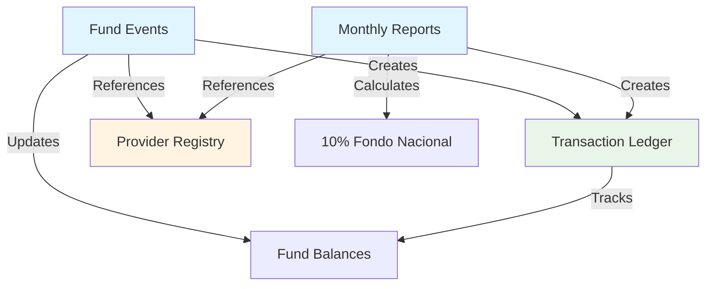

# Feature Documentation Index

This directory contains comprehensive feature guides for the IPUPY_Tesoreria treasury management system. Each guide provides user-facing documentation covering workflows, permissions, technical details, and troubleshooting.

## Core Features

### 1. [Monthly Reports](./MONTHLY_REPORTS.md) (40KB)
**Monthly financial reporting system for churches**

The Monthly Reports feature allows treasurers to submit monthly financial reports including tithes (diezmos), offerings (ofrendas), and automatic 10% national fund contributions (fondo_nacional).

**Key Topics:**
- Report creation and submission workflow
- Auto-calculation of 10% fondo_nacional
- Bank deposit tracking with receipt uploads
- Donor registry integration
- Approval workflow (treasurer → admin)
- Role-based permissions

**Primary Users:** Treasurer, Pastor, Admin

---

### 2. [Fund Events](./FUND_EVENTS.md) (34KB)
**Event budget planning and tracking system**

The Fund Events system enables treasurers and fund directors to plan event budgets, track actual income/expenses post-event, and automatically create ledger transactions upon approval.

**Key Topics:**
- Event budget creation with line items
- Draft → Submitted → Approved workflow
- Treasurer approval process
- Actual vs budget variance analysis
- Automatic transaction creation on approval
- Fund director role restrictions
- 7 budget categories (honorarios, alimentación, transporte, etc.)

**Primary Users:** Treasurer, Fund Director, Admin

---

### 3. [Provider Registry](./PROVIDER_REGISTRY.md) (31KB)
**Centralized vendor/supplier database**

The Provider Registry is a centralized system for managing all vendors and suppliers across the organization with RUC validation and deduplication.

**Key Topics:**
- Centralized provider database (shared across all churches)
- RUC validation and uniqueness enforcement
- Special utility providers (ANDE, ESSAP)
- Provider categories (servicio, producto, contratista, etc.)
- Migration from church-specific providers
- Search and autocomplete functionality

**Primary Users:** Treasurer, Admin

---

### 4. [Transaction Ledger](./TRANSACTION_LEDGER.md) (32KB)
**Multi-fund accounting and transaction tracking**

The Transaction Ledger is the core accounting system that tracks all financial movements across 10+ funds with dual-entry accounting and automatic balance calculations.

**Key Topics:**
- Multi-fund accounting architecture (Fondo Nacional, Misiones, Juventud, etc.)
- Transaction types (report-generated, event-generated, manual)
- Dual-entry accounting (amount_in vs amount_out)
- Church-level vs national-level transactions
- Fund balance tracking and reconciliation
- Role-based transaction visibility
- Common workflows and reconciliation procedures

**Primary Users:** Treasurer, Fund Director, Admin

---

## Additional Features

### 5. [Pastor Platform Access UI](./PASTOR_PLATFORM_ACCESS_UI.md) (7.3KB)
**Pastor role interface design**

Documentation for the pastor-specific user interface and accessible features.

---

## Documentation Structure

Each feature guide follows this structure:

1. **Overview** - High-level summary
2. **Feature Purpose** - Why this feature exists
3. **User Roles & Permissions** - Who can do what
4. **Workflows** - Step-by-step processes with Mermaid diagrams
5. **Use Cases** - Common real-world scenarios
6. **Troubleshooting** - Common issues and solutions
7. **Technical Reference** - API endpoints, database schema, RLS policies
8. **See Also** - Cross-references to related documentation

## Cross-Feature Relationships

### How Features Work Together

1. **Monthly Reports → Transaction Ledger**
   - When a report is approved, automatic transactions are created in the ledger
   - Each deposit creates entries in multiple funds (church fund + fondo_nacional)

2. **Fund Events → Transaction Ledger**
   - When an event is approved, actual income/expenses become ledger transactions
   - Transactions are tagged with event_id for traceability

3. **Provider Registry → Reports & Events**
   - Centralized provider database shared by both monthly reports and fund events
   - RUC deduplication ensures data consistency

4. **Transaction Ledger → Fund Balances**
   - All transactions automatically update fund_balances table
   - Balance recalculation happens on every transaction

## Role-Based Feature Access

| Role | Monthly Reports | Fund Events | Provider Registry | Transaction Ledger |
|------|----------------|-------------|-------------------|-------------------|
| **Admin** | Full access | Full access | Full access | Full access |
| **Treasurer** | Create, submit, view own church | Create, approve, view national-level | Create, edit, view all | Create, view national-level |
| **Fund Director** | View only | Create, view fund-specific | View only | View fund-specific |
| **Pastor** | View own church | View own church | View only | View own church |
| **Church Manager** | View own church | View own church | View only | View own church |
| **Secretary** | View own church | View own church | View only | View own church |

## Getting Started

**For Treasurers:**
1. Start with [Monthly Reports](./MONTHLY_REPORTS.md) to understand core financial reporting
2. Review [Provider Registry](./PROVIDER_REGISTRY.md) to learn how to manage vendors
3. Read [Transaction Ledger](./TRANSACTION_LEDGER.md) for reconciliation procedures
4. Explore [Fund Events](./FUND_EVENTS.md) for event budget planning

**For Fund Directors:**
1. Begin with [Fund Events](./FUND_EVENTS.md) to understand event budget workflows
2. Review [Transaction Ledger](./TRANSACTION_LEDGER.md) for fund-specific transaction visibility
3. Check [Provider Registry](./PROVIDER_REGISTRY.md) for vendor lookup

**For Pastors:**
1. Start with [Monthly Reports](./MONTHLY_REPORTS.md) to understand church financial reporting
2. Review [Transaction Ledger](./TRANSACTION_LEDGER.md) for church-level transaction history

**For Admins:**
1. Review all feature guides to understand complete system capabilities
2. Focus on approval workflows in [Monthly Reports](./MONTHLY_REPORTS.md) and [Fund Events](./FUND_EVENTS.md)
3. Understand [Transaction Ledger](./TRANSACTION_LEDGER.md) for national-level financial oversight

## Related Documentation

- [API Reference](../API_REFERENCE.md) - Complete API endpoint documentation
- [Architecture Overview](../ARCHITECTURE.md) - System architecture and design patterns
- [Database Schema](../DATABASE_SCHEMA.md) - Database tables and relationships
- [Security Model](../SECURITY_AUDIT_2025-09-28.md) - RLS policies and authorization
- [User Management Guide](../guides/USER_MANAGEMENT_GUIDE.md) - User administration procedures

## Terminology Reference

| Spanish Term | English Translation | Context |
|--------------|-------------------|---------|
| **Diezmos** | Tithes | 10% religious contribution |
| **Ofrendas** | Offerings | Voluntary donations |
| **Fondo Nacional** | National Fund | 10% of church income sent to national level |
| **Tesorero** | Treasurer | Church financial manager |
| **Pastor** | Pastor | Church leader |
| **RUC** | Registro Único de Contribuyentes | Paraguayan tax ID |
| **Honorarios** | Professional Fees | Payment for services |
| **Alimentación** | Food/Meals | Meal expenses |
| **Transporte** | Transportation | Travel expenses |
| **Hospedaje** | Lodging | Accommodation expenses |

## Support and Feedback

For questions or feedback about these feature guides:
- Technical support: `administracion@ipupy.org.py`
- Documentation issues: Create an issue in the repository

---

**Last Updated:** October 6, 2025
**Documentation Version:** 1.0
**System Version:** IPUPY_Tesoreria v2.2
